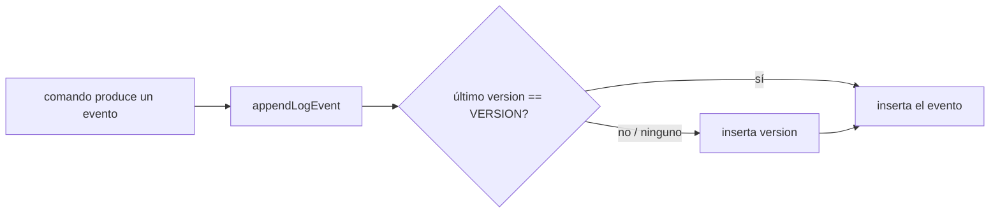

## Request

Cada change debe dejar constancia de con qué versión de ChangeLedger se hizo,
para poder comparar la eficacia y la eficiencia de la herramienta entre
versiones. El registro es independiente de las métricas de consumo de tokens:
existe siempre, sin configuración, y funciona igual con la ref de estado y en el
layout legacy. Un change puede empezar con una versión y continuar con otra si
la instalación se actualiza a mitad de trabajo; el registro debe mostrar ese
cambio y permitir atribuir cada evento a la versión que lo produjo.

Quedan fuera de este change: las métricas de consumo y su colector (change
independiente), cualquier analizador o vista que explote el dato, el relleno
retroactivo de changes anteriores, el sellado de `edit`, de los documentos de
`apply` sobre changes existentes, de `fix` y de `task`, y la detección de
ediciones manuales del documento.

## Investigation

Hoy ningún change, journal ni manifest registra la versión de la CLI. La única
declaración es `min_cli_version` en la configuración (change `20260924-184354`),
y `VERSION` en `src/framing.mjs` lee la versión del `package.json` distribuido
(change `20260628-113218`); el `package.json` de este repo declara
`0.18.0-dev`, así que las prereleases son un caso real.

El Log es la única superficie presente en el documento en ambos layouts, por lo
que no necesita almacenamiento nuevo ni toca la ref de estado. Su modelo único
(change `20260720-125007`) vive en `LOG_EVENT_DEFINITIONS` de
`src/lifecycle.mjs`; `LOG_EVENT_TYPES` y el mensaje de error de `check` para
eventos inválidos se derivan de ese mapa. `TRANSITION_PAYLOAD` no admite dígitos
ni puntos, así que el nuevo tipo necesita su propio parser. `[note]` es el
precedente de tipo no transicional: `checkLifecycleSequence` en `src/check.mjs`
sólo reproduce `status`, `review` y `validation`, y `src/metrics.mjs` filtra los
mismos tres tipos, así que un tipo con `transition: false` no altera la
reconstrucción del estado ni las métricas.

Todas las escrituras de eventos pasan por `appendLogEvent` en `src/writer.mjs`,
en ambos layouts: `status`, `approve`, `review`, `validation`, `reopen`,
`discard`, `owner`, `branch`, `archive` (incluido `archive --graduated`),
`graduate`, `log`, los eventos de `apply` y las transiciones del viewer
(`changeStatusImpl` reutiliza los comandos de `src/commands/agent.mjs`). Es el
único punto de inserción común. `appendLogEvent` crea `## Log` si falta, así que
los tipos sin etapa Log (`chore`) ya reciben la sección al moverse; los chores
existentes del ledger la tienen y pasan `check`. No pasan por él: la creación
(`render()` en `src/commands/new.mjs` no escribe eventos, y tampoco el `target:
"new"` de `apply`), `task` (no toca el Log), `edit` y los documentos de `apply`
(contenido completo aportado por el agente, sin regla de Log append-only, con
no-op byte-idéntico) y `fix`.

Consumidores que deben reconocer el tipo: `LOG_EVENT_PRODUCERS` en
`bin/changeledger.mjs` (la ayuda de `log` lanza un error si su conjunto difiere
de `LOG_EVENT_DEFINITIONS`), la lista «Types are …» y sus formas en
`templates/contract/implement.md` (el test de contrato exige que coincidan con
el mapa y en su orden), y los tests de `test/lifecycle.test.mjs`,
`test/cli-bin.test.mjs` y `test/contract.test.mjs` que enumeran los tipos
(change `20260824-134716`). El viewer y `search` tratan el Log como texto, sin
estilo por tipo.

Sincronización: `sync` compara por documento completo, así que dos clones que
modifican el mismo change ya chocan hoy; el sello no crea una clase nueva de
conflicto. `import` compara Logs por prefijo de entradas (change
`20260809-113241`): un sello es una entrada más y sigue esa misma regla.

Interfaces externas: ninguna. La versión sale del `package.json` distribuido,
dato estable que ya expone `changeledger --version`.

## Proposal

Añadir el tipo no transicional `version` al final de `LOG_EVENT_DEFINITIONS`,
con dos formas: `<semver>` cuando el change no tiene un sello previo y
`<semver> → <semver>` cuando la versión cambia. Ambas aceptan prerelease y
metadata de build con la misma gramática SemVer que valida `min_cli_version`.

El sello vive en un único lugar, `appendLogEvent`: antes de insertar un evento
busca el último `[version]` del Log; si no hay ninguno o su versión final
difiere de `VERSION`, inserta primero la línea de versión con el mismo instante
que el evento. La comparación es de igualdad textual, no de precedencia, para
registrar también una versión inferior permitida por el mínimo. Así cada evento
pertenece a la última versión registrada antes que él, y una actualización a
mitad del change queda en una sola línea.

La creación sella explícitamente: `new` (scaffold y `--from`) y el `target:
"new"` de `apply` añaden `[version] <VERSION>` con el instante `created` del
documento, porque ninguna de esas rutas escribe un evento.

Alternativas descartadas: un archivo de transiciones aparte (otro
almacenamiento, otro mecanismo de sync y otra superficie en la ref de estado);
un trailer en los commits del journal (no existe en legacy); un campo de
frontmatter (no representa una actualización a mitad del change); una versión
en cada línea del Log (repite el dato y encarece cada contexto que carga el
change). Sellar `edit` y los documentos de `apply` alteraría contenido aportado
por el agente y rompería su no-op byte-idéntico; se excluye.

## Specification

### CR1 — La creación registra la versión
- **Given** la CLI con `VERSION` `0.18.0` y un repo inactivo
- **When** se ejecuta `changeledger new feature demo "Demo"`
- **Then** el `## Log` del documento creado contiene exactamente una entrada, `` - **<created>** `[version]` 0.18.0 ``, donde `<created>` es el valor de `created` de su frontmatter
- **And** lo mismo ocurre con `changeledger new feature demo "Demo" --from <archivo>` en un repo activado y con una entrada `{"target": "new"}` de `changeledger apply`

### CR2 — La misma versión no se repite
- **Given** un change `approved` cuyo último `[version]` es `0.18.0` y la CLI `0.18.0`
- **When** se ejecutan `changeledger status <id> in-progress` y `changeledger log <id> "nota"`
- **Then** el Log gana sólo los eventos de esos comandos (`[status]`, `[owner]`/`[branch]` automáticos y `[note]`) y ninguna línea `[version]`

### CR3 — Una actualización a mitad del change queda registrada una vez
- **Given** un change `approved` cuyo último `[version]` es `0.17.0` y la CLI `0.18.0`
- **When** se ejecuta `changeledger status <id> in-progress` y después `changeledger log <id> "nota"`
- **Then** la primera entrada nueva del Log es `[version]` con payload `0.17.0 → 0.18.0` y el mismo instante que el `[status]` `approved → in-progress` que la sigue
- **And** la `[note]` posterior no va precedida de otra línea `[version]`

### CR4 — Un change sin sello previo recibe la versión sin origen
- **Given** un change con eventos en el Log y ninguna línea `[version]`, y la CLI `0.18.0`
- **When** se ejecuta `changeledger log <id> "nota"`
- **Then** las dos últimas entradas son `[version]` con payload `0.18.0` y la `[note]` `nota`, con el mismo instante

### CR5 — Una versión inferior también se registra
- **Given** un change cuyo último `[version]` es `0.18.1`, un repo con `min_cli_version: 0.18.0` y la CLI `0.18.0`
- **When** se ejecuta `changeledger log <id> "nota"`
- **Then** antes de la `[note]` aparece `[version]` con payload `0.18.1 → 0.18.0`

### CR6 — Todo productor de eventos sella, en ambos layouts
- **Given** la CLI `0.18.0`, un repo inactivo y uno activado, y por cada productor un change en el estado que ese comando acepta, con último `[version]` `0.17.0`
- **When** se ejecuta cada comando listado en `LOG_EVENT_PRODUCERS` para un tipo distinto de `version`, una transición desde el viewer y un evento `status` de `changeledger apply`
- **Then** en cada documento resultante el evento producido va precedido por `[version]` con payload `0.17.0 → 0.18.0`

### CR7 — Las rutas que no producen eventos no sellan
- **Given** la CLI `0.18.0` y un change `in-progress` cuyo último `[version]` es `0.17.0`
- **When** se ejecutan `changeledger task <id> done 1`, `changeledger edit <id> --from <archivo>` con un cambio de prosa, una entrada de documento de `changeledger apply` sobre ese change y `changeledger fix <id>`
- **Then** ninguno añade una línea `[version]` al Log
- **And** `changeledger edit <id> --from <archivo>` con el documento byte-idéntico sigue siendo un no-op

### CR8 — La gramática del sello es SemVer y no altera el ciclo de vida
- **Given** un change cuyo Log contiene `[version]` con payloads `0.18.0-dev`, `0.17.0 → 0.18.0-dev+abc.1` y, en otro change, `latest` y `0.17 → 0.18.0`
- **When** se ejecuta `changeledger check`
- **Then** los dos primeros payloads son válidos y el estado reconstruido del Log no cambia por ellos
- **And** `latest` y `0.17 → 0.18.0` se reportan con el error de evento inválido, cuya lista de tipos válidos incluye `version`

### CR9 — Ayuda y contrato publican el tipo
- **Given** la CLI con el tipo `version` en `LOG_EVENT_DEFINITIONS`
- **When** se ejecutan `changeledger log --help` y `changeledger context implement`
- **Then** la ayuda lista `version` con su payload `<semver> | <semver> → <semver>` y su productor
- **And** la línea «Types are …» del contexto de implementación incluye `` `version` `` en el mismo orden que `LOG_EVENT_TYPES`, seguida de su forma

### CR10 — El primer uso real a través de una actualización
- **Given** un repo activado donde la CLI `0.17.0` creó un change y lo aprobó
- **When** la instalación se actualiza a `0.18.0` y se ejecutan `changeledger status <id> in-progress`, `changeledger log <id> "avance"`, `changeledger status <id> in-review` y `changeledger review <id> pass`
- **Then** el Log contiene exactamente dos líneas `[version]`: `0.17.0` antes de `draft → approved` y `0.17.0 → 0.18.0` antes de `approved → in-progress`
- **And** cada evento posterior a esa segunda línea pertenece a `0.18.0` y `changeledger check` termina con código cero

## Plan

- [x] Escribir pruebas fallidas del tipo `version`: gramática, parser y serialización
  - **Target:** `test/lifecycle.test.mjs`
  - **Verify:** `node --test test/lifecycle.test.mjs`
  - **Criteria:** CR8
  - **Resolved:** `2026-10-01T16:33:02Z`
- [x] Añadir `version` a `LOG_EVENT_DEFINITIONS` con su parser SemVer propio
  - **Target:** `src/lifecycle.mjs, src/version-guard.mjs`
  - **Verify:** `node --test test/lifecycle.test.mjs test/check.test.mjs`
  - **Criteria:** CR8
  - **Resolved:** `2026-10-01T16:33:03Z`
- [x] Escribir pruebas fallidas del sello en `appendLogEvent` y en los productores de ambos layouts
  - **Target:** `test/writer.test.mjs, test/agent.test.mjs, test/apply.test.mjs, test/view.test.mjs`
  - **Verify:** `node --test test/writer.test.mjs test/agent.test.mjs test/apply.test.mjs test/view.test.mjs`
  - **Criteria:** CR2, CR3, CR4, CR5, CR6, CR7
  - **Resolved:** `2026-10-01T16:33:03Z`
- [x] Sellar en `appendLogEvent` cuando el último `[version]` difiere de `VERSION`
  - **Target:** `src/writer.mjs`
  - **Verify:** `node --test test/writer.test.mjs test/agent.test.mjs test/apply.test.mjs test/view.test.mjs`
  - **Criteria:** CR2, CR3, CR4, CR5, CR6, CR7
  - **Resolved:** `2026-10-01T16:33:04Z`
- [x] Probar y sellar la creación en `new` (scaffold y `--from`) y en `apply` con `target: "new"`
  - **Target:** `src/commands/new.mjs, src/commands/apply.mjs, test/cli.test.mjs, test/apply.test.mjs`
  - **Verify:** `node --test test/cli.test.mjs test/apply.test.mjs`
  - **Criteria:** CR1
  - **Resolved:** `2026-10-01T16:33:04Z`
- [x] Reorientar las pruebas existentes que fijan el contenido exacto del Log tras una mutación
  - **Target:** `test/`
  - **Verify:** `pnpm test`
  - **Support:**
  - **Resolved:** `2026-10-01T16:33:04Z`
- [x] Publicar el tipo en la ayuda y en el contrato de implementación
  - **Target:** `bin/changeledger.mjs, templates/contract/implement.md`
  - **Verify:** `node --test test/cli-bin.test.mjs test/contract.test.mjs`
  - **Criteria:** CR9
  - **Resolved:** `2026-10-01T16:33:05Z`
- [x] Probar el recorrido completo a través de una actualización en un repo activado
  - **Target:** `test/agent.test.mjs`
  - **Verify:** `node --test test/agent.test.mjs`
  - **Criteria:** CR10
  - **Resolved:** `2026-10-01T16:33:05Z`
- [x] Ejecutar el gate completo
  - **Verify:** `pnpm verify`
  - **Support:**
  - **Resolved:** `2026-10-01T16:33:05Z`

## Log
- **2026-10-01T16:09:46Z** `[status]` draft → approved (human via conversation)
- **2026-10-01T16:10:04Z** `[status]` approved → in-progress
- **2026-10-01T16:10:04Z** `[branch]` set: feature/20261001-155216 (auto)
- **2026-10-01T16:33:06Z** `[note]` Implementación delegada (subagente, mid tier). Decisiones no especificadas: (1) el payload parseado es {version} o {previous, version}, porque un tipo no transicional no puede llevar from/to; (2) la creación reutiliza la misma comparación textual: un documento --from que ya trae el sello de la versión vigente no recibe otro y uno con sello antiguo recibe old → VERSION; (3) todo new de chore crea ya su ## Log, y el scaffold de --print sale sin sello porque lo sella --from; (4) newChangeFrom ya no aterriza el texto byte-idéntico, sino el texto más el sello; (5) implement.md gana una cláusula: los comandos de ciclo de vida sellan version cuando la versión instalada difiere de la última sellada; (6) las versiones se simulan con el parámetro runningVersion de appendLogEvent, con VERSION real frente a una semilla 0.17.0 y con CLIs copiadas para CR5 y CR10. Residuos: fix <id> sólo repara líneas del Plan, así que el caso fix de CR7 usa un marcador [X]. Gate: pnpm verify en verde con 1591/1591 tests.
- **2026-10-01T16:33:11Z** `[status]` in-progress → in-review
- **2026-10-01T16:33:38Z** `[note]` Mandato del review: la superficie que el change gobierna — el rango dev..HEAD (commit b97b083) contra CR1-CR10 y el Plan, con las decisiones no especificadas del Log como puntos de escrutinio.
