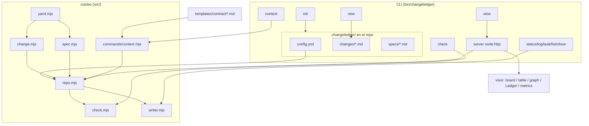

# Arquitectura de ChangeLedger

ChangeLedger separa **almacén** (fuente de verdad, optimizada para agente y git)
de **presentación** (un visor agradable para el humano). Es un CLI global; en
cada repo solo viven los documentos bajo `.changeledger/`.

## Componentes

`bin/changeledger.mjs` define la interfaz de comandos con `commander`, manteniendo
`src/commands/*` como capa de aplicación. La dependencia está fijada en una
línea compatible con Node 20 y el binario conserva el shebang + modo ejecutable,
porque se publica como comando global `changeledger`. El parser rechaza opciones
desconocidas en lugar de ignorarlas silenciosamente.

El binario expone su versión instalada mediante `changeledger --version`, `-v` y
`-V`; el valor se lee del `package.json` distribuido para que una instalación
empaquetada nunca dependa de un literal duplicado.

`.changeledger/config.yml` declara un `schema_version` entero. La ausencia se
interpreta como schema histórico `0`; `check` y `register` lo detectan y ofrecen
`changeledger config migrate --dry-run`, pero nunca migran implícitamente. La
migración explícita construye un candidato con el AST de YAML, actualiza estructura
y comentarios administrados, conserva decisiones y extensiones propias, no mueve
directorios y escribe atómicamente. Repetirla sobre el schema vigente es un no-op
byte-idéntico; un schema más nuevo que el soportado falla cerrado. Las
migraciones son una cadena versionada y aditiva: el schema vigente es `4`. La
migración 1 → 2 añade el tipo `quick` y sus impactos a repos schema 1 sin pisar
un `quick` custom ni extensiones propias (guardas `Object.hasOwn`). La migración
3 → 4 repara el acoplamiento entre `review_required` y las stages verificables:
inserta las stages ausentes, en su posición canónica, sólo en los tipos que
declaran `review_required: true`, y deja byte a byte los demás. Lee el documento
YAML vivo y no la instantánea previa, porque una migración anterior de la misma
cadena puede haber añadido el propio `review_required` que dispara la reparación.
Nunca inserta una stage que la lista canónica del repo no declare: sin punto de
inserción legítimo se abstiene y deja en pie el error exacto de `checkConfig`, en
vez de fabricar una lista inválida y declararse terminada. La misma 3 → 4 añade
además la sección `readiness` cuando falta, copiando valores y comentario de
`templates/config.yml` para que plantilla y migración no puedan divergir, y
dejando intacto —byte a byte— cualquier `readiness` que el repo ya declarara,
incluso malformado: esa clave es del usuario y su diagnóstico pertenece a
`check`. El resumen
de la migración expone la versión de origen real detectada, y CLI y visor
comparten el mismo motor; el cliente del visor lee la versión soportada del
payload del servidor en vez de duplicar la constante. En repos activados
(`20260808-234920`) el candidato de migración se deriva del blob de config de
la ref — nunca del marcador del worktree, que queda byte a byte intacto — y
se aplica como un único commit CAS (`config: migrate`); el preview del visor
lee por la misma costura de autoridad. La ruta inactiva ejecuta exactamente
una operación del store: el probe read-only de la activación, y ninguna otra.
La propiedad del ledger la decide el ancla de `authority.yml`
(`20260810-120457`), nunca heurísticas de ubicación o identidad: el marker
descubierto es propio si y solo si su ruta relativa al top-level de git
coincide exactamente con el `ledger_dir` anclado. Un marker no anclado —
anidado, o declarando cualquier `project_id`, incluso el del propio
snapshot — migra su propio archivo del worktree dejando la ref del host
intacta; el anclado con marker stale sirve la ref, byte a byte intacto el
marker. La decisión vive en una única definición (`resolveOwnedActivation`,
`src/state-store.mjs`) que consumen por igual la lectura de config,
`config migrate` y la costura de contenido.

Toda frontera que escribe en el ledger valida el schema con una precondición
compartida antes de adquirir locks, crear directorios o modificar archivos. Esto
incluye creación y lifecycle de changes, `fix`, graduación, releases y escrituras
del viewer. Un schema futuro produce el mismo diagnóstico accionable en todas
ellas y exige actualizar ChangeLedger antes de escribir. Las lecturas,
`changeledger check`, los previews de migración y `fix --dry-run` permanecen
disponibles para diagnosticar el repositorio sin mutarlo.

El contexto core funciona también como índice operativo mínimo. Antes de escanear
archivos, orienta a consultar trabajo autorizado con `changeledger list --status
approved` y decisiones de cierre pendientes con `changeledger list --pending
graduation`. La orientación es estática: no ejecuta esas consultas ni incorpora
estado efímero al contexto determinista.

## Store del estado global (núcleo local)

`src/state-store.mjs` implementa el núcleo de almacenamiento de la capacidad
acotada por `global-state-scope.md`: el ledger completo como árbol exclusivo
(`.changeledger-state/{manifest.yml, config.yml, changes/, specs/, releases/}`)
en la ref fija `refs/heads/changeledger/state`. Lectura por snapshot sin
checkout (`readSnapshot`, sobre `src/git-batch.mjs`: un `ls-tree` + `cat-file
--batch` por lotes con validación UTF-8 estricta), escritura por
compare-and-swap (`mutateState`: árbol candidato en índice temporal,
`update-ref` con old-value, `LedgerConflictError` en conflicto) e integridad
padre-contra-candidato: ninguna identidad desaparece sin `remove` explícito.
La activación es checkout-independiente — `refs/changeledger/activation`
apunta a un commit cuya `authority.yml` nombra la ref de verdad y el ledger
que la activación posee: `ledger_dir`, la ruta del `.changeledger` relativa
al top-level de git, derivada dentro de `writeActivation` con un walk
fs-only de ancestros (nunca `rev-parse --show-toplevel`, que respondería el
realpath y rompería la comparación exacta). `readActivation` exige el campo:
una activación pre-ancla falla explícito pidiendo re-ejecutar
`changeledger activate`, que la repara — y toda lectura de refs es
fail-closed:
ausencia real devuelve `null`, cualquier fallo de lectura lanza con el stderr
de git; los objetos se verifican por tipo (`assertCommitObject`), nunca por
peel. Los diagnósticos de error son exactos (`20260808-171107`): una ref
ilegible lanza con una sola copia del stderr real de git, nunca el mensaje
wrapper duplicado; un fallo de `update-ref` reporta el fallo primario como
`cause` conservando el estado observado de la ref; y el literal CAS
`state changed since load` tiene una única fuente de producción
(`src/state-store.mjs`) de la que componen bin y visor.

El enrutado de lectura (`20260808-151641`) es un único resolver: la familia
`loadRepo`/`loadRepoWithConfig`/`loadRepoAsync` de `src/repo.mjs`, compartida
por el CLI y por el viewer (`router.mjs` no tiene camino de lectura propio).
Tras descubrir el repo, consulta la activación vía `resolveOwnedActivation`
— solo si `repoRoot` está
dentro de un repo git, decidido subiendo por los ancestros en busca de un
`.git` (archivo o directorio, el mismo descubrimiento que hace git; una
comprobación de filesystem, nunca un subproceso), no solo el directorio exacto
que recibió `loadRepo`: `.changeledger/` puede vivir por debajo del top-level
de git (la misma brecha entre `repoRoot` y la raíz real que ya documentan
`gitTopLevel`/`commit()` en `src/git.mjs`), y comprobar solo el directorio
exacto ocultaba en silencio una activación viva ahí. Sin activación propia —
ausente, o anclada a un `ledger_dir` que no es el descubierto —, el
comportamiento es el de siempre, byte a byte, con `state: null` — y en un
directorio que no está dentro de ningún repo git, cero subprocesos. Con
activación, `changes`, `specs`, `releases` y `config` salen de `readSnapshot`
en lugar del working tree, y el resultado gana `state: { revision }` — la
costura que el CAS de escritura usará como `expectedRevision`. La carga
resuelve la activación y enumera el snapshot exactamente UNA vez
(`20260809-194235`): un bootstrap único sirve config y documentos de la misma
lectura — misma revisión para ambos, 9 subprocesos por carga activada, cero
fuera de un repo git — y `loadRepoWithConfig` acepta ese snapshot con un
contrato tri-estado (ausente = resuélvelo tú; null = inactivo; objeto =
sírvelo) que ningún caller externo puede usar para inyectar un snapshot
obsoleto: la staleness la sigue cazando el CAS porque la revisión reportada
es la del snapshot realmente servido. Una activación
presente cuya ref de estado es ilegible o ausente propaga el error
fail-closed del store; nunca degrada al worktree.

Segunda vía de lectura, misma frontera: `resolveChange` (`src/repo.mjs`)
sigue siendo un escaneo directo del working tree — lo necesitan los
consumidores que mutan (`src/commands/agent.mjs`, `src/commands/graduate.mjs`
y las escrituras del viewer),
porque una mutación necesita una ruta de archivo real para escribir, y esa
ruta pertenece por diseño a `20260808-151643` (el change de escritura).
`resolveChangeInRepo`, en cambio, resuelve el mismo id por búsqueda exacta
pero contra `repo.changes` de un `loadRepo*` ya cargado — hereda la autoridad
bajo la que ese repo se cargó (snapshot si está activado) en lugar de leer
disco de nuevo. `context`/`agent-context` (`src/commands/context.mjs`,
`src/commands/agent-context.mjs`) la usan para sus lecturas por id de change,
dependencia y relación; su captura sin id (modo core o palabra clave) no
necesita ningún documento de change, así que no paga un `loadRepo` completo.
La frontera de config quedó cerrada en `20260809-113242` con un único camino
de autoridad: `loadEffectiveConfig(repoRoot, changeledgerDir)`
(`src/config.mjs`) devuelve el config de la ref cuando el repo está activado
— vía una primitiva focalizada del store (`readStateConfigText`) que valida
el layout completo con las mismas garantías de blob regular y UTF-8 que
`readSnapshot` sin cargar los documentos — y el del worktree cuando no. Todos
los antiguos callers frontera enrutan por él: `register`, el bootstrap de
`check`, las capturas sin id de `context`/`agent-context`, el propio
bootstrap de `loadRepo*`, las lecturas de config del visor y el listado del
registry (que además conserva el nombre cacheado cuando la ruta registrada no
es un directorio utilizable, sin propagar fallos del probe). `loadConfig`
queda como primitiva interna del camino inactivo; `new.mjs` mantiene su gate
propio y `resolveChange` sigue siendo por diseño el camino de mutación sobre
worktree en modo inactivo. La autoridad que este camino devuelve la decide el mismo ancla de propiedad
(ver Componentes): un proyecto anidado sin `.git` propio bajo un repo
activado lee SU config del worktree anidado en toda la superficie de
`loadEffectiveConfig`. La costura de CONTENIDO comparte la decisión —
`loadRepo*` y `change-store` consultan `resolveOwnedActivation` — así que un
ledger no anclado se carga inactivo desde su worktree: `list`/`show`/`new`
desde el anidado operan sobre su propio ledger y las escrituras nunca
aterrizan en la ref del host.

## Costura de escritura del estado global

`src/change-store.mjs` (`20260808-151643`) es el único punto que decide, por
`repo.state`, si una mutación de `.changeledger/**` aterriza en el worktree
(`mutateFileAtomic`/`writeFileAtomic` de siempre) o como commit CAS en la ref
de estado (`mutateState`, con `expectedRevision: repo.state.revision`).
`mutateLedgerFile(repo, target, mutate, { message })` cubre un documento —
`target` es `{ file }` (ruta de worktree) en modo inactivo o `{ relPath,
text }` (ruta relativa al árbol de estado más el texto ya leído a
`repo.state.revision`) en modo activo; `mutate` recibe ese texto y devuelve
el siguiente, o `undefined` para no escribir, el mismo contrato de
`mutateFileAtomic`. `writeLedgerFiles(repo, entries, { message })` cubre
varios documentos como una sola unidad: inactivo, cada entrada se escribe a
su `file` de forma independiente (sin atomicidad cruzada, como siempre);
activo, todas las entradas aterrizan en **un** commit CAS — la costura que
permite a `graduate` en modo activo retirar el rollback manual de dos
escrituras que el modo inactivo todavía conserva.

Cada mutador decide su rama sin depender de un `loadRepo` completo cuando
está inactivo: `repoIsActivated(repoRoot)` es la puerta barata (delega en
`resolveOwnedActivation`, la única definición de propiedad del store),
consultada *antes* de decidir cómo localizar el documento — vía
`resolveChange` tolerante a hermanos rotos si está inactivo, vía
`resolveChangeInRepo` sobre el repo ya cargado si está activo, ya que el
documento puede no existir en disco en absoluto). Los mutadores de
`src/commands/agent.mjs`, `graduate`/`skipGraduation`
(`src/commands/graduate.mjs`, spec+change en un solo commit en modo activo),
`fix` (`src/commands/fix.mjs`, una invocación = un commit), `release.mjs`,
las tres escrituras de config del visor (`src/viewer/domain.mjs`) y la
costura de autoría (`src/commands/edit.mjs` y el `new --from` activado)
enrutan por esta costura sin excepción, y todos propagan el conflicto CAS
sin reintentar. El
conflicto CAS se presenta en `bin/changeledger.mjs` como
`state changed since load — re-run the command`, exit distinto de cero, sin
relabeling del mensaje interno del store (`state ref moved: ...`) — el bin
solo presenta, el store ya garantiza que no hay escritura parcial. Con esto
cierra el gate de la etapa 1: un repo activado opera enteramente contra la
ref en local, tanto en lectura como en escritura.

La autoría de documentos (`20260810-182641`) es la misma costura con
contrato de documento completo: `changeledger edit <change-id|spec:slug>
--from <archivo|->` reemplaza frontmatter y cuerpo de una vez. El documento
entrante se valida íntegro a la severidad del status vigente antes de
escribir — nada inválido aterriza —, `id` y `created` son inmutables, los
campos con comando propio (`status`, `owner`, `branch`, `archived`,
`reviewed`; `graduated_from` en specs) deben coincidir con el vigente y el
rechazo nombra al comando dueño, y un contenido byte-idéntico es no-op sin
commit. En modo activo cada edición es un commit `edit: <id>` /
`edit: spec <name>`; en inactivo, un reemplazo atómico del archivo del
worktree sin ningún commit. `new` en activo nunca publica un scaffold
vacío: exige el documento ya compuesto (`--from`, con el id derivado del
propio documento — por eso el reintento por bump de id no existe) y
`--print` emite el scaffold sin escribir nada. El principio que gobierna la
costura lo fijó el humano: el journal es permanente, así que una entrada es
un evento con significado y un documento aterriza completo — nunca estados
intermedios.

## Adopción del estado global

La adopción (`20260809-113240`) entra por dos comandos sobre las primitivas del
store, sin protocolo de dos fases ni plan intermedio:

`changeledger cutover` (`src/commands/cutover.mjs`) corta de un solo tiro desde
una fuente única y explícita: el commit HEAD de la rama de integración, con el
repo sin activar y el ledger limpio (ni cambios sin commitear bajo
`.changeledger/` ni índice con staged). Valida el snapshot completo con las
reglas de `checkRepo` antes de escribir nada, publica la ref con `initState`,
activa y crea en la rama de integración el commit de limpieza que elimina
`changes/`, `specs/` y `releases/` conservando `config.yml` como marcador de
descubrimiento. El `config.yml` del snapshot se republica byte a byte vía
`mutateState` tras `initState`, porque `initState` serializa el mapping
parseado y perdería comentarios y orden de claves justo cuando la copia de la
ref pasa a ser la autoridad. El commit de limpieza es el marcador del corte:
subject fijo `chore(state): cut the ledger over to the state ref`, trailer
`Changeledger-Cutover-Baseline: <oid>` y cuerpo `ChangeLedger: none — …` (por
eso el lint de markers lo exime sin caso especial); se crea con `--no-verify`.
La idempotencia es por igualdad de contenido (project_id, bytes del config y
mapa path→texto de documentos, equivalente a igualdad de tree sobre este
layout exclusivo de blobs `100644`): re-ejecutar sobre un corte idéntico es
no-op con exit 0 aunque hayan aterrizado commits ordinarios después, y las
dos ventanas de interrupción deterministas se completan re-ejecutando
(`20260809-131004`): un corte publicado y activado al que solo le falta el
commit de limpieza lo crea y termina indistinguible de un corte no
interrumpido — la única exención del requisito de índice vacío, verificada
entrada a entrada por `exactStagedCleanup`, incluyendo contenido ignorado o
sin trackear bajo las colecciones —, y un undo interrumpido entre el commit
de revert y el borrado de refs completa el borrado. La divergencia real y la
media publicación (solo una de las dos refs presente) siguen fallando
explícito y fail-closed, con el mensaje nombrando la ref presente, la ausente
y la salida manual literal.

`changeledger activate` (`src/commands/activate.mjs`) activa clones y
worktrees que ya tienen la ref de estado, sin depender del checkout.
`writeActivation` es CAS desde este change: create con old-value cero, no-op
sobre un estado idéntico, reparación CAS de una activación pre-ancla (mismo
`state_ref` sin `ledger_dir`: se reescribe sobre su oid actual) y rechazo
explícito ante una activación divergente — un `ledger_dir` distinto se
rechaza igual que un `state_ref` divergente —, nunca force-update; devuelve
`{ revision, created, repaired }`. Un `.lock` stale falla con el error real
de git, nunca relabeled como escritura concurrente: la desambiguación del
conflicto compara contra el old-value esperado, la misma disciplina que
`mutateState` e `initState`. La identidad comparada
es el `state_ref` declarado en `authority.yml`, no el oid del commit de
activación — `commit-tree` sella timestamp, así que contenido idéntico
re-deriva a oids distintos y compararlos convertiría cada re-activación en
divergencia. La divergencia lanza `Error` plano, no `LedgerConflictError`: el
consejo "re-run" del bin no arregla una divergencia.

`changeledger cutover --undo` es la única vuelta atrás (no hay `deactivate`
suelto: dejaría un repo activado a medias sirviendo un worktree sin
documentos). Es válido mientras la ref de estado siga apuntando al baseline
registrado en el trailer, no mientras HEAD sea el commit de corte:
`scanCutovers` recorre TODOS los commits alcanzables con el subject exacto
(`--topo-order`, todos los padres — un corte en segundo padre de un merge
sigue siendo el corte de este repo; el `--grep -F` solo prefiltra y decide la
línea de subject), y el corte vivo es el registro cuyo baseline aún sostiene
la ref de estado, con el más reciente por descendencia solo como sustituto de
diagnóstico cuando ninguno concuerda. Un empate entre varios registros con
ese baseline (`20260809-194233` — un re-corte de contenido idéntico en el
mismo segundo lo reproduce sin forjar nada) se desambigua por evidencia de
undo: un registro con un undo COMPLETADO posterior — subject exacto, inverso
real (`isInverseCommit`) y en el linaje first-parent, donde tomó efecto —
está retirado y no compite; si dos o más registros sin esa evidencia empatan,
ambos comandos fallan cerrado nombrándolos. La selección topológica se confía
solo para diagnóstico: la puerta del camino de escritura es
`assertRevertRestoresSnapshot`, que antes de revertir (también en el resume
S1) exige que cada entrada que el revert restauraría exista en el snapshot de
la ref con el MISMO blob y un modo admisible por la regla del propio store
(`assertRegularBlobEntry`; la publicación normaliza a `100644`, así que se
compara admisibilidad, no igualdad — un documento `100755` honesto hace
round-trip) y que los conjuntos de rutas coincidan en ambas direcciones.
Materializar el snapshot publicado de vuelta es la definición del undo:
cualquier decoy — forjado, con undo negado después, o byte-fiel con modo
cambiado — muere en esa comparación, sea cual sea su topología. Un commit con el subject pero sin
trailer se salta con un aviso que nombra su oid (un señuelo escrito a mano no
brickea nada, tampoco el primer corte de un repo nunca cortado); si la
búsqueda se agota sin registro verificable y el repo muestra evidencia de
corte, el error nombra los oids saltados y pide resolverlo a mano — nunca
afirma que nada es alcanzable. El undo revierte ese oid como commit nuevo
encima de HEAD — los commits posteriores al corte no son suyos para
descartar. `findCompletedUndo`, en cambio, busca solo por primer padre —
asimetría deliberada: encontrar el corte es una pregunta de alcanzabilidad,
pero un undo solo está "interrumpido" cuando la rama está parada sobre su
ledger restaurado; un merge que lo descartó (`-s ours`) no restauró nada. Las
refs se borran con old-value observado, worktree primero y refs después: una
interrupción deja un repo activado consistente, nunca uno desactivado sin
documentos, y se completa re-ejecutando. Un conflicto de revert (un commit
posterior tocó las rutas retiradas) aborta limpio y devuelve la decisión al
humano. Un corte deshecho no deja tombstone: sin ninguna de las dos refs el
repo vuelve a ser cortable, y la detección de medio-corte es "exactamente una
ref presente".

`changeledger import --from <ref>` (`src/commands/import.mjs`,
`20260809-113241`) absorbe exactamente una ref por invocación hacia la ref de
estado de un repo activado: la fuente es una rama con layout de worktree
(ramas en vuelo del momento de la migración y rezagados posteriores; nunca
refs en formato de estado). La ref debe resolver a un commit
(`assertCommitObject`, nunca peel) y todos sus documentos se validan con las
reglas de `checkRepo` antes de clasificar nada. La clasificación es por
identidad de contenido (change=id, spec=nombre, release=versión) contra el
snapshot: ausente → alta; byte-idéntico → no-op; para changes, la relación de
prefijo propio entre las entradas del `## Log` ordena las versiones — el
snapshot que extiende al importado es no-op, el importado que extiende al
snapshot es actualización (escrita en el path existente del snapshot aunque
la fuente renombrara el archivo: la identidad es el id, honrar el nombre
publicaría el change dos veces); todo lo demás (mismo Log con cuerpo
distinto, Logs divergentes, specs/releases con contenido distinto) es
conflicto para el humano. Un conflicto cualquiera aborta el import entero sin
escribir (todo-o-nada); sin conflictos, altas y actualizaciones aterrizan en
una única `mutateState` cuyo mensaje registra ref y commit importados, y
re-ejecutar el mismo import es no-op con exit 0. El `config.yml` de la fuente
se ignora — el layout y las reglas los dicta siempre el config del snapshot
(consecuencia asumida: un source que recolocó `changes_dir` no expone sus
documentos al import) — y el reporte distingue "la ref no expone documentos
ChangeLedger" de "todo lo de la fuente ya está publicado". Cuando el propio
`config.yml` del source declara un layout distinto al del snapshot, el
comando avisa por stderr nombrando ambos layouts (`20260809-140157`) sin
tocar el exit 0 ni la ref; un source sin config o con config inparseable no
produce aviso falso, y el help del comando declara que la validación cubre lo
visible bajo el layout del snapshot, no "el source entero".

## API documental del visor

`GET /api/ledger-tree?project=<id>` entrega las categorías documentales como
paths lógicos relativos y formato, nunca paths absolutos. Exige resolución exacta
de un proyecto vivo incluso para fuentes instaladas: un id desconocido responde
`404 {"error":"no project"}` y una entrada registrada cuya ruta desapareció,
`410 {"error":"project path is gone"}`. `Project docs` incluye únicamente los
`README.md`, `AGENTS.md` e `INTENT.md` existentes en la raíz del proyecto;
`Contract`, recursivamente los `.md`, `.yml` y `.yaml` de
`templates/contract/` instalado; `Templates`, esos mismos formatos del resto de
`templates/`, excluyendo todo el subárbol `contract/`. Los ausentes se omiten y
cada colección se ordena léxicamente. Specs conserva su payload y cuerpos en
`/api/repo`; estos endpoints no la duplican.

`GET /api/ledger-document?project=<id>&category=<slug>&path=<lógico>` solo lee
una entrada exacta del árbol allowlisted y responde
`{ category, path, format, content }`, con `format: "markdown"` para `.md` y
`format: "source"` para YAML. Categoría/path vacío o desconocido, path absoluto,
NUL, backslash, segmentos vacíos/`.`/`..`, extensión no permitida, fichero fuera
de allowlist, no regular o escape por symlink fallan cerrado como
`404 {"error":"document not found"}` sin revelar rutas locales. El tamaño se
comprueba antes de leer: más de 1 MiB responde
`413 {"error":"document too large"}`. Ambos endpoints aceptan solo GET; otro
método responde 405 con `Allow: GET`.

La enumeración y lectura resuelven primero contra la raíz lógica de su categoría
y vuelven a comprobar `realpath` de raíz, directorios y fichero. Solo siguen
symlinks cuyo destino real permanece contenido, evitan ciclos de directorios y
omiten escapes; la lectura vuelve a exigir fichero regular y mide mediante el
descriptor abierto. Así el árbol recursivo puede representar subdirectorios sin
convertirse en un explorador genérico del filesystem.

`changeledger search <términos...>` completa ese descubrimiento con búsqueda
léxica determinista sobre changes (incluidos archivados) y specs: scoring
título×3 / headings+CR×2 / cuerpo×1, normalización a minúsculas sin acentos y
desempate estable a igual score — la verdad persistente primero (spec antes que
change) y después ref descendente. Sin embeddings ni servicios externos,
coherente con el núcleo local-first. El contrato de autoría ordena ejecutarla
antes de investigar desde cero para reutilizar decisiones ya registradas.

## Specs de dominio

- [Modelo de datos e identidad](data-model.md)
- [Ciclo de vida y gate de revisión](lifecycle.md)
- [Releases portables](releases.md)
- [Validación (changeledger check)](validation.md)
- [Trazabilidad git](git-traceability.md)
- [Discovery del contrato](contract-discovery.md)
- [Definition of Ready](readiness.md)
- [Política de idioma](language.md)
- [Viewer y presentación](viewer.md)
- [Política de dependencias](dependencies.md)
- [Métricas](metrics.md)
