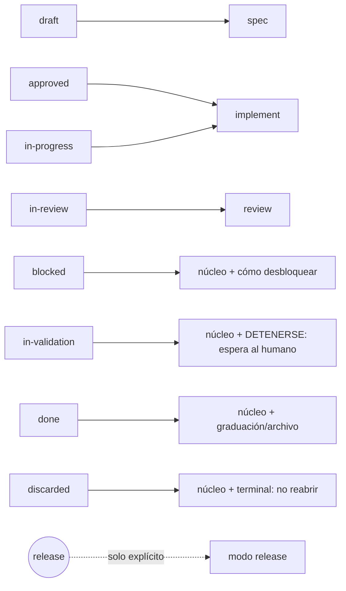

## Request

El contrato (`templates/AGENTS.md`) ha crecido a ~540 líneas / ~30 KB y se carga
**entero** en cada sesión: la referencia de los repos apunta al symlink
`.changeledger/AGENTS.md`, que enlaza el contrato completo. El agente paga el coste
de tokens de todo el documento aunque la tarea solo necesite un trozo, y debe
decidir por sí mismo qué sección aplica. Además el symlink es per-machine y
gitignored: tras un clone/move queda colgando y obliga a `changeledger register`
(fricción ya registrada en uso real).

Objetivo autorizado: **dejar de saturar el contexto del agente desde el inicio** y
**dejar de regar symlinks**, sin perder el descubrimiento de ChangeLedger ni la
fuente única de verdad del workflow.

## Investigation

Estado actual verificado en el código:

- `templates/AGENTS.md`: 540 líneas. Se entrega vía symlink
  `.changeledger/AGENTS.md → templates/AGENTS.md` creado por `linkContract`
  (`src/contract.mjs`); en Windows sin symlinks cae a una **copia** real
  (`writeFileAtomic`). Gitignored por `ensureGitignore`.
- La referencia de descubrimiento (`ensureReference`, marker `<!-- changeledger -->`)
  apunta literalmente a leer `.changeledger/AGENTS.md`.
- `checkContract` (`src/contract.mjs`) exige que el link/copia exista y que el
  marker esté presente; **no** valida que el contenido de la referencia sea el
  vigente (una referencia obsoleta con el marker pasa el check).
- **No existe** comando `context` (verificado: ningún `command('context')`).
- Base reutilizable: `loadRepo`/`resolveChange` (`src/repo.mjs`) cargan el change
  tipado por id; `config.yml` define `statuses`, `types` y `review_required`.

Riesgo central de "borrar el contrato del todo": hoy auto-carga porque el agente
lee `AGENTS.md`/`CLAUDE.md` al arrancar. Si se elimina el documento
siempre-cargado, el flujo depende de que el agente (a) lea la referencia, (b)
elija el modo y (c) ejecute el comando. La **referencia de descubrimiento es la
garantía** y debe permanecer, con bootstrap explícito.

## Proposal

**Dividir, no borrar.** El contrato se parte en fragmentos bajo
`templates/contract/`:

- `core.md` — **núcleo mínimo**: no-negociables + mapa de lifecycle + índice de
  modos + instrucción de pedir más. Único imprescindible siempre.
- `implement.md`, `review.md`, `spec.md`, `release.md` — **packs por tarea**;
  `readiness.md` es un fragmento compartido que se compone en `spec` e
  `implement` sin duplicar Definition of Ready.
- `blocked.md`, `validation.md`, `close.md`, `discarded.md` — **overlays de
  lifecycle** para estados que no deben caer silenciosamente en implementación.

**Fuente única de verdad.** `templates/AGENTS.md` (el monolito) **desaparece**: no
se reemplaza por otro documento canónico paralelo. Los fragmentos de
`templates/contract/` son la única fuente; `changeledger context` los compone.
No queda un segundo documento que pueda divergir.

Nuevo comando determinista `changeledger context`, el **compilador de contexto**:

- `changeledger context` (sin args) → emite el núcleo (`core.md`).
- `changeledger context <change-id>` → infiere el modo por el status del change y
  emite núcleo + pack + **el contenido relevante del change** (Request,
  Investigation, Proposal, Specification con sus `CRn` completos, y Plan con sus
  tareas; Log cuando existe) — no solo ids: el agente necesita el razonamiento,
  los criterios, el plan y las decisiones de ejecución para trabajar sin
  re-derivar.
- `changeledger context <mode>` → modo explícito (`implement|review|spec|release`),
  sin un change concreto.

Mapeo status → modo (afinado):

`release` **no** se infiere de ningún status: es una operación, solo accesible por
modo explícito. `blocked` no emite `implement` directo (emite cómo desbloquear);
`in-validation` emite instrucción explícita de detenerse; `done` emite el contexto
de cierre (graduación/archivo), y `discarded` deja explícito que es terminal. Las
guías salen de sus overlays empaquetados, no de strings duplicados en el comando.

**Retiro total del symlink.** `init`/`register` dejan de crear
`.changeledger/AGENTS.md` (symlink **o** copia Windows) y de añadir la entrada a
`.gitignore`. La referencia de descubrimiento **permanece** en `AGENTS.md`/
`CLAUDE.md`, reescrita a la forma `context` con **bootstrap**: ordena ejecutar
`changeledger context` antes de actuar. Si el CLI no está disponible, el bootstrap
falla cerrado: no autoriza crear ni modificar artefactos y pide restaurar/instalar
ChangeLedger. No remite a una ruta interna del paquete que el agente quizá no
pueda localizar. `register` migra repos viejos: elimina el symlink; elimina una
copia regular solo si se reconoce como contrato legacy administrado por la
herramienta (si no, falla sin borrar); limpia la entrada exacta de `.gitignore` y
reescribe la referencia. `check` deja de exigir el link pero sigue exigiendo la
referencia **y** detecta una referencia obsoleta (forma vieja que apunta a
`.changeledger/AGENTS.md`), no solo la presencia del marker.

**Presupuesto de contexto.** El núcleo (`context` sin args) tiene un tope de
tamaño medible en líneas **y bytes UTF-8** para garantizar la reducción real
frente al monolito de 540 líneas / ~30 KB y evitar que líneas artificialmente
largas falseen el límite.

**Límite de la curación determinista.** Esta primera versión compone reglas + el
change seleccionado. No intenta adivinar qué specs o decisiones son
semánticamente relevantes: los enlaces explícitos que ya estén en el change se
conservan en la salida. Inferir relevancia sin relaciones explícitas reintroduciría
heurística/IA y queda fuera de alcance hasta que exista un caso real y metadata
determinista que lo soporte.

**Alternativas descartadas:**

- *Borrar el contrato entero*: rompe el descubrimiento. Rechazada.
- *Solo recortar a un único dump*: no escala, vuelve a crecer. Rechazada.
- *Solo modo explícito*: traslada al agente la carga de elegir modo. Se conserva
  como vía secundaria; la inferencia por lifecycle es la principal.

## Specification

### CR1 — `context` sin args emite el núcleo
- **Given** un repo ChangeLedger inicializado
- **When** ejecuto `changeledger context`
- **Then** stdout incluye los principios no-negociables, el mapa de lifecycle y la
  lista de modos `implement, review, spec, release`
- **And** el código de salida es `0`

### CR2 — `context <id>` incluye el contenido relevante del change
- **Given** un change con `status: in-progress` con Specification (CR1, CR2) y Plan
- **When** ejecuto `changeledger context <id>`
- **Then** stdout incluye `Mode: implement`, el pack `implement`, y el contenido
  del change: Request, Investigation, Proposal, su Specification con los `CRn`
  **completos** (texto Given/When/Then, no solo los ids) y su Plan con las tareas

### CR3 — modo explícito sin change
- **Given** un repo ChangeLedger inicializado
- **When** ejecuto `changeledger context review`
- **Then** stdout incluye `Mode: review` y el pack `review`; exit `0` sin requerir id

### CR4 — argumento desconocido falla claro
- **Given** un repo ChangeLedger inicializado
- **When** ejecuto `changeledger context bogus`
- **Then** exit `1` y stderr contiene literalmente
  `Unknown context "bogus" — valid modes: implement, review, spec, release (or pass a change id)`

### CR5 — salida determinista
- **Given** el mismo estado del repo
- **When** ejecuto `changeledger context implement` dos veces
- **Then** ambas salidas son byte-idénticas

### CR6 — los packs derivan de los fragmentos (fuente única)
- **Given** el fragmento de Definition of Ready vive en `templates/contract/`
- **When** ejecuto `changeledger context implement`
- **Then** stdout contiene ese texto proveniente del fragmento (no una copia)

### CR7 — presupuesto de contexto del núcleo
- **Given** un repo ChangeLedger inicializado
- **When** ejecuto `changeledger context` (sin args)
- **Then** la salida del núcleo no excede 120 líneas ni 8192 bytes UTF-8 (el
  monolito tenía 540 líneas / ~30 KB), garantizando una reducción medible

### CR8 — mapeo completo de lifecycle
- **Given** changes `blocked`, `in-validation`, `done` y `discarded`
- **When** ejecuto `changeledger context <id>` sobre cada uno
- **Then** `blocked` emite el overlay de desbloqueo, **no** el pack `implement`
- **And** `in-validation` ordena detenerse y esperar la validación humana
- **And** `done` emite el overlay de graduación/archivo y `discarded` indica que
  es terminal y no se reabre

### CR9 — `release` solo por modo explícito
- **Given** un change en cualquier status
- **When** ejecuto `changeledger context <id>`
- **Then** la salida nunca selecciona el modo `release` por inferencia; `release`
  solo se obtiene con `changeledger context release`

### CR10 — `init` no crea link ni entrada gitignore, y deja bootstrap
- **Given** un repo nuevo con `AGENTS.md`
- **When** ejecuto `changeledger init`
- **Then** `.changeledger/AGENTS.md` no existe y `.gitignore` no contiene esa línea
- **And** `AGENTS.md` contiene el bloque `<!-- changeledger -->` que ordena ejecutar
  `changeledger context` antes de actuar y, si el CLI falta, detiene las
  modificaciones hasta restaurarlo
- **And** ese bloque no menciona `.changeledger/AGENTS.md`

### CR11 — `register` migra artefactos legacy sin borrar archivos ajenos
- **Given** un repo con `.changeledger/AGENTS.md` (symlink **o** copia regular), la
  línea en `.gitignore` y la referencia antigua
- **When** ejecuto `changeledger register`
- **Then** `.changeledger/AGENTS.md` ya no existe cuando es un symlink o una copia
  reconocible del contrato legacy
- **And** `.gitignore` ya no contiene esa línea
- **And** la referencia queda reescrita a la forma `changeledger context`
- **And** una copia regular no reconocible no se elimina y la migración falla con
  un mensaje accionable

### CR12 — `check` exige referencia vigente, no solo el marker
- **Given** un repo sin `.changeledger/AGENTS.md` y con una referencia válida y
  vigente en `AGENTS.md`
- **When** ejecuto `changeledger check`
- **Then** no reporta error sobre link/contrato faltante
- **And** si la referencia falta, reporta
  `AGENTS.md has no ChangeLedger reference — run \`changeledger register\``
- **And** si la referencia existe pero es la forma **obsoleta** (apunta a
  `.changeledger/AGENTS.md`), `check` la reporta como desactualizada

### CR13 — superficies públicas y código no conservan el modelo del symlink
- **Given** la migración al contexto dinámico implementada
- **When** busco referencias operativas a `templates/AGENTS.md`, `agentsTemplate`
  o al symlink `.changeledger/AGENTS.md`
- **Then** README, ayuda, código y tests describen el bootstrap por `context`; las
  únicas menciones antiguas permitidas son fixtures de migración explícitas

## Plan

- [x] Crear los fragmentos del contrato en `templates/contract/` (`core.md`, packs `implement`/`review`/`spec`/`release`, `readiness.md` compartido y overlays `blocked`/`validation`/`close`/`discarded`) extraídos de `templates/AGENTS.md`, con el núcleo dentro del presupuesto; verify: `node --test test/context.test.mjs` (CR1, CR6, CR7, CR8) — 2026-06-28T01:17:02Z
- [x] Implementar `src/commands/context.mjs` que componga núcleo + pack de forma determinista; verify: `node --test test/context.test.mjs` (CR1, CR3, CR5, CR6) — 2026-06-28T01:17:02Z
- [x] Añadir en `src/commands/context.mjs` la resolución de change id (vía `resolveChange` en `src/repo.mjs`), la inferencia status→modo/overlay para todos los estados y release explícito, y la inclusión del contenido relevante del change sin inferir specs relacionadas; verify: `node --test test/context.test.mjs` (CR2, CR8, CR9) — 2026-06-28T01:17:02Z
- [x] Manejar el argumento desconocido en `src/commands/context.mjs` con el mensaje literal y exit 1; verify: `node --test test/context.test.mjs` (CR4) — 2026-06-28T01:17:02Z
- [x] Registrar el comando `context` en `bin/changeledger.mjs` con USAGE y help; verify: `node --test test/cli-bin.test.mjs` (CR1, CR3) — 2026-06-28T01:17:02Z
- [x] Retirar `linkContract` y `ensureGitignore` de `src/contract.mjs` y reescribir `REFERENCE` con bootstrap fail-closed apuntando a `changeledger context`; verify: `node --test test/contract.test.mjs` (CR10) — 2026-06-28T01:17:02Z
- [x] Actualizar `src/commands/init.mjs` para no enlazar ni tocar `.gitignore`; verify: `node --test test/contract.test.mjs` (CR10) — 2026-06-28T01:17:02Z
- [x] Implementar la migración segura en `src/commands/register.mjs`: eliminar symlink o copia legacy reconocible, preservar y rechazar copias desconocidas, limpiar la entrada exacta de `.gitignore` y reescribir la referencia; verify: `node --test test/contract.test.mjs` (CR11) — 2026-06-28T01:17:03Z
- [x] Ajustar `checkContract` en `src/contract.mjs`: no exigir link, exigir referencia y detectar la forma obsoleta; verify: `node --test test/check.test.mjs` (CR12) — 2026-06-28T01:17:03Z
- [x] Eliminar `templates/AGENTS.md` y `agentsTemplate` de `src/paths.mjs` una vez los fragmentos lo cubren, y migrar `README.md`, ayuda y tests para que no quede documentación operativa del modelo anterior salvo fixtures explícitas de migración; verify: `node --test test/contract.test.mjs test/cli-bin.test.mjs` (CR6, CR13) — 2026-06-28T01:17:03Z
- [x] Auto-aplicar al propio repo: borrar el symlink/copia `.changeledger/AGENTS.md`, quitar su línea de `.gitignore`, reescribir la referencia en `AGENTS.md` y `CLAUDE.md`; verify: `node bin/changeledger.mjs check` (support) — 2026-06-28T01:17:03Z

## Log

- **2026-06-28T01:15:43Z** — La extracción preserva Definition of Ready como `readiness.md` único y lo compone tanto en `spec` como en `implement`; evita duplicar la misma norma entre packs para satisfacer CR6.
- **2026-06-28T01:00:50Z** — status: draft → approved
- **2026-06-28T01:06:08Z** — status: approved → in-progress
- **2026-06-28T01:06:08Z** — owner → Roberto Ruiz (auto)
- **2026-06-28T01:17:03Z** — Implementation complete: dynamic context, safe legacy migration, public docs and self-registration verified; pnpm verify passed with 413 tests
- **2026-06-28T01:17:03Z** — status: in-progress → in-review
- **2026-06-28T01:40:20Z** — review → in-progress (retry): CR11 legacy-copy recognition can delete an unrelated regular file sharing the historical heading; use exact known-content hashes and remove only the literal gitignore entry
- **2026-06-28T01:41:24Z** — Review correction: regular legacy copies now require an exact SHA-256 match against historical shipped contracts; similarly named files fail closed, and gitignore cleanup removes only the literal entry
- **2026-06-28T01:41:29Z** — status: in-progress → in-review
- **2026-06-28T01:43:31Z** — review → in-validation (delegated subagent, clean context)
- **2026-06-28T01:45:18Z** — validation → done (human accepted)
- **2026-06-28T01:46:07Z** — graduado a spec `contract-discovery.md`
- **2026-06-28T01:46:07Z** — graduado a spec `language.md`
- **2026-06-28T01:46:07Z** — graduado a spec `architecture.md`
- **2026-06-28T01:46:50Z** — archived
