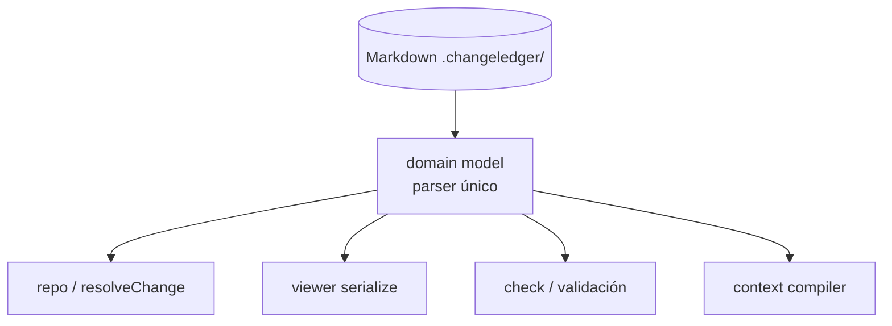

## Request

Hoy el parseo y la representación de los documentos de ChangeLedger están
repartidos en tres lectores que evolucionan por separado y pueden divergir:

- `src/repo.mjs` — carga el repo y resuelve un change por id (`loadRepo`,
  `resolveChange`).
- `src/viewer/domain.mjs` — serializa el repo a la forma que consume el viewer.
- `src/check.mjs` — vuelve a recorrer los mismos campos para validar.

Cada uno conoce la forma de un change/spec por su cuenta. Un cambio de formato
(un campo nuevo, una regla de frontmatter) obliga a tocar varios sitios y arriesga
que la validación, el viewer y el CLI vean modelos distintos del mismo archivo.

Esto es **deuda señalada, no urgente**: no hay un consumidor bloqueado. Se crea
ahora para atenderla deliberadamente cuando vuelva a costar, no para construirla
de inmediato. Cualquier comando nuevo que parsee changes (p. ej. el compilador de
contexto de [[20260627-205033]]) debería apoyarse en este modelo único una vez
exista.

## Proposal

Un **domain model** único: un módulo que parsea Markdown → objetos tipados
(`Change`, `Spec`, `Task`, `Release`) y es la **única** autoridad de forma. El
resto pasa a consumirlo:

- Markdown sigue siendo el almacenamiento; el domain model es el runtime.
- Ningún subsistema vuelve a parsear Markdown por su cuenta.
- Refactor sin cambio de comportamiento observable: la salida de `check`, del
  viewer y de los comandos debe mantenerse igual; los tests existentes son la red
  de no-regresión.

Alcance acotado: consolidar los tres lectores actuales. **Fuera de alcance**
(no se añade aquí, sería expansión especulativa): sistema de `query` genérico,
comando `doctor`, grafo de conocimiento (`blocks`/`replaces`), integraciones
REST/MCP/IDE. Cada uno se evalúa por separado contra el presupuesto de
complejidad si aparece un consumidor real.

## Plan

- [ ] Extraer un módulo de domain model que parsee change/spec a objetos tipados, reutilizando lo que hoy hacen `src/change.mjs`/`src/spec.mjs`; verify: `node --test test/change.test.mjs test/spec.test.mjs` (support)
- [ ] Reescribir `src/repo.mjs` (`loadRepo`/`resolveChange`) sobre el domain model sin cambiar su salida; verify: `node --test test/repo.test.mjs` (support)
- [ ] Reescribir `src/viewer/domain.mjs` (`serialize`) para consumir el domain model; verify: `node --test test/view.test.mjs test/viewer-metadata.test.mjs` (support)
- [ ] Reescribir `src/check.mjs` para validar sobre el domain model en vez de re-recorrer frontmatter; verify: `node --test test/check.test.mjs` (support)
- [ ] Verificar no-regresión global de la suite y el gate; verify: `pnpm verify` (support)

## Log
- **2026-06-28T00:47:48Z** — status: draft → discarded: diagnóstico incorrecto verificado contra el código: no hay tres parsers. check.mjs (checkRepo) y viewer/domain.mjs (serialize) consumen objetos YA parseados por repo.mjs vía change.mjs/spec.mjs; recorrer campos para validar/serializar no es parsear. El domain model funcional ya existe. Refactor transversal sin evidencia
