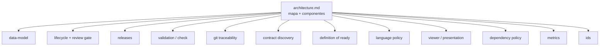

## Request

`.changeledger/specs/architecture.md` es un único documento de ~528 líneas con 14
secciones de dominio, sobre el que han graduado 58 changes. Es la verdad
persistente del proyecto, pero crece como un monolito: el mismo patrón que aqueja
al contrato. Un muro de 528 líneas es difícil de consultar, de graduar contra él
sin colisiones, y de cargar parcialmente.

Objetivo autorizado: partir la verdad persistente en specs por dominio (espejo de
los módulos), para que cada dominio sea consultable y graduable por separado, y
para que el saneamiento de la cola de graduación caiga en una estructura ordenada
en vez de engordar el monolito.

Es saneamiento de la verdad persistente, primer paso antes de cerrar la deuda de
graduación.

## Proposal

Un spec por dominio coherente, espejo de los módulos del código. Las 14 secciones
actuales se reparten así (un archivo por dominio, `architecture.md` queda como
mapa de alto nivel que enlaza al resto):

Reparto de las secciones actuales:

| Sección actual | Spec destino |
|---|---|
| Componentes (mapa de alto nivel) | `architecture.md` (reducido) |
| Modelo de datos + Identidad | `data-model.md` |
| Ciclo de vida y gate de revisión | `lifecycle.md` |
| Releases portables (solo release init/plan/record) | `releases.md` |
| Validación (`changeledger check`) | `validation.md` |
| Trazabilidad git | `git-traceability.md` |
| Discovery del contrato | `contract-discovery.md` |
| Definition of Ready (tdd) | `readiness.md` |
| Política de idioma | `language.md` |
| Presentación | `viewer.md` |
| Política de dependencias | `dependencies.md` |
| Métricas | `metrics.md` |

La sección `## Releases portables` del monolito mezclaba contenido no-release
(deuda preexistente): graduación, escritura atómica, `depends_on` cross-proyecto,
Log/owner e intención/ejecución. Se reparte temáticamente, no por encabezado:
release init/plan/record → `releases.md`; graduación + Log/owner +
intención/ejecución → `lifecycle.md`; escritura atómica + `depends_on`
cross-proyecto → `data-model.md`.

Reglas de la partición:

- **Sin pérdida de contenido**: cada línea del monolito termina en exactamente un
  spec destino. `architecture.md` conserva solo el mapa de componentes y enlaces.
- **Trazabilidad de graduación por dominio**: los 35 markers `> Graduado del change
  X (tema)` se distribuyen al spec del dominio de su tema (cada id en exactamente
  un spec); `architecture.md` conserva solo los de arquitectura general (parser
  CLI, migración integral).
- **Sin cambio de verdad**: es reorganización, no reescritura de lo que el sistema
  hace. Si al partir se detecta contenido obsoleto, se anota pero no se corrige
  aquí (sería otro concern).
- Cada spec lleva el frontmatter mínimo (`title`, `updated`, `tags`).
- Dos secciones quedarán reescritas pronto por otros changes ([[20260627-205033]]
  reescribe Discovery del contrato; [[20260627-210011]] reescribe Validación);
  partir ahora les da un archivo destino limpio donde graduar.

Alcance: solo repartir el contenido existente. **Fuera de alcance**: corregir
contenido obsoleto, añadir specs de dominios no presentes hoy, o tocar el código.

## Plan

- [x] Crear los specs por dominio en `.changeledger/specs/` repartiendo las 14 secciones según la tabla, con frontmatter mínimo; verify: `node bin/changeledger.mjs check` (support) — 2026-06-27T21:31:33Z
- [x] Reducir `.changeledger/specs/architecture.md` al mapa de componentes con enlaces a cada spec de dominio; verify: `node bin/changeledger.mjs check` (support) — 2026-06-27T21:31:33Z
- [x] Verificar que ninguna línea de contenido del monolito se perdió en el reparto (diff de cobertura sección→archivo); verify: `node bin/changeledger.mjs check` (support) — 2026-06-27T21:31:33Z
- [x] Distribuir los 35 markers de graduación al spec de su dominio (cada id 1 vez); verify: `node bin/changeledger.mjs check` (support) — 2026-06-27T21:53:42Z

## Log
</content>
- **2026-06-27T21:22:50Z** — status: draft → approved
- **2026-06-27T21:25:08Z** — status: approved → in-progress
- **2026-06-27T21:25:08Z** — owner → raruiz-hiberuscom (auto)
- **2026-06-27T21:31:33Z** — status: in-progress → in-review
- **2026-06-27T21:34:56Z** — review → in-progress (retry): releases.md heredó contenido no-release (graduación, escritura atómica, depends_on cross-project) que en el monolito estaba mal ubicado bajo '## Releases portables'. Repartir temáticamente: graduación→lifecycle.md, persistencia+depends_on cross-project→data-model.md; releases.md queda solo con release init/plan/record.
- **2026-06-27T21:37:40Z** — status: in-progress → in-review
- **2026-06-27T21:39:24Z** — review → in-validation (delegated subagent, clean context)
- **2026-06-27T21:50:01Z** — status: in-validation → in-progress
- **2026-06-27T21:50:02Z** — validación rechazada (humano, vía CLI autorizado): los 37 markers 'Graduado del change' quedaron todos en architecture.md; deben distribuirse al spec del dominio de cada tema
- **2026-06-27T21:53:42Z** — status: in-progress → in-review
- **2026-06-27T21:55:50Z** — review → in-validation (delegated subagent, clean context)
