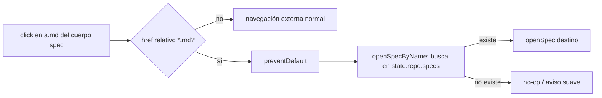

## Request

Tras partir la verdad persistente en specs por dominio ([[20260627-212133]]),
`architecture.md` y otros specs enlazan entre sí con markdown relativo, p. ej.
`[Modelo de datos](data-model.md)`. En el viewer esos enlaces **no funcionan**:
al hacer click se intenta una navegación nativa del navegador a una ruta relativa
inexistente (404). El comportamiento esperado es el mismo que al hacer click en
una dependencia de un change: que abra el spec referenciado dentro del viewer.

Objetivo autorizado: que un enlace markdown entre specs abra el spec destino en el
viewer, reusando el patrón de navegación de dependencias.

## Investigation

Diagnóstico del código (verificado):

- El cuerpo del spec se renderiza así: `app.openSpec(s)` →
  `view-parts.specBody(body)` → `templates.markdownHtml()` →
  `security.safeHtml()` = `marked.parse()` + `DOMPurify.sanitize(html, { FORBID_TAGS: ['style'] })`.
- `marked` convierte `[texto](data-model.md)` en `<a href="data-model.md">texto</a>`
  y DOMPurify **permite** `<a>` (solo prohíbe `style`). El enlace se renderiza,
  pero **no hay handler** que intercepte el click → navegación nativa rota.
- Las dependencias sí navegan porque tienen handler explícito: en `app.openDetail`
  (`src/viewer/public/app.js` ~L387-399) cada pill `data-dep` recibe
  `el.onclick = () => openDetail(el.dataset.dep)`.
- Para changes existe `openDetail(id)` (busca en `state.repo.changes`). Para specs
  existe `openSpec(specObject)` pero **no** una función que abra un spec por su
  nombre de archivo; `renderSpecs` llama `openSpec(specs[i])` con el objeto.
- `state.repo.specs` expone `name` por spec (de `viewer/domain.serialize`).

Brecha: falta (a) una función "abrir spec por nombre" y (b) delegación de eventos
sobre los `<a>` del cuerpo del spec que resuelva el href al spec destino.

## Proposal

Reusar el patrón de dependencias para enlaces internos de spec:

1. **`openSpecByName(name)`** en `app.js`: normaliza el href (quita `./` y la
   extensión `.md`), busca el spec en `state.repo.specs` por `name`, y delega en
   `openSpec(found)`. Si no existe, no rompe (no-op silencioso o aviso suave).
2. **Delegación de eventos** sobre el contenedor del cuerpo del spec: un listener
   de click que detecte `<a>` con href **relativo a un spec** (`*.md` sin esquema
   `http(s):`/`mailto:` ni `/` inicial), haga `preventDefault()` y llame
   `openSpecByName(href)`. Los enlaces externos (`http…`) se dejan pasar tal cual.

No se cambia el renderizado ni el sanitizado (los `<a>` ya sobreviven). No se toca
la fuente de verdad; es solo navegación en la capa de presentación.

**Fuera de alcance**: enlaces a anclas dentro de un spec (`#seccion`), enlaces de
spec a change, y deep-linking por URL. Si se quieren, serán changes aparte.

## Specification

### CR1 — click en enlace interno abre el spec destino
- **Given** el viewer muestra `architecture.md`, cuyo cuerpo contiene
  `<a href="data-model.md">Modelo de datos</a>`, y existe un spec con
  `name: "data-model"`
- **When** el usuario hace click en ese enlace
- **Then** se previene la navegación nativa y el viewer muestra el spec
  `data-model` (se invoca la apertura del spec destino)

### CR2 — enlace a spec inexistente no rompe
- **Given** el cuerpo de un spec contiene `<a href="no-existe.md">x</a>` y no hay
  spec con `name: "no-existe"`
- **When** el usuario hace click
- **Then** se previene la navegación nativa y el viewer no cambia de spec ni lanza
  una excepción no controlada

### CR3 — enlace externo no se intercepta
- **Given** el cuerpo de un spec contiene
  `<a href="https://example.com">ext</a>`
- **When** el usuario hace click
- **Then** el handler no llama `openSpecByName` ni `preventDefault`: la navegación
  externa sigue su curso normal

### CR4 — normalización del href
- **Given** un enlace `<a href="./lifecycle.md">x</a>`
- **When** el usuario hace click
- **Then** `openSpecByName` resuelve al spec con `name: "lifecycle"` (se ignora el
  prefijo `./` y la extensión `.md`)

## Plan

- [ ] Añadir `openSpecByName(name)` en `src/viewer/public/app.js` que normalice el href (quita `./` y `.md`) y abra el spec de `state.repo.specs`; verify: `node --test test/view.test.mjs` (CR1, CR4)
- [ ] Añadir en `src/viewer/public/app.js` la delegación de click sobre el contenedor del cuerpo del spec que intercepte solo enlaces relativos `*.md` y deje pasar los externos; verify: `node --test test/view.test.mjs` (CR1, CR2, CR3)
- [ ] Cubrir en `src/viewer/public/app.js` el caso de spec inexistente sin excepción (no-op); verify: `node --test test/view.test.mjs` (CR2)

## Log
- **2026-06-27T21:58:59Z** — status: draft → approved
