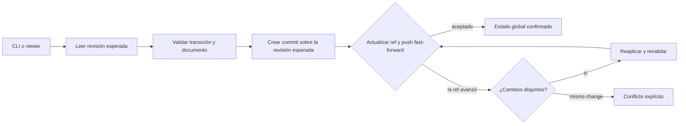

## Request

Los changes viven actualmente en la rama de trabajo que los creó. Esto conserva
una trazabilidad estrecha con la implementación, pero impide disponer de una
vista compartida y vigente del proyecto: el CLI y el viewer solo encuentran los
changes presentes en el worktree actual.

Se necesita un estado global por proyecto que siga siendo local-first, portable
y auditable con Git. La solución no debe depender de Jira, una base de datos o
un servicio central, ni permitir que la sincronización o los conflictos oculten
decisiones humanas.

Al compartir el estado también se debe impedir que dos responsables implementen
el mismo change por desconocimiento. La aprobación reservará el trabajo para un
owner explícito, y las ramas de implementación seguirán un formato configurable
derivado del change.

## Investigation

`loadRepo`, `loadRepoAsync`, `resolveChange`, las consultas y las mutaciones del
viewer parten de `.changeledger/config.yml` y leen los Markdown del filesystem
actual. Las operaciones de lifecycle reutilizan esa misma resolución y escriben
con mutación atómica local. Por tanto, agregar ramas únicamente en la interfaz
dejaría dos autoridades: una vista global de solo lectura y comandos que siguen
modificando la copia de la rama actual.

Git ya aporta las propiedades esenciales para un almacén compartido pequeño:
historial inmutable, identidad de autor, operación compare-and-swap sobre refs,
replicación y trabajo offline. Una rama dedicada dentro del mismo repositorio
mantiene además los permisos, la portabilidad y el ownership del proyecto. El
límite deliberado es que una escritura se vuelve global después de un push
aceptado; ChangeLedger no promete colaboración subsegundo ni visibilidad de
ediciones sin publicar.

La propuesta se relaciona con `20260613-222918`, que introdujo los vínculos entre
changes y Git, y con `20260711-210115`, que declaró la rama de integración. Ambos
están terminados y aportan contexto, pero no son prerrequisitos de ejecución.
También reemplaza deliberadamente la autoasignación tardía de
`20260614-124047`: asignar owner al entrar en `in-progress` es demasiado tarde
cuando `approved` ya representa trabajo disponible y compartido. El soporte de
owner introducido por `20260613-222912` se mantiene como base del modelo.
La migración de configuración de `20260628-113219` aporta preview y aplicación
controlada, pero el cutover del almacén necesita además coordinar refs, clientes
antiguos y documentos distribuidos entre ramas.

Alternativas descartadas:

- **Seguir agregando las ramas de trabajo:** permite consultar más copias, pero
  no determina cuál es vigente ni evita transiciones concurrentes divergentes.
- **Repositorio independiente por proyecto:** conserva Git, pero duplica
  repositorios, permisos, bootstrap y recuperación sin aportar una propiedad que
  no pueda ofrecer una ref del repositorio original.
- **Repositorio único para todos los proyectos:** simplifica un dashboard
  organizacional a costa de centralizar disponibilidad, esquema y permisos. Una
  vista multiproyecto puede agregarse después sin convertirla en autoridad.
- **Base de datos o servicio remoto:** mejora el tiempo real, pero hace que
  autenticación, red y operación cloud formen parte obligatoria del core.
- **Worktree permanente visible:** es sencillo de implementar, pero expone al
  usuario un checkout que puede modificarse, borrarse o quedar en una revisión
  distinta. El acceso por objetos y refs de Git evita esa superficie adicional.

## Proposal

Cada proyecto podrá habilitar explícitamente un almacén en la rama protegible
`changeledger/state`. Esta rama será una autoridad operativa independiente: no
se fusiona con `dev`, `main` ni con las ramas de implementación. Su árbol tendrá
solo un manifiesto versionado y los documentos del ledger; el código y la verdad
persistente graduada continúan en las ramas normales.

```text
refs/heads/changeledger/state
└── .changeledger-state/
    ├── manifest.yml
    └── changes/
        └── <id>-<slug>.md
```

El manifiesto fija al menos la versión del formato, `project_id` y la rama de
integración que proporciona la configuración canónica. ChangeLedger interpreta
el estado con la configuración publicada en esa rama de integración, no con una
configuración todavía aislada en la rama de trabajo del invocador.

La transición `draft → approved` exigirá un owner no vacío. La operación podrá
usar el owner ya declarado en el draft o recibirlo explícitamente al aprobar, en
cuyo caso asignación y aprobación se guardarán en el mismo commit de estado. No
se inferirá el owner a partir de la identidad del aprobador: aprobar y ejecutar
son responsabilidades diferentes.

Desde `approved` y mientras el trabajo no llegue a una decisión human-owned,
solo la identidad que coincide con `owner` podrá iniciar la implementación,
actualizar tareas o registrar las transiciones agent-owned de ese change. Las
acciones human-owned conservan su autoridad propia. Un actor diferente no podrá
autoasignarse: la transferencia de ownership será una operación explícita y
auditada, autorizada por el owner vigente o por una decisión humana de override.
La transferencia no reescribe eventos anteriores ni implica por sí sola una
transición de estado.

El chequeo de identidad del CLI es una protección de coordinación, no una
frontera de seguridad: una identidad local de Git puede configurarse. Cuando se
requiera enforcement fuerte, la validación server-side comparará el actor
autenticado por el remoto con el owner y comprobará que cualquier transferencia
cumpla la misma regla. Si el servidor no expone una identidad verificable,
ChangeLedger informará que la exclusividad no está reforzada remotamente en vez
de prometer una garantía inexistente.

La configuración Git incorporará un formato de rama de implementación:

```yaml
schema_version: 4

git:
  integration_branch: dev
  change_branch_format: "{type}/{id}"
```

El valor por defecto será `{type}/{id}`. La primera versión admitirá únicamente
los placeholders `{type}` y `{id}`, exigirá que `{id}` aparezca exactamente una
vez y permitirá texto literal para prefijos como `changes/{type}/{id}`. Campos
mutables como owner o title no participarán en el nombre, evitando renombrar la
rama cuando cambie la asignación. Placeholders desconocidos y nombres que no
pasen `git check-ref-format --branch` fallarán de forma explícita.

El schema 4 admitirá además los campos de activación, ausentes mientras el
repositorio conserve el almacenamiento legacy:

```yaml
git:
  integration_branch: dev
  change_branch_format: "{type}/{id}"
  state_branch: changeledger/state
  state_baseline: <commit-sha>
```

`config migrate` compondrá las migraciones anteriores hasta `3 → 4`, preservará
comentarios y claves custom, y añadirá `git.change_branch_format` solo cuando no
exista. No añadirá `state_branch` ni `state_baseline`, porque su presencia activa
el nuevo origen de verdad y requiere que la importación ya esté validada.
`state init` exigirá schema 4 y creará únicamente la candidata; `state activate`
escribirá ambos campos en la rama de integración como parte del cutover. Los dos
campos serán atómicos: configurar solo uno será inválido.

Las lecturas usarán los objetos de Git sin checkout. Las escrituras construirán
un nuevo árbol y commit cuyo padre sea la revisión observada, actualizarán la ref
local mediante compare-and-swap y publicarán únicamente un avance fast-forward.
No se usará force-push ni se reescribirá historia publicada.



La unidad de concurrencia será el documento de change. Si dos actores parten de
la misma revisión y modifican archivos diferentes, ChangeLedger podrá reaplicar
automáticamente la operación sobre el nuevo head. Si modifican el mismo change,
la segunda operación fallará mostrando la revisión esperada y la vigente; nunca
resolverá por timestamp ni mediante última escritura gana.

El commit del estado conservará autor, committer, change afectado y operación.
Los commits de implementación seguirán usando `[#<id>]`. Las operaciones de
revisión, validación, graduación y cierre registrarán también las revisiones de
código relevantes, de modo que separar físicamente el ledger no rompa la cadena
verificable entre aprobación, implementación y aceptación.

Al iniciar un change aprobado, ChangeLedger calculará el nombre esperado desde
su type e id y verificará que la rama parta de la rama de integración declarada.
Una rama con otro nombre no otorgará ownership ni permitirá iniciar el change;
el control de autorización depende del owner y el formato es una invariante de
trazabilidad, no un mecanismo de seguridad.

El formato se exigirá al iniciar trabajo nuevo después de activar esta
capacidad. Un change ya `in-progress` conservará su rama registrada aunque no
coincida con el patrón; ChangeLedger la mostrará como legado y no intentará
renombrarla. La previsualización de migración señalará además drafts o approved
sin owner antes de importar el estado.

Una operación offline puede producir un commit local pendiente, pero no se
presentará como estado global confirmado hasta publicarlo. Mientras exista una
escritura pendiente, el CLI y el viewer mostrarán esa condición y bloquearán
nuevas decisiones human-owned sobre ese change hasta sincronizar o resolver el
conflicto.

La protección remota pertenece a la infraestructura Git, pero ChangeLedger
publicará y comprobará el contrato esperado: rama no eliminable, sin force-push,
solo fast-forward, escritores restringidos y validación server-side cuando el
proveedor la permita. El core no dependerá de un proveedor concreto. En un
servidor administrado, un hook `pre-receive` podrá ejecutar la misma validación
del almacén antes de aceptar la ref.

La adopción será explícita. Los repositorios sin almacén configurado conservarán
el comportamiento actual. La inicialización importará los changes visibles solo
después de mostrar la revisión, el conjunto exacto y los conflictos detectados;
incluirá drafts, activos, done, discarded y archived, y no eliminará todavía sus
copias de las ramas normales. Esa limpieza ocurrirá únicamente en el cutover,
después de confirmar que el estado global completo es recuperable.

### Migración y cutover

La migración tendrá dos fronteras distintas. **Inicializar** crea una copia
global candidata, pero no cambia la autoridad. **Activar** ejecuta el cutover y
solo podrá ocurrir después de validar la candidata y la protección remota.

1. El humano actualiza ChangeLedger y hace explícitamente el fetch de las refs
   que desea incluir. El preview declara qué refs conoce para no fingir que el
   inventario local representa todo el remoto.
2. ChangeLedger recorre los changes de esas refs y agrupa por id. Contenido
   idéntico se importa una vez conservando todos sus orígenes; contenido
   divergente bloquea la migración hasta una resolución humana.
3. Drafts pueden continuar sin owner. Todo `approved` debe recibir owner antes
   del cutover. Un `in-progress` debe tener owner y una rama de implementación
   inequívoca; esa rama se registra como legado y no se renombra. Estados
   terminales se conservan sin exigir una asignación retroactiva.
4. La importación crea un commit baseline en `changeledger/state`. Sus trailers
   registran por change la ref, commit y blob de origen, permitiendo verificar la
   procedencia sin alterar los documentos históricos.
5. El humano publica y protege la rama candidata. `state doctor` comprueba
   descendencia, layout, formato, remoto y las protecciones que sea capaz de
   verificar. Hasta aquí, las ramas normales siguen siendo la autoridad.
6. El cutover actualiza el schema y la configuración de la rama de integración,
   declara la ref y el baseline exactos, y elimina de esa rama todos los
   documentos de change ya importados, incluidos los históricos. Un marcador
   legible indica que el ledger se trasladó a la ref de estado. Desde ese commit,
   el almacén global es la única autoridad; specs, releases y configuración que
   no sean estado de changes permanecen en la rama de integración.
7. Las ramas de trabajo existentes deben actualizarse contra la integración. Un
   cliente nuevo que detecte el manifiesto remoto pero una configuración local
   anterior falla cerrado en toda mutación y pide actualizar la rama; no escribe
   una copia legacy.

Los clientes antiguos no pueden ofrecer por sí mismos esta garantía. El cutover
fuerte requiere que el remoto rechace modificaciones de los paths legacy fuera
de `changeledger/state`, mediante `pre-receive` o una protección equivalente.
Si ChangeLedger no puede comprobar esa capacidad, la activación se detiene salvo
que el humano acepte explícitamente un modo advisory con motivo auditado. El
producto no presentará ese modo como protección fuerte.

Antes de la primera escritura posterior al cutover se puede abortar la
activación conservando el baseline importado. Después de que el estado global
avance, rollback significa exportar el head vigente a una rama de recuperación
y realizar otro cutover explícito; nunca volver silenciosamente a las copias
legacy, porque ya podrían estar obsoletas.

## Specification

### CR1 — Inicialización explícita y recuperable
- **Given** un repositorio ChangeLedger sin almacén global y con una rama de integración configurada
- **When** el humano inicializa el almacén `changeledger/state`
- **Then** se crea una rama independiente con un manifiesto que contiene versión, `project_id` y rama de integración
- **And** la rama normal y sus archivos no se modifican ni eliminan
- **And** repetir la inicialización informa que el almacén ya existe sin reemplazarlo

### CR2 — Lectura independiente de la rama de trabajo
- **Given** un almacén global confirmado cuyo head es `S1`
- **When** `list`, `show`, `search`, `context`, `check` o el viewer se ejecutan desde dos ramas de trabajo diferentes
- **Then** ambos leen el mismo conjunto de changes de `S1`
- **And** interpretan los documentos con la configuración de la rama de integración declarada en el manifiesto

### CR3 — Publicación fast-forward
- **Given** una mutación válida basada en el head remoto `S1`
- **When** la ref remota continúa en `S1`
- **Then** ChangeLedger crea un commit con padre `S1` que identifica change, operación y actor
- **And** publica el nuevo head mediante fast-forward sin checkout ni reescritura de historia
- **And** solo después del push informa que el estado global está confirmado

### CR4 — Concurrencia sobre changes distintos
- **Given** dos operaciones basadas en `S1` que modifican changes diferentes
- **When** la primera publica `S2` y la segunda encuentra que el remoto avanzó
- **Then** la segunda verifica que su documento no cambió entre `S1` y `S2`
- **And** reaplica y revalida su operación sobre `S2` antes de publicar `S3`
- **And** `S3` contiene ambas operaciones sin merge manual

### CR5 — Conflicto sobre el mismo change
- **Given** dos operaciones basadas en `S1` que modifican el mismo change
- **When** una publica primero y la segunda detecta una versión vigente diferente
- **Then** la segunda falla sin crear una transición global ni aplicar última escritura gana
- **And** informa el id, la revisión esperada, la revisión vigente y la necesidad de recargar

### CR6 — Estado pendiente sin falsa confirmación
- **Given** una operación local válida que no puede publicarse por falta de red o rechazo remoto
- **When** termina el intento de sincronización
- **Then** ChangeLedger conserva la operación como pendiente y la distingue del head global confirmado
- **And** CLI y viewer muestran la condición pendiente
- **And** bloquean nuevas decisiones human-owned sobre ese change hasta sincronizar o resolverla

### CR7 — Protección append-only verificable
- **Given** un almacén configurado
- **When** ChangeLedger inspecciona su historia y configuración local
- **Then** rechaza un head que no descienda del último head global conocido
- **And** nunca ejecuta force-push, borrado de ref ni actualización non-fast-forward
- **And** ofrece instrucciones agnósticas al proveedor para restringir escritores, borrado y force-push remotos

### CR8 — Trazabilidad entre estado y código
- **Given** un change implementado desde una rama de código
- **When** se revisa su trazabilidad
- **Then** los commits de código conservan el marcador `[#<id>]`
- **And** el ledger permite resolver las revisiones asociadas a aprobación, implementación, revisión y aceptación
- **And** `check` reporta referencias inexistentes o incompatibles sin inventar una asociación

### CR9 — Compatibilidad sin activación implícita
- **Given** un repositorio que no ha inicializado ni configurado el almacén global
- **When** ejecuta cualquier comando existente
- **Then** conserva el comportamiento basado en el worktree actual
- **And** ningún comando crea una rama, hace fetch o push de forma implícita

### CR10 — Importación sin pérdida
- **Given** changes distribuidos entre ramas con ids únicos o repetidos
- **When** el humano solicita una previsualización de importación
- **Then** ChangeLedger enumera origen, revisión y resultado propuesto de cada documento
- **And** incluye drafts, activos, done, discarded y archived
- **And** clasifica como conflicto todo id con contenido divergente
- **And** solo una confirmación explícita crea los commits de importación
- **And** no elimina los documentos originales
- **And** registra para cada documento importado sus refs, commits y blobs de origen

### CR11 — Validación server-side reutilizable
- **Given** un servidor Git que permite hooks de recepción
- **When** el administrador instala la validación de ChangeLedger como `pre-receive`
- **Then** el hook valida el rango old-head/new-head sin checkout
- **And** rechaza documentos inválidos, historia reescrita y archivos fuera del layout permitido
- **And** usa el mismo motor de validación que el CLI

### CR12 — Owner obligatorio al aprobar
- **Given** un change draft sin owner
- **When** el humano intenta aprobarlo sin indicar un responsable
- **Then** la transición falla y el change permanece byte-for-byte en draft
- **And** el error indica que `draft → approved` requiere un owner
- **When** el humano aprueba indicando un owner explícito
- **Then** asignación y transición se registran atómicamente en el mismo commit de estado

### CR13 — Implementación exclusiva y transferencia auditada
- **Given** un change approved o in-progress cuyo owner es `ana`
- **When** una identidad diferente intenta iniciarlo, modificar tareas o ejecutar una transición agent-owned
- **Then** la operación falla sin modificar el estado y muestra el owner vigente
- **When** `ana` o un humano autorizado transfiere el ownership a `luis`
- **Then** el Log registra owner anterior, owner nuevo, actor y canal
- **And** `luis` puede continuar desde el estado vigente sin reescribir la historia de `ana`
- **And** la validación server-side aplica la misma regla usando la identidad autenticada o declara explícitamente que el remoto no permite reforzarla

### CR14 — Formato configurable de rama
- **Given** que `git.change_branch_format` no está configurado y un change feature tiene id `20260720-124231`
- **When** ChangeLedger calcula su rama de implementación
- **Then** devuelve exactamente `feature/20260720-124231`
- **Given** la configuración `changes/{type}/{id}`
- **When** calcula la rama del mismo change
- **Then** devuelve exactamente `changes/feature/20260720-124231`
- **And** rechaza formatos sin `{id}`, con placeholders desconocidos o cuyo resultado no sea una rama Git válida
- **And** iniciar el change verifica el nombre calculado y que su baseline sea la rama de integración
- **And** un change que ya estaba in-progress antes de activar el formato conserva su rama registrada sin renombrado automático

### CR15 — Preflight de migración completo y determinista
- **Given** un conjunto explícito de refs locales y remotas conocidas
- **When** el humano solicita el preview de migración
- **Then** el resultado enumera las refs inspeccionadas y advierte que las refs no fetched no están incluidas
- **And** agrupa por id las copias idénticas y divergentes con su commit y blob
- **And** bloquea el cutover por cada contenido divergente, approved sin owner o in-progress sin owner o rama inequívoca
- **And** repetir el preview sobre las mismas refs produce la misma candidata y el mismo informe

### CR16 — Cutover sin dos autoridades
- **Given** un baseline importado y validado que todavía no está activo
- **When** el humano ejecuta el cutover confirmado
- **Then** la configuración de integración registra ref y baseline exactos en un schema nuevo
- **And** elimina de la rama de integración todos los documentos de change incluidos en el baseline, dejando un marcador de traslado sin reescribir la historia Git
- **And** conserva en la rama de integración specs, releases y configuración ajena al estado operativo de los changes
- **And** desde ese commit toda mutación soportada usa exclusivamente el almacén global
- **And** una mutación iniciada desde configuración legacy que detecta el manifiesto remoto falla cerrado y pide actualizar la rama
- **And** la activación fuerte exige protección remota contra escrituras legacy o una aceptación humana explícita y auditada del modo advisory

### CR17 — Compatibilidad de clientes fail-closed
- **Given** una configuración o manifiesto cuyo schema requiere una versión de ChangeLedger más reciente
- **When** cualquier comando intenta mutar config, change, lifecycle, tasks, releases o specs relacionadas
- **Then** falla antes de escribir e informa la versión mínima requerida
- **And** las consultas compatibles pueden continuar en modo de solo lectura sin presentar datos parciales como vigentes

### CR18 — Aborto y recuperación sin pérdida
- **Given** un baseline importado sin escrituras globales posteriores
- **When** el humano aborta la activación
- **Then** el comportamiento legacy puede restaurarse conservando la rama candidata y su procedencia
- **Given** un almacén que avanzó después del cutover
- **When** el humano solicita rollback
- **Then** ChangeLedger exporta el head vigente a una rama de recuperación y exige otro cutover explícito
- **And** nunca selecciona automáticamente una copia legacy potencialmente obsoleta

### CR19 — Migración de configuración separada de la activación
- **Given** una configuración válida de schema 0, 1, 2 o 3 sin formato de rama custom
- **When** el humano ejecuta el preview o la aplicación de `config migrate`
- **Then** la migración compone todos los pasos hasta schema 4 y añade `git.change_branch_format: "{type}/{id}"`
- **And** preserva comentarios, claves custom y cualquier formato ya declarado
- **And** no crea refs, no hace fetch o push, no mueve changes y no añade `state_branch` ni `state_baseline`
- **Given** un baseline global validado
- **When** el humano ejecuta `state activate`
- **Then** el cutover añade juntos `git.state_branch` y `git.state_baseline` con la ref y commit exactos
- **And** una configuración que contiene solo uno de esos campos falla como inválida

## Plan

- [x] Añadir primero pruebas del formato y del acceso a objetos Git, después implementar `src/state-store.mjs` y `src/git.mjs`; verify: `node --test test/state-store.test.mjs` (CR1, CR2, CR7)
  - **Resolved:** `2026-07-20T15:08:23Z`
- [x] Añadir primero pruebas de inicialización y previsualización, después implementar los comandos de estado en `src/commands/state.mjs` y `bin/changeledger.mjs`; verify: `node --test test/state-command.test.mjs test/cli-bin.test.mjs` (CR1, CR9, CR10)
  - **Resolved:** `2026-07-20T15:08:23Z`
- [x] Añadir primero pruebas de carga global, después desacoplar `src/repo.mjs` y las consultas de la resolución directa del worktree; verify: `node --test test/repo.test.mjs test/search.test.mjs test/list.test.mjs` (CR2, CR9)
  - **Resolved:** `2026-07-20T15:08:24Z`
- [x] Añadir primero pruebas de compare-and-swap, reintento disjunto y conflicto, después implementar la transacción append-only en `src/state-store.mjs`; verify: `node --test test/state-store.test.mjs` (CR3, CR4, CR5)
  - **Resolved:** `2026-07-20T15:08:24Z`
- [x] Añadir primero pruebas de mutación compartida, después migrar lifecycle, tasks, review, validation, graduation y archive en `src/commands/`; verify: `node --test test/agent.test.mjs test/task.test.mjs test/graduate.test.mjs test/archive.test.mjs` (CR3, CR5, CR6, CR8, CR9)
  - **Resolved:** `2026-07-20T15:08:24Z`
- [x] Añadir primero pruebas HTTP y de presentación del estado global, después adaptar `src/viewer/` para mostrar revisión, frescura, pendientes y conflictos; verify: `node --test test/view.test.mjs test/app-state.test.mjs` (CR2, CR5, CR6)
  - **Resolved:** `2026-07-20T15:08:25Z`
- [x] Añadir primero pruebas de referencias de código y rangos de refs, después ampliar `src/check.mjs` y `src/commands/check.mjs`; verify: `node --test test/check.test.mjs test/git.test.mjs` (CR7, CR8, CR11)
  - **Resolved:** `2026-07-20T15:08:25Z`
- [x] Añadir primero pruebas de aprobación con owner y autorización de mutaciones, después ajustar `src/commands/agent.mjs`, `src/lifecycle.mjs` y el viewer; verify: `node --test test/agent.test.mjs test/view.test.mjs` (CR12, CR13)
  - **Resolved:** `2026-07-20T15:08:26Z`
- [x] Añadir primero pruebas del schema 4, formato, preservación YAML y validación de ramas, después ampliar `src/config.mjs`, `src/config-migration.mjs`, `src/git.mjs` y los formularios de configuración; verify: `node --test test/config-migration.test.mjs test/git.test.mjs test/view.test.mjs` (CR14, CR19)
  - **Resolved:** `2026-07-20T15:08:27Z`
- [x] Añadir primero pruebas de inventario multi-ref, conflictos, provenance y preflight, después implementar la migración en `src/commands/state.mjs` y `src/state-migration.mjs`; verify: `node --test test/state-migration.test.mjs` (CR10, CR15)
  - **Resolved:** `2026-07-20T15:08:27Z`
- [x] Añadir primero pruebas de activación, detección legacy y ausencia de doble autoridad, después implementar el cutover en `src/state-migration.mjs`, `src/repo.mjs` y `src/config-migration.mjs`; verify: `node --test test/state-migration.test.mjs test/repo.test.mjs test/config-migration.test.mjs` (CR16)
  - **Resolved:** `2026-07-20T15:08:28Z`
- [x] Añadir primero una matriz de mutaciones con schema futuro, después aplicar el guard común en `src/commands/` y el viewer; verify: `node --test test/future-schema.test.mjs test/view.test.mjs test/cli-bin.test.mjs` (CR17)
  - **Resolved:** `2026-07-20T15:08:28Z`
- [x] Añadir primero pruebas de aborto pre-cutover y recuperación post-cutover, después implementar export y recovery en `src/commands/state.mjs`; verify: `node --test test/state-migration.test.mjs` (CR18)
  - **Resolved:** `2026-07-20T15:08:29Z`
- [x] Documentar el contrato y la guía de protección agnóstica en `templates/contract/`, `README.md` y la spec graduable; verify: `pnpm test && changeledger check` (CR6, CR7, CR9, CR11)
  - **Resolved:** `2026-07-20T15:08:29Z`
- [x] Ejecutar el gate completo y verificar manualmente dos clones concurrentes contra un remoto temporal protegido; verify: `pnpm verify` (support)
  - **Resolved:** `2026-07-20T15:10:45Z`

## Log

- **2026-07-20T12:42:31Z** `[note]` Se propone una rama de estado protegible por repositorio; Jira y cualquier integración externa quedan fuera del alcance.
- **2026-07-20T12:42:31Z** `[note]` La autoridad se separa de las ramas de trabajo, pero la trazabilidad se conserva mediante historia append-only, marcadores de commit y revisiones explícitas.
- **2026-07-20T13:12:48Z** `[note]` El humano amplía la propuesta: owner obligatorio y exclusivo desde aprobación, transferencia explícita y formato configurable de ramas de implementación.
- **2026-07-20T13:12:48Z** `[note]` Se decide no inferir el owner desde el aprobador y limitar el formato inicial a `{type}` y `{id}` para que una transferencia no renombre la rama.
- **2026-07-20T13:20:11Z** `[note]` Se completa el diseño de migración con preflight multi-ref, baseline inactivo, cutover explícito, clientes fail-closed y recuperación sin retorno silencioso a copias legacy.
- **2026-07-20T13:23:53Z** `[note]` Se aclara el resultado del cutover: todos los changes, incluidos históricos, pasan a la rama de estado y sus documentos se eliminan de la rama de integración sin reescribir su historia.
- **2026-07-20T13:28:52Z** `[note]` Se concreta schema 4: `config migrate` añade el formato sin activar estado; `state activate` incorpora juntos la rama y el baseline después de validar la importación.
- **2026-07-20T14:21:31Z** `[status]` draft → approved
- **2026-07-20T14:23:28Z** `[status]` approved → in-progress
- **2026-07-20T14:23:28Z** `[owner]` set: Roberto Ruiz (auto)
- **2026-07-20T15:10:48Z** `[status]` in-progress → in-review
- **2026-07-20T15:25:12Z** `[review]` in-review → in-progress (retry): Corregir contextos globales, detección remota fail-closed, ownership por commit, ramas legacy, señalización pending y validación de trazabilidad/head; añadir regresiones.
- **2026-07-20T15:41:38Z** `[status]` in-progress → in-review
- **2026-07-20T15:52:32Z** `[review]` in-review → in-progress (retry): Marcar sin remoto como pending, detectar rewinds aun con pendientes, validar todos los trailers y bloquear sync de manifiestos futuros; añadir regresiones.
- **2026-07-20T15:57:32Z** `[status]` in-progress → in-review
- **2026-07-20T16:07:36Z** `[review]` in-review → in-progress (retry): Rechazar trailers malformados, exigir base confirmada para pending con remoto conocido y bloquear replay sobre manifiesto remoto futuro; añadir regresiones.
- **2026-07-20T16:11:21Z** `[status]` in-progress → in-review
- **2026-07-20T16:22:02Z** `[review]` in-review → in-progress (retry): Corregir sync para detectar conflictos por Change-Id aunque cambie el nombre, revalidar replay antes de publicar y añadir regresión concurrente.
- **2026-07-20T16:26:50Z** `[status]` in-progress → in-review
- **2026-07-20T16:36:35Z** `[review]` in-review → in-progress (retry): Exigir candidata publicada antes del cutover, admitir imports multi-ref, validar trailers obligatorios por commit y registrar revisión/rama al iniciar implementación; añadir regresiones.
- **2026-07-20T16:40:55Z** `[status]` in-progress → in-review
- **2026-07-20T16:57:32Z** `[review]` in-review → in-progress (retry): Detectar rewinds remotos, exigir trazabilidad de código según operación, permitir override humano explícito en validate-receive y exponer manifiestos futuros como read-only; añadir regresiones.
- **2026-07-20T17:02:37Z** `[status]` in-progress → in-review
- **2026-07-20T17:07:49Z** `[review]` in-review → in-progress (retry): Exponer state publish para confirmar una candidata inactiva y probar el flujo CLI init → publish → activate sin APIs internas.
- **2026-07-20T17:10:28Z** `[status]` in-progress → in-review
- **2026-07-20T17:16:57Z** `[review]` in-review → in-progress (retry): Refrescar el head remoto inmediatamente antes de state activate y exigir candidate === confirmed === remote; añadir regresión de avance concurrente.
- **2026-07-20T17:21:01Z** `[status]` in-progress → in-review
- **2026-07-20T17:34:50Z** `[review]` in-review → in-progress (retry): Cerrar cutover sobre el snapshot refrescado; refrescar abort/recovery; endurecer layout, ownership y validación advisory; resolver migración por Change-Id, proteger config activa y probar flujo CLI completo.
- **2026-07-20T17:41:31Z** `[status]` in-progress → in-review
- **2026-07-20T17:52:04Z** `[review]` in-review → in-progress (retry): Validar invariantes de owner y evidencia auditada commit a commit; exigir procedencia Change-Origin completa y verificable en el baseline antes del cutover.
- **2026-07-20T17:56:20Z** `[status]` in-progress → in-review
- **2026-07-20T18:03:56Z** `[review]` in-review → in-progress (retry): Validar asignación y transferencia mediante eventos nuevos parseados dentro de Log, preservar actores con espacios y exigir que cada ref Change-Origin exista y alcance su commit.
- **2026-07-20T18:07:59Z** `[status]` in-progress → in-review
- **2026-07-20T18:14:17Z** `[review]` in-review → in-progress (retry): Exigir status Log en toda aprobación aunque el owner ya exista, validar la nota de transferencia de forma exacta y rechazar Change-Origin que no corresponda a un change del baseline.
- **2026-07-20T18:16:41Z** `[status]` in-progress → in-review
- **2026-07-20T18:26:48Z** `[review]` in-review → in-progress (retry): El baseline raíz vacío omite la validación de trailers Change-Origin; debe rechazar cualquier origen huérfano o malformado.
- **2026-07-20T18:27:57Z** `[note]` Corregida la validación de procedencia para baselines raíz vacíos: solo se permite ausencia de Change-Origin; los trailers presentes se validan y los huérfanos se rechazan.
- **2026-07-20T18:27:59Z** `[status]` in-progress → in-review
- **2026-07-20T18:35:22Z** `[review]` in-review → in-validation (delegated subagent, clean context)
