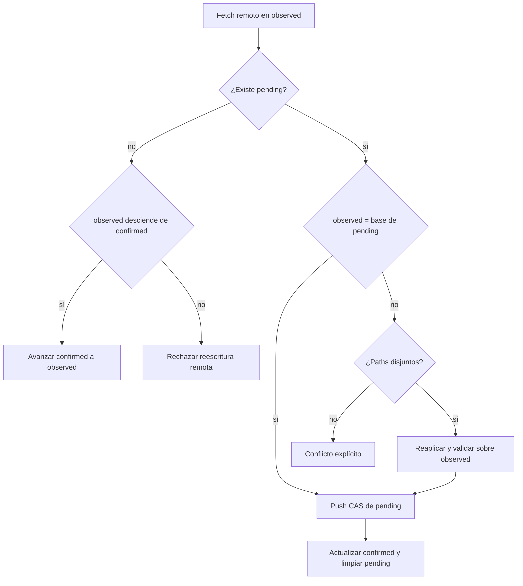

## Request

El snapshot centralizado necesita mantenerse visible y actualizable entre
clones sin convertir una rama local en autoridad, cache y cola de escritura al
mismo tiempo. El protocolo debe soportar lectura local, sincronización
explícita, publicación compare-and-swap, trabajo offline limitado y conflictos
comprensibles.

## Investigation

El prototipo de `codex/global-state-branch@6ac08826` usa una rama local como
baseline de lectura y como cabeza de escrituras pendientes. La auditoría mostró
un caso bloqueante: un clon limpio en `S1` que hace fetch de `S2`, sin escritura
pendiente, no puede avanzar su ref confirmada porque `sync` solo contempla la
reaplicación de un pending. También mostró que `abort` razona desde la revisión
remota observada y puede abandonar una escritura local sin comprobar si llegó a
publicarse.

La rama de integración de `20260711-210115` sigue siendo el punto de partida de
las ramas de código, pero no debe participar en la réplica del ledger. La
sincronización necesita tres hechos separados: último remoto confirmado por el
clon, último remoto observado por fetch y una mutación local todavía no
confirmada.

Se descarta una cola offline de múltiples operaciones en v1. Aporta poco al
objetivo de visibilidad de equipo y multiplica rebase, orden, aborto y mensajes
ambiguos. Un clon podrá conservar una única operación pendiente y deberá
sincronizarla o descartarla explícitamente antes de mutar de nuevo.

## Proposal

La ref remota pública permanece en `refs/heads/changeledger/state`. Cada clon
mantendrá refs internas, no ramas de usuario:

```text
refs/changeledger/confirmed  último estado remoto cuya publicación se confirmó
refs/changeledger/observed   head obtenido por el último fetch válido
refs/changeledger/pending    única mutación local aún no confirmada
```

Cada clon usa un solo remoto de estado: `git config changeledger.remote` y, si
no existe, `origin`. La v1 no replica contra múltiples remotos ni intenta elegir
entre ellos; un remoto ausente o ambiguo es un error de configuración visible.

Las lecturas usan `confirmed`, salvo que exista `pending`: en ese caso muestran
el pending como vista local y declaran de forma visible que no está confirmado.
No hacen fetch por defecto. `state status` expone las tres revisiones, remoto,
fecha de última observación y condición `fresh`, `stale`, `pending`, `conflict`
o `unknown`. `state sync` es la única operación normal que hace fetch/push; el
viewer tendrá una acción explícita “Actualizar estado” que invoca el mismo
protocolo. Los comandos de mutación ejecutan `sync` antes de construir su
operación salvo `--offline` explícito.

Desde este protocolo, un repositorio con autoridad activa deja de leer la rama
pública local: la revisión efectiva es exclusivamente `pending` o, en su
ausencia, `confirmed`. `observed` nunca es autoridad de lectura. Si no existe
ninguna revisión confirmada, las lecturas fallan indicando que se necesita
`state sync`; no vuelven a `refs/heads/changeledger/state`, al baseline ni al
worktree. El cutover posterior publica el baseline y cada clon inicializa
`confirmed` mediante sincronización.

El algoritmo usa ancestry y el diff por paths de Git:



El commit pending es la representación reproducible de una única operación: su
padre es la base confirmada y su árbol contiene el resultado completo. Los paths
afectados se derivan del diff Git con framing NUL; no se serializan en trailers
line-based, porque un path válido puede contener saltos de línea. Los trailers
conservan solo metadata escalar de auditoría como operación y actor.

Una reaplicación transporta sobre `observed` el delta exacto de blobs y borrados
entre la base y pending, únicamente cuando los paths son disjuntos, y vuelve a
validar el snapshot candidato completo antes de crear el nuevo commit. No hace
merge textual, no reejecuta callbacks efímeros ni elige por timestamp. Aunque
los paths sean disjuntos, un fallo de validación tras la reaplicación se
convierte en conflicto explícito.

Un push con resultado ambiguo conserva `pending`. La siguiente sincronización
hace fetch: si el commit pendiente ya es ancestro del remoto, lo confirma y
limpia; si no, vuelve a aplicar las reglas anteriores. `state abort --pending`
también hace ese chequeo primero: nunca descarta un commit que ya llegó al
remoto. Si no puede comprobarlo por falta de red, exige `--offline` y muestra el
riesgo exacto antes de borrar solo la ref local.

Las transiciones que afectan varias refs locales usan una sola transacción de
`update-ref`: confirmar una publicación actualiza `confirmed` y `observed` y
elimina `pending` indivisiblemente. La hora de observación es metadata local
advisory escrita de forma atómica y solo se muestra si todavía corresponde al
OID de `observed`; una ausencia o mismatch produce `unknown`, nunca una garantía
de frescura inventada.

## Specification

### CR1 — Clon limpio alcanza el remoto
- **Given** un clon con `confirmed=S1`, sin pending, y remoto en `S2` descendiente de `S1`
- **When** ejecuta `state sync`
- **Then** fetch guarda `S2` en `observed` y avanza `confirmed` a `S2`
- **And** `list`, `search`, `context` y el viewer leen `S2`
- **And** no se crea commit ni push

### CR2 — Mutación confirmada mediante CAS
- **Given** `confirmed=observed=S1`, sin pending, y una mutación válida que produce `P1`
- **When** el remoto continúa en `S1` y se sincroniza
- **Then** publica `P1` como sucesor fast-forward de `S1`
- **And** actualiza `confirmed` a `P1`, elimina pending e informa `confirmed`
- **And** usa un push fast-forward ordinario y nunca agrega un refspec forzado ni una opción de force-push

### CR3 — Escritura offline inequívoca
- **Given** un clon en `S1`, sin red y sin pending
- **When** ejecuta una mutación con `--offline`
- **Then** crea un único pending basado en `S1` y la salida dice `local, pending publication`
- **And** las lecturas locales incluyen esa mutación y señalan que no es global
- **When** intenta otra mutación antes de resolver pending
- **Then** falla sin crear un segundo commit pendiente
- **And** toda superficie mutadora CLI/viewer usa el mismo preflight online o
  propaga el `--offline` explícito hasta la frontera común

### CR4 — Reaplicación disjunta
- **Given** un pending basado en `S1` que afecta `changes/A.md` y un remoto `S2` que solo cambió `changes/B.md`
- **When** ejecuta `state sync`
- **Then** reconstruye y valida la operación de A sobre `S2`
- **And** publica un sucesor de `S2` que contiene ambos cambios
- **And** confirma el nuevo head y limpia el pending original
- **And** deriva ambos conjuntos de paths con framing NUL y preserva los mismos
  nombres aceptados por el snapshot en SHA-1 y SHA-256

### CR5 — Conflicto sin resolución implícita
- **Given** un pending basado en `S1` y un remoto `S2` que modifican el mismo path o cuya combinación invalida el snapshot
- **When** ejecuta `state sync`
- **Then** no publica ni sobrescribe ninguna revisión
- **And** conserva pending e informa base, observed, paths y causa del conflicto

### CR6 — Push ambiguo y aborto seguro
- **Given** un push de pending cuyo resultado local es timeout o error ambiguo
- **When** termina el comando
- **Then** conserva pending y no afirma publicación ni rechazo
- **When** `state sync` o `state abort --pending` recupera un remoto que ya contiene ese commit
- **Then** lo marca confirmado y no lo descarta
- **And** sin poder observar el remoto, abort requiere `--offline` explícito y solo elimina la ref local
- **And** confirmar o abortar actualiza conjuntamente las refs implicadas o no
  actualiza ninguna

### CR7 — Frescura observable y red explícita
- **Given** cualquier estado de las refs internas
- **When** se ejecuta `state status`, una lectura CLI o se carga el viewer
- **Then** muestra revisión efectiva, estado de confirmación y última observación sin hacer red implícita
- **And** solo `state sync`, “Actualizar estado” o el preflight de una mutación online hacen fetch/push
- **And** identifica el único remoto configurado o falla si no puede resolverlo
- **And** una autoridad sin `confirmed` ni `pending` falla indicando `state sync`
  y nunca usa la rama pública local como fallback

## Plan

- [ ] Añadir una tabla de tests fallidos para todas las combinaciones confirmed/observed/pending en `test/state-replica.test.mjs` y crear el modelo puro en `src/state-replica.mjs`; verify: `node --test test/state-replica.test.mjs` (CR1, CR2, CR3, CR4, CR5, CR6)
- [ ] Hacer que `src/ledger-store.mjs` resuelva exclusivamente pending/confirmed y falle sin autoridad efectiva; actualizar fixtures state sin fallback a la rama pública; verify: `node --test test/ledger-store.test.mjs test/repo.test.mjs` (CR1, CR3, CR7)
- [ ] Implementar refs transaccionales, fetch, fast-forward y metadata de observación en `src/state-store.mjs` con repositorios reales SHA-1/SHA-256; verify: `node --test test/state-store.test.mjs` (CR1, CR2, CR6, CR7)
- [ ] Implementar pending único y replay del delta NUL-framed en `src/state-store.mjs`; verify: `node --test test/state-store.test.mjs test/state-replica.test.mjs` (CR3, CR4, CR5)
- [ ] Propagar preflight online y `--offline` por la matriz mutadora mediante `bin/changeledger.mjs`, `src/commands/*.mjs` y `src/viewer/domain.mjs` hasta `LedgerStore.mutate`; verify: `node --test test/ledger-mutations.test.mjs test/cli-bin.test.mjs test/view.test.mjs` (CR2, CR3, CR7)
- [ ] Añadir tests de timeout, push aceptado con respuesta perdida y aborto online/offline antes de implementar `sync`/`abort` en `src/commands/state.mjs`; verify: `node --test test/state-command.test.mjs test/state-store.test.mjs` (CR6)
- [ ] Integrar frescura en lecturas, `context` y viewer mediante `src/repo.mjs` y `src/viewer/server/router.mjs`; verify: `node --test test/repo.test.mjs test/context.test.mjs test/view.test.mjs` (CR1, CR3, CR7)
- [ ] Documentar el protocolo y ejecutar el gate completo; verify: `pnpm verify` (support)

## Log

- **2026-07-21T19:31:02Z** `[note]` Draft v2 limita deliberadamente cada clon a una operación pendiente para que confirmación, replay y aborto tengan una semántica comprobable.
- **2026-07-22T10:14:11Z** `[status]` draft → approved
- **2026-07-22T10:17:29Z** `[note]` Readiness pre-implementación cerró los huecos que generaban riesgo de review-loop: la operación reproducible es el delta Git NUL-framed, las refs multiestado cambian transaccionalmente, no existe fallback a la rama pública local y online/offline cubre toda la matriz mutadora.
- **2026-07-22T10:18:05Z** `[status]` approved → in-progress
- **2026-07-22T10:18:05Z** `[owner]` set: Roberto Ruiz (auto)
