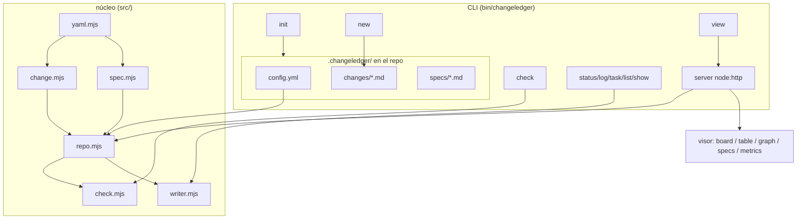

# Arquitectura de ChangeLedger

> Graduado del change 20260613-205854 (capa specs: verdad persistente y graduación).
> Graduado del change 20260614-151759 (discovery del contrato).
> Graduado del change 20260614-162547 (Definition of Ready / tdd).
> Graduado del change 20260614-165720 (revisión de graduación / reviewed).
> Graduado del change 20260614-182513 (owner desde GitHub login).
> Graduado del change 20260615-150510 (gate de revisión independiente + invariantes de transición).
> Graduado del change 20260615-170803 (graduación a spec existente, `changeledger graduate --into`).
> Graduado del change 20260615-210508 (estado terminal `discarded`).
> Graduado del change 20260616-151221 (parsing estricto de changes).
> Graduado del change 20260616-151216 (Definition of Ready verificable).
> Graduado del change 20260616-151230 (mutaciones de frontmatter fail-fast).
> Graduado del change 20260616-151234 (resolución segura de assets estáticos).
> Graduado del change 20260616-151226 (parser CLI con commander).
> Graduado del change 20260616-162014 (validación de criterios referenciados por tareas).
> Graduado del change 20260616-162020 (normalización compartida de slugs).
> Graduado del change 20260616-162027 (registry corrupto falla sin sobrescribir).
> Graduado del change 20260616-162050 (headings dentro de fenced code blocks).
> Graduado del change 20260616-162104 (profundidad del grafo con ramas aisladas).
> Graduado del change 20260616-162017 (escrituras atomicas de fuente de verdad).
> Graduado del change 20260616-210825 (métricas cuentan cierres por revisión).
> Graduado del change 20260617-020229 (Definition of Ready con patrones configurables).
> Graduado del change 20260616-212836 (ejemplos de graduación no crean enlaces reales).
> Graduado del change 20260616-212840 (captura automática de fricciones).
> Graduado del change 20260616-212319 (archivar no vuelve stale el spec).
> Graduado del change 20260616-212322 (archivado masivo de graduados).
> Graduado del change 20260616-212314 (serialización de mutaciones por archivo).
> Graduado del change 20260616-212309 (tests del viewer sin socket local).
> Graduado del change 20260617-161309 (workflow git para trazabilidad).
> Graduado del change 20260623-125850 (legibilidad e interacción del viewer).
> Graduado del change 20260626-115134 (formato machine-readable de tareas y readiness).
> Graduado del change 20260626-160038 (política económica de delegación).
> Graduado del change 20260626-174204 (ruta rápida del contrato para agentes).
> Graduado del change 20260624-153236 (migración integral a ChangeLedger).
> Graduado del change 20260627-103625 (discovery distingue estado global de raíz de proyecto).
> Graduado del change 20260627-111219 (persistencia del estado del viewer).

ChangeLedger separa **almacén** (fuente de verdad, optimizada para agente y git)
de **presentación** (un visor agradable para el humano). Es un CLI global; en
cada repo solo viven los documentos bajo `.changeledger/`.

## Componentes

`bin/changeledger.mjs` define la interfaz de comandos con `commander`, manteniendo
`src/commands/*` como capa de aplicación. La dependencia está fijada en una
línea compatible con Node 20 y el binario conserva el shebang + modo ejecutable,
porque se publica como comando global `changeledger`. El parser rechaza opciones
desconocidas en lugar de ignorarlas silenciosamente.

## Specs de dominio

- [Modelo de datos e identidad](data-model.md)
- [Ciclo de vida y gate de revisión](lifecycle.md)
- [Releases portables](releases.md)
- [Validación (changeledger check)](validation.md)
- [Trazabilidad git](git-traceability.md)
- [Discovery del contrato](contract-discovery.md)
- [Definition of Ready](readiness.md)
- [Política de idioma](language.md)
- [Viewer y presentación](viewer.md)
- [Política de dependencias](dependencies.md)
- [Métricas](metrics.md)
