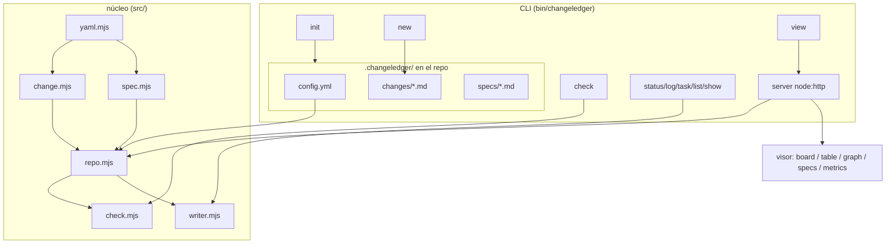

# Arquitectura de ChangeLedger

> Graduado del change 20260616-151226 (parser CLI con commander).
> Graduado del change 20260624-153236 (migración integral a ChangeLedger).

ChangeLedger separa **almacén** (fuente de verdad, optimizada para agente y git)
de **presentación** (un visor agradable para el humano). Es un CLI global; en
cada repo solo viven los documentos bajo `.changeledger/`.

## Componentes

`bin/changeledger.mjs` define la interfaz de comandos con `commander`, manteniendo
`src/commands/*` como capa de aplicación. La dependencia está fijada en una
línea compatible con Node 20 y el binario conserva el shebang + modo ejecutable,
porque se publica como comando global `changeledger`. El parser rechaza opciones
desconocidas en lugar de ignorarlas silenciosamente.

## Specs de dominio

- [Modelo de datos e identidad](data-model.md)
- [Ciclo de vida y gate de revisión](lifecycle.md)
- [Releases portables](releases.md)
- [Validación (changeledger check)](validation.md)
- [Trazabilidad git](git-traceability.md)
- [Discovery del contrato](contract-discovery.md)
- [Definition of Ready](readiness.md)
- [Política de idioma](language.md)
- [Viewer y presentación](viewer.md)
- [Política de dependencias](dependencies.md)
- [Métricas](metrics.md)
