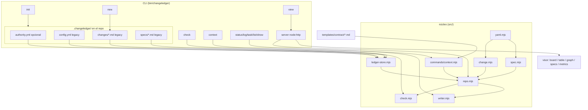

# Arquitectura de ChangeLedger

ChangeLedger separa **almacén** (fuente de verdad, optimizada para agente y git)
de **presentación** (un visor agradable para el humano). Es un CLI global; en
cada repo solo viven los documentos bajo `.changeledger/`.

El dominio accede al ledger mediante `LedgerStore`. Su lectura produce un
`LedgerSnapshot` inmutable con una sola revisión, configuración, changes, specs
y releases. Un repositorio legacy usa el adaptador `worktree`; un repositorio
activado usa el adaptador `state` y nunca mezcla ambas fuentes ni vuelve al
worktree como fallback.

## Autoridad de estado

La activación explícita se registra en `.changeledger/authority.yml`, que fija
`project_id`, el baseline confirmado y la ref pública
`refs/heads/changeledger/state`. La mera existencia local o remota de esa ref no
activa nada. La ref contiene un árbol exclusivo:

```text
.changeledger-state/
├── manifest.yml
├── config.yml
├── changes/
├── specs/
└── releases/
```

`manifest.yml` declara `format_version: 1` y el mismo `project_id` de la
configuración y del recibo de autoridad. Los directorios de colección pueden
estar ausentes cuando están vacíos; fuera de esas cinco entradas el layout
falla cerrado. Los object ids de Git son valores opacos: la carga y las
transacciones usan los mismos comandos de plumbing en repositorios SHA-1 y
SHA-256.

Una lectura resuelve la ref una vez y carga todos los documentos desde ese
commit, sin checkout ni red implícita. Una mutación construye un índice temporal
sobre la revisión leída, valida el árbol candidato completo, crea un commit con
un único padre y actualiza la ref mediante compare-and-swap. Un error de dominio,
validación o concurrencia no mueve la ref. Las operaciones bulk, graduación,
releases y configuración comparten esa frontera, por lo que cada invocación
publica un único sucesor o ninguno y devuelve su revisión.

La edición larga de una spec continúa en un archivo local ordinario:
`graduate --new --to <file>` exporta una semilla sin modificar la autoridad y
`graduate --into --from <file>` importa la versión final junto con la resolución
del change en un solo commit state.

## Componentes


```mermaid
flowchart TD
  subgraph repo[".changeledger/ en el repo"]
    AUTH[authority.yml opcional]
    CFG[config.yml legacy]
    CH[changes/*.md legacy]
    SP[specs/*.md legacy]
  end
  subgraph core["núcleo (src/)"]
    YAML[yaml.mjs] --> CHANGE[change.mjs]
    YAML --> SPEC[spec.mjs]
    CFG --> STORE[ledger-store.mjs]
    AUTH --> STORE
    CH --> STORE
    SP --> STORE
    STORE --> REPO[repo.mjs]
    CHANGE --> REPO
    SPEC --> REPO
    REPO --> CHECK[check.mjs]
    REPO --> WRITER[writer.mjs]
    CT[commands/context.mjs] --> REPO
  end
  FRAG[templates/contract/*.md] --> CT
  subgraph cli["CLI (bin/changeledger)"]
    INIT[init] --> repo
    NEW[new] --> CH
    CHECKC[check] --> CHECK
    CONTEXT[context] --> CT
    AGENT[status/log/task/list/show] --> WRITER
    VIEW[view] --> SRV
  end
  SRV[server node:http] --> REPO
  SRV --> UI[visor: board / table / graph / specs / metrics]
```

`bin/changeledger.mjs` define la interfaz de comandos con `commander`, manteniendo
`src/commands/*` como capa de aplicación. La dependencia está fijada en una
línea compatible con Node 20 y el binario conserva el shebang + modo ejecutable,
porque se publica como comando global `changeledger`. El parser rechaza opciones
desconocidas en lugar de ignorarlas silenciosamente.

El binario expone su versión instalada mediante `changeledger --version`, `-v` y
`-V`; el valor se lee del `package.json` distribuido para que una instalación
empaquetada nunca dependa de un literal duplicado.

`.changeledger/config.yml` declara un `schema_version` entero. La ausencia se
interpreta como schema histórico `0`; `check` y `register` lo detectan y ofrecen
`changeledger config migrate --dry-run`, pero nunca migran implícitamente. La
migración explícita construye un candidato con el AST de YAML, actualiza estructura
y comentarios administrados, conserva decisiones y extensiones propias, no mueve
directorios y escribe atómicamente. Repetirla sobre el schema vigente es un no-op
byte-idéntico; un schema más nuevo que el soportado falla cerrado. Las
migraciones son una cadena versionada y aditiva: el schema vigente es `3`; la
migración 1 → 2 añade el tipo `quick` y sus impactos a repos schema 1 sin pisar
un `quick` custom ni extensiones propias (guardas `Object.hasOwn`). El resumen
de la migración expone la versión de origen real detectada, y CLI y visor
comparten el mismo motor; el cliente del visor lee la versión soportada del
payload del servidor en vez de duplicar la constante.

En modo state esa configuración canónica vive en el mismo snapshot y tanto CLI
como visor la migran mediante `LedgerStore.mutate`; el archivo legacy local no
participa en la validación ni se modifica.

El contexto core funciona también como índice operativo mínimo. Antes de escanear
archivos, orienta a consultar trabajo autorizado con `changeledger list --status
approved` y decisiones de cierre pendientes con `changeledger graduate --pending`.
La orientación es estática: no ejecuta esas consultas ni incorpora estado efímero
al contexto determinista.

`changeledger search <términos...>` completa ese descubrimiento con búsqueda
léxica determinista sobre changes (incluidos archivados) y specs: scoring
título×3 / headings+CR×2 / cuerpo×1, normalización a minúsculas sin acentos y
desempate estable a igual score — la verdad persistente primero (spec antes que
change) y después ref descendente. Sin embeddings ni servicios externos,
coherente con el núcleo local-first. El contrato de autoría ordena ejecutarla
antes de investigar desde cero para reutilizar decisiones ya registradas.

## Specs de dominio

- [Modelo de datos e identidad](data-model.md)
- [Ciclo de vida y gate de revisión](lifecycle.md)
- [Releases portables](releases.md)
- [Validación (changeledger check)](validation.md)
- [Trazabilidad git](git-traceability.md)
- [Discovery del contrato](contract-discovery.md)
- [Definition of Ready](readiness.md)
- [Política de idioma](language.md)
- [Viewer y presentación](viewer.md)
- [Política de dependencias](dependencies.md)
- [Métricas](metrics.md)
