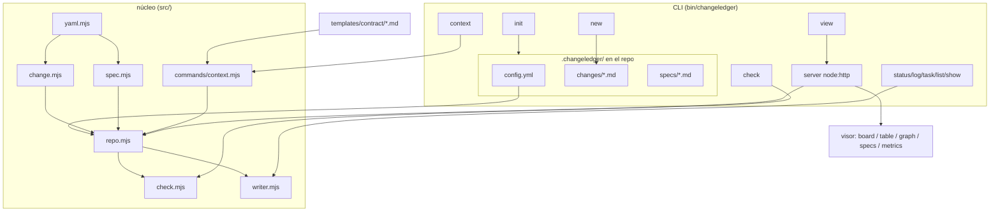

# Arquitectura de ChangeLedger

ChangeLedger separa **almacén** (fuente de verdad, optimizada para agente y git)
de **presentación** (un visor agradable para el humano). Es un CLI global; en
cada repo solo viven los documentos bajo `.changeledger/`.

## Componentes

```mermaid
flowchart TD
  subgraph repo[".changeledger/ en el repo"]
    CFG[config.yml]
    CH[changes/*.md]
    SP[specs/*.md]
  end
  subgraph core["núcleo (src/)"]
    YAML[yaml.mjs] --> CHANGE[change.mjs]
    YAML --> SPEC[spec.mjs]
    CFG --> REPO[repo.mjs]
    CHANGE --> REPO
    SPEC --> REPO
    REPO --> CHECK[check.mjs]
    REPO --> WRITER[writer.mjs]
    CT[commands/context.mjs] --> REPO
  end
  FRAG[templates/contract/*.md] --> CT
  subgraph cli["CLI (bin/changeledger)"]
    INIT[init] --> repo
    NEW[new] --> CH
    CHECKC[check] --> CHECK
    CONTEXT[context] --> CT
    AGENT[status/log/task/list/show] --> WRITER
    VIEW[view] --> SRV
  end
  SRV[server node:http] --> REPO
  SRV --> UI[visor: board / table / graph / specs / metrics]
```

`bin/changeledger.mjs` define la interfaz de comandos con `commander`, manteniendo
`src/commands/*` como capa de aplicación. La dependencia está fijada en una
línea compatible con Node 20 y el binario conserva el shebang + modo ejecutable,
porque se publica como comando global `changeledger`. El parser rechaza opciones
desconocidas en lugar de ignorarlas silenciosamente.

El binario expone su versión instalada mediante `changeledger --version`, `-v` y
`-V`; el valor se lee del `package.json` distribuido para que una instalación
empaquetada nunca dependa de un literal duplicado.

`.changeledger/config.yml` declara un `schema_version` entero. La ausencia se
interpreta como schema histórico `0`; `check` y `register` lo detectan y ofrecen
`changeledger config migrate --dry-run`, pero nunca migran implícitamente. La
migración explícita construye un candidato con el AST de YAML, actualiza estructura
y comentarios administrados, conserva decisiones y extensiones propias, no mueve
directorios y escribe atómicamente. Repetirla sobre el schema vigente es un no-op
byte-idéntico; un schema más nuevo que el soportado falla cerrado. Las
migraciones son una cadena versionada y aditiva: el schema vigente es `4`. La
migración 1 → 2 añade el tipo `quick` y sus impactos a repos schema 1 sin pisar
un `quick` custom ni extensiones propias (guardas `Object.hasOwn`). La migración
3 → 4 repara el acoplamiento entre `review_required` y las stages verificables:
inserta las stages ausentes, en su posición canónica, sólo en los tipos que
declaran `review_required: true`, y deja byte a byte los demás. Lee el documento
YAML vivo y no la instantánea previa, porque una migración anterior de la misma
cadena puede haber añadido el propio `review_required` que dispara la reparación.
Nunca inserta una stage que la lista canónica del repo no declare: sin punto de
inserción legítimo se abstiene y deja en pie el error exacto de `checkConfig`, en
vez de fabricar una lista inválida y declararse terminada. La misma 3 → 4 añade
además la sección `readiness` cuando falta, copiando valores y comentario de
`templates/config.yml` para que plantilla y migración no puedan divergir, y
dejando intacto —byte a byte— cualquier `readiness` que el repo ya declarara,
incluso malformado: esa clave es del usuario y su diagnóstico pertenece a
`check`. El resumen
de la migración expone la versión de origen real detectada, y CLI y visor
comparten el mismo motor; el cliente del visor lee la versión soportada del
payload del servidor en vez de duplicar la constante.

El contexto core funciona también como índice operativo mínimo. Antes de escanear
archivos, orienta a consultar trabajo autorizado con `changeledger list --status
approved` y decisiones de cierre pendientes con `changeledger graduate --pending`.
La orientación es estática: no ejecuta esas consultas ni incorpora estado efímero
al contexto determinista.

`changeledger search <términos...>` completa ese descubrimiento con búsqueda
léxica determinista sobre changes (incluidos archivados) y specs: scoring
título×3 / headings+CR×2 / cuerpo×1, normalización a minúsculas sin acentos y
desempate estable a igual score — la verdad persistente primero (spec antes que
change) y después ref descendente. Sin embeddings ni servicios externos,
coherente con el núcleo local-first. El contrato de autoría ordena ejecutarla
antes de investigar desde cero para reutilizar decisiones ya registradas.

## Specs de dominio

- [Modelo de datos e identidad](data-model.md)
- [Ciclo de vida y gate de revisión](lifecycle.md)
- [Releases portables](releases.md)
- [Validación (changeledger check)](validation.md)
- [Trazabilidad git](git-traceability.md)
- [Discovery del contrato](contract-discovery.md)
- [Definition of Ready](readiness.md)
- [Política de idioma](language.md)
- [Viewer y presentación](viewer.md)
- [Política de dependencias](dependencies.md)
- [Métricas](metrics.md)
