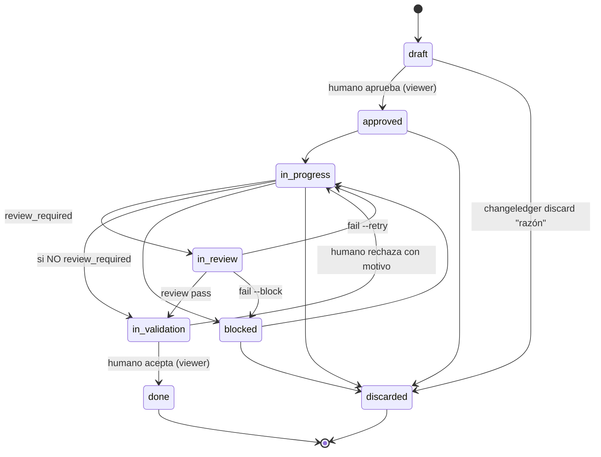

## Ciclo de vida y gate de revisión

**Descartar.** `discarded` es un estado **terminal** alternativo a `done`: el
change se decidió no hacer. Se alcanza desde cualquier estado activo no terminal
(`draft`, `approved`, `in-progress`, `blocked`) con `changeledger discard <id> "<razón>"`
—la razón es obligatoria y se registra en el Log—. Preferirlo a borrar el
archivo: la decisión y su porqué siguen siendo verdad, y las referencias
`depends_on` se mantienen resolubles. El visor lo oculta por defecto (toggle
"Discarded") y nunca le da columna. `changeledger status` rechaza `discarded` para forzar
el verbo con razón; tampoco es alcanzable desde el visor.

El gate opcional **`in-review`** cierra el lazo doc↔código para los tipos que
requieren una **revisión independiente**. La revisión la
ejecuta un **subagente con contexto limpio** (sin el historial de implementación,
para no heredar sesgo) y un **modelo acorde a la dificultad**. *Qué* valida:
cada `CRn` cumplido, sin residuo y Plan realmente hecho. La
auditoría profunda de seguridad/lint/SAST queda en herramientas dedicadas que el
revisor puede invocar; ChangeLedger no las reimplementa. El *cómo* se lanza el
subagente es del agente anfitrión — el contrato (AGENTS.md §6) solo fija el qué.

El contrato canónico permite delegar cualquier etapa a subagentes cuando reduce
presión de contexto, baja coste con un modelo suficiente, paraleliza trabajo
realmente independiente o aporta revisión de contexto limpio. La delegación no es
un requisito universal ni un mecanismo prescrito por ChangeLedger: el agente
principal decide según el harness disponible. Sí es una decisión auditable: cada
delegación debe tener motivo, ownership o pregunta clara, salida esperada y
criterio de integración. El contrato desaconseja sobrefragmentar (por archivo,
por línea o por edición mecánica diminuta), exige disjunción para trabajo en
paralelo y pide ajustar el modelo a la dificultad: modelos fuertes para
ambigüedad, arquitectura, seguridad o revisiones difíciles; modelos suficientes y
baratos para exploración localizada, inventarios, edición mecánica, tests y
verificaciones acotadas.

**Activación por tipo.** `config.yml` marca `review_required: true` por tipo
(`feature`, `bug`, `refactor` por defecto). `chore` y `audit` saltan únicamente
la revisión: van `in-progress → in-validation`. Todo tipo pasa por validación
humana antes de `done`; así `done` siempre significa resultado aceptado.

**Invariantes de transición.** El grafo del ciclo vive en `src/lifecycle.mjs` y
es la **única autoridad**, compartida por `changeledger status` y el visor.
`lifecycle.assertTransition(from, to, { type, reviewRequired })` valida el grafo
completo (no solo el gate) y `agent.status()` lo invoca antes de escribir, así que
el CLI rechaza saltos, regresiones y no-ops
(`change is already "X"`), y el gate (`in-progress → in-validation` bajo
`review_required` → mensaje accionable). Entre statuses no canónicos degrada a
validación por enum. `changeledger status done` se rechaza por separado porque solo el
veredicto humano puede cerrar. `done` y `discarded` son terminales y nunca se reabren. El
visor añade la política de actor: permite únicamente las transiciones humanas
`draft → approved` e `in-validation → done|in-progress`; el rechazo exige motivo.

**Veredicto (`changeledger review`, en `agent.review()`).** `pass` → `in-validation`;
`fail --retry`
→ `in-progress` (defecto dentro del contrato, el implementador corrige);
`fail --block` → `blocked` (excede el contrato, decide el humano). Exige estar en
`in-review`, `fail` exige motivo, y cada veredicto deja un marker inglés en el Log
(`review → …`). `in-review` e `in-validation` cuentan como WIP en métricas.

**Triage de fricción y autorización.** Antes de entregar al humano un resultado
completado o bloqueado, el agente clasifica la fricción ya descubierta. Si es
necesaria para cumplir el objetivo autorizado de un change activo, la incorpora
a su Specification/Plan/Log. Si amplía materialmente el comportamiento observable,
aunque esté relacionada, pide autorización antes de incorporarla. Si es un paso
operativo (verificar, commitear, graduar, archivar o cerrar), lo ejecuta o registra
allí: no crea un chore. Si es independiente, propone al humano tipo, título y
motivo y espera autorización antes de crear el `draft`. Lo demasiado vago se
menciona sin crear archivos. Al alcanzar `done`, comparte además una retrospectiva
breve del ciclo; `discarded` no implica un ciclo de implementación completado.
