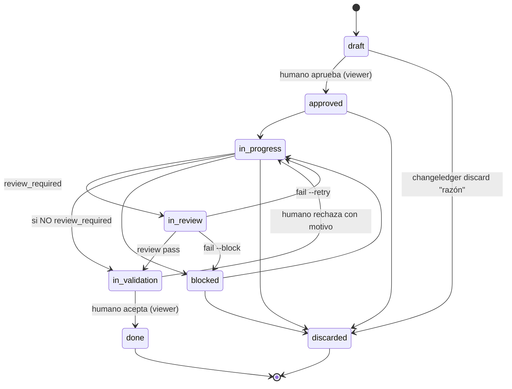

## Ciclo de vida y gate de revisión

> Graduado del change 20260614-165720 (revisión de graduación / reviewed).
> Graduado del change 20260614-182513 (owner desde GitHub login).
> Graduado del change 20260615-150510 (gate de revisión independiente + invariantes de transición).
> Graduado del change 20260615-170803 (graduación a spec existente, `changeledger graduate --into`).
> Graduado del change 20260615-210508 (estado terminal `discarded`).
> Graduado del change 20260616-212836 (ejemplos de graduación no crean enlaces reales).
> Graduado del change 20260616-212840 (captura automática de fricciones).
> Graduado del change 20260616-212319 (archivar no vuelve stale el spec).
> Graduado del change 20260616-212322 (archivado masivo de graduados).
> Graduado del change 20260626-160038 (política económica de delegación).
> Graduado del change 20260630-225210 (validación secuencial del Log).

**Descartar.** `discarded` es un estado **terminal** alternativo a `done`: el
change se decidió no hacer. Se alcanza desde cualquier estado activo no terminal
(`draft`, `approved`, `in-progress`, `blocked`) con `changeledger discard <id> "<razón>"`
—la razón es obligatoria y se registra en el Log—. Preferirlo a borrar el
archivo: la decisión y su porqué siguen siendo verdad, y las referencias
`depends_on` se mantienen resolubles. El visor lo oculta por defecto (toggle
"Discarded") y nunca le da columna. `changeledger status` rechaza `discarded` para forzar
el verbo con razón; tampoco es alcanzable desde el visor.

El gate opcional **`in-review`** cierra el lazo doc↔código para los tipos que
requieren una **revisión independiente**. La revisión la
ejecuta un **subagente con contexto limpio** (sin el historial de implementación,
para no heredar sesgo) y un **modelo acorde a la dificultad**. *Qué* valida:
cada `CRn` cumplido, sin residuo y Plan realmente hecho. La
auditoría profunda de seguridad/lint/SAST queda en herramientas dedicadas que el
revisor puede invocar; ChangeLedger no las reimplementa. El *cómo* se lanza el
subagente es del agente anfitrión — `changeledger context review` solo fija el qué.

El contrato canónico permite delegar cualquier etapa a subagentes cuando reduce
presión de contexto, baja coste con un modelo suficiente, paraleliza trabajo
realmente independiente o aporta revisión de contexto limpio. La delegación no es
un requisito universal ni un mecanismo prescrito por ChangeLedger: el agente
principal decide según el harness disponible. Sí es una decisión auditable: cada
delegación debe tener motivo, ownership o pregunta clara, salida esperada y
criterio de integración. El contrato desaconseja sobrefragmentar (por archivo,
por línea o por edición mecánica diminuta), exige disjunción para trabajo en
paralelo y pide ajustar el modelo a la dificultad: modelos fuertes para
ambigüedad, arquitectura, seguridad o revisiones difíciles; modelos suficientes y
baratos para exploración localizada, inventarios, edición mecánica, tests y
verificaciones acotadas.

**Activación por tipo.** `config.yml` marca `review_required: true` por tipo
(`feature`, `bug`, `refactor` por defecto). `chore` y `audit` saltan únicamente
la revisión: van `in-progress → in-validation`. Todo tipo pasa por validación
humana antes de `done`; así `done` siempre significa resultado aceptado.

**Invariantes de transición.** El grafo del ciclo vive en `src/lifecycle.mjs` y
es la **única autoridad**, compartida por `changeledger status` y el visor.
`lifecycle.assertTransition(from, to, { type, reviewRequired })` valida el grafo
completo (no solo el gate) y `agent.status()` lo invoca antes de escribir, así que
el CLI rechaza saltos, regresiones y no-ops
(`change is already "X"`), y el gate (`in-progress → in-validation` bajo
`review_required` → mensaje accionable). Entre statuses no canónicos degrada a
validación por enum. `changeledger status done` se rechaza por separado porque solo el
veredicto humano puede cerrar. `done` y `discarded` son terminales y nunca se reabren. El
visor añade la política de actor: permite únicamente las transiciones humanas
`draft → approved` e `in-validation → done|in-progress`; el rechazo exige motivo.

**Veredicto (`changeledger review`, en `agent.review()`).** `pass` → `in-validation`;
`fail --retry`
→ `in-progress` (defecto dentro del contrato, el implementador corrige);
`fail --block` → `blocked` (excede el contrato, decide el humano). Exige estar en
`in-review`, `fail` exige motivo, y cada veredicto deja un marker inglés en el Log
(`review → …`). `in-review` e `in-validation` cuentan como WIP en métricas.

**Triage de fricción y autorización.** Antes de entregar al humano un resultado
completado o bloqueado, el agente clasifica la fricción ya descubierta. Si es
necesaria para cumplir el objetivo autorizado de un change activo, la incorpora
a su Specification/Plan/Log. Si amplía materialmente el comportamiento observable,
aunque esté relacionada, pide autorización antes de incorporarla. Si es un paso
operativo (verificar, commitear, graduar, archivar o cerrar), lo ejecuta o registra
allí: no crea un chore. Si es independiente, propone al humano tipo, título y
motivo y espera autorización antes de crear el `draft`. Lo demasiado vago se
menciona sin crear archivos. Al alcanzar `done`, comparte además una retrospectiva
breve del ciclo; `discarded` no implica un ciclo de implementación completado.

## Intención y ejecución

El contrato separa intención y ejecución. Antes de crear un change permite
conversación e investigación de solo lectura, pero exige conjuntamente claridad
suficiente y autorización humana explícita; una petición directa de creación ya
autoriza, sin permitir que el agente invente requisitos faltantes. El humano
autoriza alcance, aprueba drafts y acepta resultados; el agente divide y ejecuta
el trabajo dentro de ese alcance.

## Log y owner

El `## Log` es el **ledger del ciclo de vida**, ortogonal a las etapas de
contenido del tipo: registra cada transición de `status` con su timestamp y se
crea automáticamente al primer cambio de estado aunque el tipo no lo declare
(p.ej. `chore`).

**Validación secuencial.** `changeledger check` reproduce los eventos del Log
desde `draft` contra el grafo de `src/lifecycle.mjs` mediante el parser
compartido `parseLogEvent` (líneas `status: from → to` con origen explícito;
`review → …` y `validation → …` con origen implícito `in-review`/`in-validation`).
Son **errores**: una transición cuyo origen no coincide con el estado
reconstruido (p.ej. un veredicto `review → in-validation` duplicado), self-loops,
aristas fuera del grafo y un `status` final incompatible con la secuencia. Dos
compatibilidades **acotadas** mantienen legible el historial anterior al gate
universal sin relajar el grafo para trabajo nuevo: las aristas legacy literales
(`in-review → done`, `in-progress → done`, `draft → in-progress`) y el *resync*
de huecos tempranos — solo un origen explícito `status:` puede adelantar la
reconstrucción, solo hacia delante y solo entre `draft`/`approved`/`in-progress`;
los orígenes implícitos de review/validation exigen siempre la secuencia exacta.
Statuses no canónicos desactivan la validación del change (el grafo no modela
esos estados). El `owner` se autoasigna al pasar a `in-progress` (cuando empieza
el trabajo) vía `ownerHandle`: username de GitHub (`gh api user --jq .login`), con
fallback a `git config user.name` si `gh` falta o no está autenticado; tolerante
(vacío si ninguno). No pisa un owner fijado a mano (`changeledger owner`).

## Graduación

**Revisión de graduación.** Tras `done`, cada change se resuelve: gradúa a un spec
o registra un skip (bug/chore sin verdad persistente). La finalización con
`--into` y el skip fijan `reviewed: true` (`writer.setReviewed`);
`changeledger graduate --pending` (`pendingGraduation`) lista los `done` con
`reviewed !== true`. `changeledger graduate <id> --skip [razón]`
(`skipGraduation`, solo en `done`) deja `graduation skipped` en el Log sin crear
una spec. "Graduado a spec" sigue siendo derivable de la marca `graduado a spec`
del Log — `reviewed` solo registra que la pregunta quedó zanjada. `check` valida
que `reviewed`, si está, sea booleano; no avisa de pendientes (es bajo demanda).

`changeledger archive --graduated [--dry-run]` limpia el board de forma explícita y
conservadora: selecciona solo changes `done`, `reviewed: true`, no archivados, y
con resolución de graduación en `## Log` (`graduado a spec` o `graduation
skipped`). El dry-run lista los candidatos y total sin escribir. El archivado
masivo reutiliza el parser del repo y escribe `archived: true` más una entrada
`archived` en el Log; no toca estados activos, bloqueados, descartados, cambios
sin reviewed ni cambios ya archivados.

La intención es siempre explícita y los modos `--new`, `--into`, `--skip` y
`--pending` son mutuamente excluyentes. Un slug posicional sin modo falla sin
escribir, por lo que `skip` o `skip-*` nunca pueden convertirse accidentalmente
en nombres de spec.

Para una spec nueva, `--new` llama a `scaffoldSpec()`: crea una semilla desde
Specification/Proposal con un marcador explícito de scaffold, pero no escribe el
Log ni fija `reviewed`; el change continúa pendiente. El agente reemplaza la
semilla por verdad actual durable y elimina el marcador. Después `--into`
(`graduate(..., { into: true })`) exige que la spec exista y que el marcador ya
no esté, refresca `updated` (`writer.setSpecUpdated`), deja intacto el cuerpo y
registra el vínculo más `reviewed: true`. Para una spec ya existente, el agente
edita primero su cuerpo y usa directamente `--into`.
