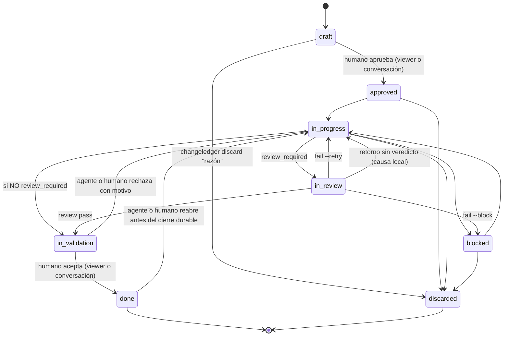

## Ciclo de vida y gate de revisión

```mermaid
stateDiagram-v2
    [*] --> draft
    draft --> approved: humano aprueba (viewer o conversación)
    approved --> in_progress
    in_progress --> in_review: review_required
    in_progress --> in_validation: si NO review_required
    in_progress --> blocked
    in_review --> in_validation: review pass
    in_review --> in_progress: fail --retry
    in_review --> in_progress: retorno sin veredicto (causa local)
    in_review --> blocked: fail --block
    in_validation --> done: humano acepta (viewer o conversación)
    in_validation --> in_progress: agente o humano rechaza con motivo
    done --> in_progress: agente o humano reabre antes del cierre durable
    blocked --> in_progress
    draft --> discarded: changeledger discard "razón"
    approved --> discarded
    in_progress --> discarded
    blocked --> discarded
    done --> [*]
    discarded --> [*]
```

**Descartar.** `discarded` es un estado **terminal** alternativo a `done`: el
change se decidió no hacer. Se alcanza desde cualquier estado activo no terminal
(`draft`, `approved`, `in-progress`, `blocked`) con `changeledger discard <id> "<razón>"`
—la razón es obligatoria y se registra en el Log—. Preferirlo a borrar el
archivo: la decisión y su porqué siguen siendo verdad, y las referencias
`depends_on` se mantienen resolubles. El visor lo oculta por defecto (toggle
"Discarded") y nunca le da columna. `changeledger status` rechaza `discarded` para forzar
el verbo con razón; tampoco es alcanzable desde el visor.

El gate opcional **`in-review`** cierra el lazo doc↔código para los tipos que
requieren una **revisión independiente**. La revisión la
ejecuta un **subagente con contexto limpio** (sin el historial de implementación,
para no heredar sesgo) y un **modelo acorde a la dificultad**. *Qué* valida:
cada `CRn` cumplido, sin residuo y Plan realmente hecho. La
auditoría profunda de seguridad/lint/SAST queda en herramientas dedicadas que el
revisor puede invocar; ChangeLedger no las reimplementa. El *cómo* se lanza el
subagente es del agente anfitrión — `changeledger context review` solo fija el qué.

Cada review tiene un **mandato declarado antes de delegar** — *spot check* del
diff nombrado, la superficie que el change gobierna, o auditoría completa — que
el orquestador registra como nota de Log del change (`changeledger log`) y
entrega ya relleno en el prompt: el revisor inspecciona dentro del mandato y
reporta lo que note fuera de él sin ampliar la inspección. La cápsula
`agent-prompt review` porta el campo, y la checklist de la cápsula de contexto
(`agent-context review`) es **condicional al mandato**: bajo auditoría completa
—o sin mandato declarado, el default fail-safe— aplica la inspección completa;
bajo mandato más estrecho, el alcance declarado es la inspección, con el mismo
rigor.

El estado revisado es el estado entregable, y **el gate local decide si existe un
candidato revisable**: el agente anfitrión aplica el formatter y ejecuta los gates
completos **antes** de `changeledger status <id> in-review`, nunca después. Los
tipos sin review pasan el mismo gate antes de su transición directa a
`in-validation`. Si el gate falla, el change no se movió, así que no hay historia
de review que deshacer; y si hubiera que retornar desde `in-review` por una causa
local, la vía es `changeledger status <id> in-progress` —el retorno **sin
veredicto**—, nunca `review fail --retry`, que registraría un veredicto que ningún
revisor emitió y contaminaría Log y métricas.

La transición a `in-review` **rechaza un candidato cuya readiness es inválida**:
valida el documento tal como está, antes del cambio de status, y nombra cada
defecto encontrado sin dejar rastro en el documento. Validar el texto posterior al
cambio exoneraría al propio candidato bajo juicio, porque los defectos de readiness
solo son errores mientras el change es previo a la revisión. El alcance es la
readiness del documento, no los invariantes de repositorio.

Como el veredicto vuelve a mutar status y Log, antes del commit o del handoff se
reaplica el formatter y se repiten los checks afectados, incluido
`changeledger check`; si el candidato cambia otra vez antes de que el revisor lo
vea, se repite toda verificación afectada. El núcleo no ejecuta hooks, formatters
ni comandos externos configurables como efecto lateral; esos gates pertenecen al
repositorio anfitrión.

**Inspección post-review.** Un change en `in-validation` admite una inspección
delegada estrictamente read-only: `changeledger agent-context post-review <id>`
entrega una cápsula autocontenida con el change, sus criterios y una frontera
explícita de no mutación (archivos, Git, ledger). El delegado devuelve hallazgos y
evidencia, nunca un veredicto que mueva el lifecycle, y la operación no cambia el
status ni añade entradas al Log. El contexto `review` conserva su restricción a
`in-review` y su receta de veredicto única.

El rol se llama `post-review`, no `audit`, y sin alias de compatibilidad: `audit`
es además un **tipo** de change configurado, y compartir la cadena en dos
espacios de nombres sin relación hacía que el error de puerta del rol se leyera
como un fallo del tipo. El nombre elegido es el que el propio contrato ya usaba
para describir la actividad, y no colisiona con ningún tipo, rol ni status.

El contrato canónico permite delegar cualquier etapa a subagentes cuando reduce
presión de contexto, baja coste con un modelo suficiente, paraleliza trabajo
realmente independiente o aporta revisión de contexto limpio. La delegación no es
un requisito universal ni un mecanismo prescrito por ChangeLedger: el agente
principal decide según el harness disponible. Sí es una decisión auditable: cada
delegación debe tener motivo, ownership o pregunta clara, salida esperada y
criterio de integración; los roles que escriben declaran además el baseline
esperado (rama o commit) que el delegado verifica antes de tocar su worktree. El contrato desaconseja sobrefragmentar (por archivo,
por línea o por edición mecánica diminuta), exige disjunción para trabajo en
paralelo y pide ajustar el modelo a la dificultad: modelos fuertes para
ambigüedad, arquitectura, seguridad o revisiones difíciles; modelos suficientes y
baratos para exploración localizada, inventarios, edición mecánica, tests y
verificaciones acotadas.

**Activación por tipo.** `config.yml` marca `review_required: true` por tipo
(`feature`, `bug`, `refactor` por defecto). `chore`, `audit` y `quick` saltan
únicamente la revisión: van `in-progress → in-validation`. Todo tipo pasa por
validación humana antes de `done`; así `done` siempre significa resultado
aceptado.

Exigir revisión y no poder contener nada verificable es una configuración
incoherente, no una preferencia: `checkCoverage` sólo corre para tipos que
activan `specification`, y los bloques `### CRn` sólo se parsean de esa stage, de
modo que un tipo con `review_required: true` sin ella manda al revisor un encargo
sin criterios que comprobar. `checkConfig` lo rechaza nombrando el tipo y las
stages ausentes en orden canónico. Por eso `refactor` activa `specification`: es
el tipo con más probabilidad de cambiar comportamiento en silencio, y sus
criterios son la prueba de que se preservó; el trabajo mecánico pertenece a
`chore` o `quick`. Queda pendiente una incoherencia menor y conocida: `chore`
activa `plan` sin `specification`, así que sus tareas no reciben diagnósticos de
trazabilidad — pérdida de trazabilidad, no revisor mal dirigido, porque `chore`
no exige revisión.

**Carril `quick`.** Tipo oficial para trabajo pequeño trazable que antes acababa
en bypass silencioso: un solo concern, reversible, sin ampliar superficie
pública ni verdad persistente (`specs/`). Stages activos solo `## Request` y
`## Log` (documento objetivo ~10-15 líneas), sin Specification, Plan ni review
gate, pero con el ciclo corto completo (`draft → approved` humano →
`in-progress → in-validation → done`) y las mismas reglas de rama y marcador
`[#id]`. Si el alcance crece durante la ejecución, se descarta y se recrea con
el tipo correcto. Su graduación es siempre `--skip`: por elegibilidad no
produce verdad persistente.

**Ownership operacional.** El core compuesto publica una única matriz de
transición → propietario → mecanismo. Distingue las decisiones humanas
(`draft → approved`, aceptación en `in-validation`), los movimientos del
agente, los tres veredictos que registra el orquestador mediante
`changeledger review`, y el descarte con razón; evita que esa autoridad se
infiera de prosa o de un diagrama paralelo.

Las decisiones human-owned admiten dos superficies confiadas: el viewer y una
instrucción explícita en la conversación activa que identifique inequívocamente
el change y el veredicto. El agente transmite esta última con `changeledger
approve <id>`, `changeledger validation <id> pass` o, para rechazo con razón,
`changeledger validation <id> fail --human "<razón>"`. Elogios, “continúa”,
silencio o una recomendación del agente no autorizan estos comandos. No se
persisten conversaciones ni se añaden tokens de confirmación.

**Invariantes de transición.** El grafo del ciclo vive en `src/lifecycle.mjs` y
es la **única autoridad**, compartida por `changeledger status` y el visor.
`lifecycle.assertTransition(from, to, { type, reviewRequired })` valida el grafo
completo (no solo el gate) y `agent.status()` lo invoca antes de escribir, así que
el CLI rechaza saltos, regresiones y no-ops
(`change is already "X"`), y el gate (`in-progress → in-validation` bajo
`review_required` → mensaje accionable). Entre statuses no canónicos degrada a
validación por enum.

El gate es simétrico: además del salto, el grafo prohíbe la **entrada** a
`in-review` a los tipos que no declaran `review_required`. Sin esa mitad, un tipo
ligero podía entrar en revisión y la cápsula exigía al revisor comprobar `CRn` y
tareas que su documento no puede contener — el origen mecánico de que los
revisores acabaran opinando sobre diseño. Cerrarla en el grafo, y no filtrando en
los consumidores del contexto, es lo que hace el estado inalcanzable en vez de
tapado: sin `in-review` no hay estado desde el que pedir la cápsula. Cuando el
tipo del documento no se conoce, la transición se rechaza nombrando esa causa
(`cannot decide review entry: the change declares no type`) en vez de
interpolar un hueco: lo que no se puede decidir aborta y se nombra. La validación
de la secuencia registrada en el Log sigue siendo insensible al tipo, así que
ninguna historia ya escrita se invalida retroactivamente. `changeledger status done` se rechaza por separado porque solo el
veredicto humano puede cerrar. `discarded` es terminal. `done` puede volver a
`in-progress` por acción humana o del agente con motivo mientras siga sin
graduación/skip, sin archive y fuera de releases; `reviewed: true` también cierra
esa ventana. Después de cualquiera de esas fronteras no se reabre. El
visor añade la política de actor: permite `draft → approved`, `in-validation →
done|in-progress` y la reapertura elegible `done → in-progress`; rechazo y
reapertura exigen motivo. El CLI permite al agente rechazar con `changeledger
validation <id> fail "<razón>"` y reabrir con `changeledger reopen <id>
"<razón>"`; los verbos conversacionales positivos y `--human` solo transmiten
una decisión humana explícita y reutilizan los mismos guards del viewer.
Antes de aceptar, construye en memoria la única transición `validation → done
(human accepted)` y ejecuta el check scoped. Tareas incompletas o cualquier
inconsistencia del Log rechazan la operación antes de escribir, conservando el
archivo en `in-validation`; warnings del seleccionado y errores ajenos no
bloquean.

El Log distingue el canal conversacional con `status: draft → approved (human
via conversation)`, `validation → done (human accepted via conversation)` y
`validation → in-progress (human rejected via conversation): <reason>`. El
viewer conserva sus eventos históricos sin el sufijo de canal y el rechazo
agent-owned conserva `(agent rejected)`.

**Reapertura provisional.** El viewer ofrece `Reopen` sólo en `done`; exige una
razón y registra `status: done → in-progress (human reopened): <reason>`. El
comando del agente registra `agent reopened` con las mismas fronteras. El change
repite review cuando corresponde y siempre validación humana. La acción
sirve para completar o corregir el alcance original; cualquier expansión
observable requiere un change nuevo. `reviewed: true`, una marca real de
graduación/skip, `archived: true` o pertenencia a un release registrado son
fronteras irreversibles comprobadas antes de escribir.
La comprobación de releases y la mutación comparten el lock de historial de
releases; así ningún manifest puede incorporar el `done` entre el preflight y la
escritura de la reapertura.

**Veredicto (`changeledger review`, en `agent.review()`).** `pass` → `in-validation`;
`fail --retry`
→ `in-progress` (defecto dentro del contrato, el implementador corrige);
`fail --block` → `blocked` (excede el contrato, decide el humano). Exige estar en
`in-review`, `fail` exige motivo, y cada veredicto deja un marker inglés en el Log
(`review → …`). `in-review` e `in-validation` cuentan como WIP en métricas.
Confirmar la corrección de un `fail --retry` exige **volver con
`changeledger status <id> in-review` antes de delegar al revisor fresco**: la
transición re-valida el candidato y el rol de review no carga en ningún otro
status — el arco de vuelta es el mismo `in_progress --> in_review` del diagrama.
**Una review de confirmación falla solo por el defecto nombrado sin cerrar o
por una regresión que la corrección introdujo**; lo latente o adyacente que
encuentre se reporta como follow-up y lo juzga el orquestador, sin tumbar la
ronda.

**Todo fallo diagnosticado se clasifica antes de corregirse** — el veredicto
`fail` del revisor y el rechazo humano en `in-validation` por igual. La
taxonomía la posee el contexto de blocked (sede única; review y validation
apuntan): enumeración incompleta dentro de una estrategia ya verificada →
corrección normal barriendo la clase, sin que el número de rondas cierre el
camino mientras la clase se sostenga; clase nueva de defecto → parar y decidir
con el humano entre salidas ilustradas como no exhaustivas (rediseño en el
mismo alcance, extensión con re-aprobación, partición, descarte). No hay
contador ni mecanismo: la clasificación es prosa del contrato y decisión
registrada en el Log.

**Parada de validación local.** `in-validation` detiene solo ese change: el
humano decide, el agente nunca acepta en su nombre. No es una pausa global de
la cola. El agente puede empezar el siguiente change `approved` cuya cadena
`depends_on`, directa o transitiva, no llegue a ese ni a ningún otro change en
`in-validation`; `changeledger context <id>` ya resuelve el status de cada
dependencia directa en una línea, así que la cadena transitiva se recorre
consultándola de un salto en otro sin un comando nuevo. Si la dependencia
bloqueante existe, el agente la nombra y no empieza ese candidato. Si todos los
`approved` restantes están bloqueados así, el agente se detiene por completo:
no inventa trabajo ni toca los resultados ya entregados mientras espera. El
change seleccionado sigue las reglas normales de rama, baseline, commits y
aislamiento de correcciones; solo uno está en implementación activa por
worktree, aunque otro ya entregado siga esperando validación humana.

**Triage de fricción y autorización.** Antes de entregar al humano un resultado
completado o bloqueado, el agente clasifica la fricción ya descubierta. Si es
necesaria para cumplir el objetivo autorizado de un change activo, la incorpora
a su Specification/Plan/Log. Si amplía materialmente el comportamiento observable,
aunque esté relacionada, pide autorización antes de incorporarla. Si es un paso
operativo (verificar, commitear, graduar, archivar o cerrar), lo ejecuta o registra
allí: no crea un chore. Si es independiente, propone al humano tipo, título y
motivo y espera autorización antes de crear el `draft`. Lo demasiado vago se
menciona sin crear archivos. Al alcanzar `done`, comparte además una retrospectiva
breve del ciclo; `discarded` no implica un ciclo de implementación completado.

**Fronteras de commit.** Git conserva evidencia significativa y el Log conserva
la granularidad temporal. Al iniciar, `approved → in-progress` se commitea como
baseline con el documento aprobado antes del código. Cada unidad de
implementación agrupa código, tests y verdad del ledger relacionada; la
transición a `in-review` puede acompañar la última unidad. Un movimiento que solo
cambia status y Log no exige commit propio: se agrupa con el commit sustantivo
más cercano. Tras aceptación, `done`, graduación o skip y la edición durable de
spec forman un único commit final de cierre. Un handoff real entre sesión,
agente o worktree puede persistir todo el estado pendiente en un único
checkpoint justificado, nunca en un commit por transición. Las correcciones no
confirmadas tras review o rechazo humano conservan las reglas de aislamiento del
worktree hasta superar su gate.

## Intención y ejecución

El contrato separa intención y ejecución. Antes de crear un change permite
conversación e investigación de solo lectura, pero exige conjuntamente claridad
suficiente y autorización humana explícita; una petición directa de creación ya
autoriza, sin permitir que el agente invente requisitos faltantes. El humano
autoriza alcance, aprueba drafts y acepta resultados; el agente divide y ejecuta
el trabajo dentro de ese alcance.

## Log y owner

El `## Log` es el **ledger del ciclo de vida**, ortogonal a las etapas de
contenido del tipo: registra cada transición de `status` con su timestamp y se
crea automáticamente al primer cambio de estado aunque el tipo no lo declare
(p.ej. `chore`).

**Validación secuencial.** `changeledger check` reproduce los eventos del Log
desde `draft` contra el grafo de `src/lifecycle.mjs` mediante el parser
compartido `parseLogEvent` (líneas `status: from → to` con origen explícito;
`review → …` y `validation → …` con origen implícito `in-review`/`in-validation`).
Son **errores**: una transición cuyo origen no coincide con el estado
reconstruido (p.ej. un veredicto `review → in-validation` duplicado), self-loops,
aristas fuera del grafo y un `status` final incompatible con la secuencia. Dos
compatibilidades **acotadas** mantienen legible el historial anterior al gate
universal sin relajar el grafo para trabajo nuevo: las aristas legacy literales
(`in-review → done`, `in-progress → done`, `draft → in-progress`) y el *resync*
de huecos tempranos — solo un origen explícito `status:` puede adelantar la
reconstrucción, solo hacia delante y solo entre `draft`/`approved`/`in-progress`;
los orígenes implícitos de review/validation exigen siempre la secuencia exacta.
Statuses no canónicos desactivan la validación del change (el grafo no modela
esos estados). El `owner` nace en la creación (`changeledger new`): se resuelve
la identidad git local vía `ownerHandle` salvo que se pase `--owner` explícito,
que siempre prevalece. `ownerHandle` prueba primero el username de GitHub (`gh
api user --jq .login`), con fallback a `git config user.name` si `gh` falta o
no está autenticado; tolerante (vacío si ninguno, sin fallar la creación — el
change simplemente nace sin `owner`). Si un change llega a `in-progress` sin
owner —creado en CI o en un entorno sin identidad resoluble—, `changeledger
status` lo autoasigna con la misma resolución como red de seguridad; nunca pisa
un owner ya fijado, a mano (`changeledger owner`) o desde la creación, y la
resolución es perezosa: con owner ya fijado no se lanza ningún subproceso. El
runner por defecto de `gh` respeta el kill-switch `CHANGELEDGER_NO_GH` (retorno
vacío antes de cualquier exec); los scripts `test` y `verify` lo fijan, así que
la suite es hermética por construcción — ningún test alcanza la red por esta
vía aunque no inyecte resolver. Un runner inyectado puentea el kill-switch, de
modo que los tests de la propia resolución no cambian de comportamiento.

## Graduación

**Revisión de graduación.** Tras `done`, cada change se resuelve: gradúa a un spec
o registra un skip (bug/chore sin verdad persistente). La finalización con
`--into` y el skip fijan `reviewed: true` (`writer.setReviewed`);
`changeledger list --pending graduation` lista los `done` con `reviewed !==
true`. `changeledger graduate <id> --skip [razón]`
(`skipGraduation`, solo en `done`) deja `graduation skipped` en el Log sin crear
una spec. "Graduado a spec" sigue siendo derivable de la marca `graduado a spec`
del Log — `reviewed` solo registra que la pregunta quedó zanjada. `check` valida
que `reviewed`, si está, sea booleano; no avisa de pendientes (es bajo demanda).
Los tres modos que escriben (`--new`, `--into`, `--skip`) ejecutan primero el
mismo check scoped del change `done`. Si existen tareas incompletas o errores de
secuencia/formato, fallan antes de crear una spec, refrescar `updated`, añadir el
marker de graduación o fijar `reviewed: true`.

`changeledger list --pending archive [--owner NAME|--unowned]` previsualiza los
changes `done`, `reviewed: true`, no archivados y con resolución de graduación en
`## Log` (`graduado a spec` o `graduation skipped`). `changeledger archive
--graduated` acepta el mismo filtro opcional y archiva exactamente el conjunto
previsualizado; sin filtro conserva el alcance global. Escribe `archived: true`
más una entrada `archived` en el Log y no toca estados activos, bloqueados,
descartados, changes sin reviewed ni changes ya archivados. Una graduación
múltiple se acota con `list --pending graduation --owner NAME`, pero cada id se
resuelve individualmente con `--new`, `--into` o `--skip`.

La intención es siempre explícita y los modos `--new`, `--into` y `--skip` son
mutuamente excluyentes. Un slug posicional sin modo falla sin
escribir, por lo que `skip` o `skip-*` nunca pueden convertirse accidentalmente
en nombres de spec.

Para una spec nueva, `--new` llama a `scaffoldSpec()`: crea una semilla desde
Specification/Proposal con un marcador explícito de scaffold, pero no escribe el
Log ni fija `reviewed`; el change continúa pendiente. El agente reemplaza la
semilla por verdad actual durable y elimina el marcador. Después `--into`
(`graduate(..., { into: true })`) exige que la spec exista y que el marcador ya
no esté, refresca `updated` (`writer.setSpecUpdated`), deja intacto el cuerpo y
registra el vínculo más `reviewed: true`. Para una spec ya existente, el agente
edita primero su cuerpo y usa directamente `--into`.
