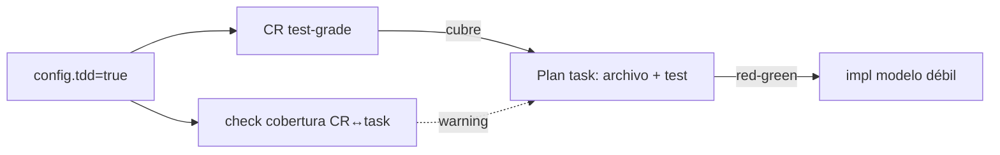

## Request

El modelo de uso de la herramienta es: **documentar con un modelo potente,
implementar con uno menos potente pero capaz**, escalando según la complejidad.
Hoy un change documenta bien para un modelo capaz, pero es marginal para uno
débil en un repo que no conoce: la Specification puede ser vaga y el Plan no
siempre dice dónde tocar ni qué probar.

Queremos definir un **Definition of Ready (DoR)**: qué hace a un change
*implementable* por un modelo menos potente, idealmente vía **TDD**. Y evaluar si
una propiedad `tdd` en `config.yml` debe gobernar cómo se documenta.

## Investigation

- **Ya existen los criterios de aceptación.** `## Specification` usa CR
  Given/When/Then y `## Plan` liga cada tarea a sus CR (`(CR1, CR2)`). El "qué
  debe cumplir" está cubierto y es la base natural de TDD: cada CR ≈ un test.
- **El hueco no es el QUÉ, es el grado.** Para que un modelo débil traduzca
  CR→test sin inventar, el CR debe ser *test-grade*: valores concretos (no "input
  válido" sino el input), salida/efecto esperado, mensajes de error literales, y
  los casos borde como CR propios. Hoy nada lo exige.
- **El Plan no es contrato de implementación.** Tareas con solo nombre de función
  asumen que el implementador lee el repo y deduce dónde cablear — eso lo hace el
  modelo fuerte, no el débil. Falta: ruta(s) de archivo y, en TDD, archivo de
  test destino. Una tarea ≈ un ciclo red-green.
- **TDD reparte responsabilidad.** El "qué se prueba" es **documentación**
  (responsabilidad del modelo fuerte: CR test-grade + mapa tarea→CR→test). El
  "cómo" (red→green→refactor) es **implementación** (modelo débil ejecuta el
  loop, no decide qué testear). ⇒ TDD empuja peso a la documentación.
- **Validable mecánicamente vs no.** "Test-grade" es intención (no parseable). Lo
  que sí se puede validar es **cobertura**: cada CR con ≥1 tarea que lo referencia
  y cada tarea con ≥1 CR. El parser ya extrae CR y tasks-con-criterios.
- **Aplicabilidad por tipo.** TDD/DoR solo aplica a tipos con `specification` +
  `plan` (feature, bug). `chore`/`audit`/`refactor` (sin specification) quedan
  fuera; un flag global debe respetar eso.

## Proposal

Tres piezas: una **política** (config), una **convención** (contrato) y una
**verificación ligera** (check de cobertura).

### 1. `tdd` en `config.yml` (default `true`)

Booleano repo-level. Señal de autoría machine-readable:

```yaml
tdd: true   # documentar test-grade; implementar red-green-refactor
```

- `true` (default, alineado con el espíritu doc-fuerte→impl-débil): el modelo
  fuerte documenta test-grade y el Plan mapea tarea→CR→test; el implementador
  trabaja TDD.
- `false`: repo exploratorio; DoR relajado, sin exigir test-grade.

Solo afecta tipos con `specification` activa. `init` lo añade al template.

### 2. DoR en el contrato (`templates/AGENTS.md`)

Nueva sección "Definition of Ready (implementation)". Un change es *ready* para
que lo implemente un modelo menos potente cuando, con `tdd: true`:

- **Specification test-grade.** Cada CR con valores concretos, salida/efecto
  esperado y errores literales. Cada caso borde es un CR. Sin requisitos en prosa
  fuera de un CR.
- **Plan como contrato.** Cada tarea: referencia ≥1 CR, nombra archivo(s)
  destino y el archivo de test. Granularidad ≈ un ciclo red-green.
- **TDD explícito.** El implementador escribe el test fallido desde el CR,
  implementa, refactoriza; no decide qué probar (lo fija el CR).

### 3. Check de cobertura (ligero, no semántico)

Cuando `tdd: true`, en un change con `specification` activa:

- **warning** si un CR no es referenciado por ninguna tarea del Plan.
- **warning** si una tarea del Plan no referencia ningún CR.

Warning (no error) para no bloquear drafts en evolución. No intenta juzgar si un
CR es "test-grade" (no parseable); solo cobertura CR↔tarea.

Descartado:
- **Error duro / gate de "test-grade".** No se puede validar la calidad de un CR
  mecánicamente; forzarlo daría falsos positivos. Queda como juicio del agente.
- **Flag por-tipo o por-change.** Sobra: `tdd` global + aplicabilidad por
  `specification` activa basta. Un override por change se puede añadir luego si
  hace falta.
- **Nuevo stage o frontmatter nuevo.** El DoR se expresa con lo que ya hay (CR +
  tareas con criterios); no añade estructura.



## Specification

### CR1 — config trae `tdd` por defecto
- **Given** un repo nuevo
- **When** corro `sl init`
- **Then** `.sl/config.yml` contiene `tdd: true`

### CR2 — check de cobertura: CR sin tarea
- **Given** `tdd: true` y un change con `specification` activa donde `CR2` no es referenciado por ninguna tarea del Plan
- **When** corro `sl check`
- **Then** emite un warning que nombra `CR2` como no cubierto
- **And** no es error (exit 0 si no hay otros errores)

### CR3 — check de cobertura: tarea sin CR
- **Given** `tdd: true` y un change con `specification` activa con una tarea de Plan sin referencia `(CRn)`
- **When** corro `sl check`
- **Then** emite un warning que nombra esa tarea como sin criterio

### CR4 — `tdd: false` desactiva el check de cobertura
- **Given** `tdd: false`
- **When** corro `sl check` sobre un change con CR no cubiertos
- **Then** no emite warnings de cobertura

### CR5 — no aplica a tipos sin specification
- **Given** `tdd: true` y un change `chore` (sin `specification` activa)
- **When** corro `sl check`
- **Then** no emite warnings de cobertura para ese change

## Plan

- [ ] Añadir `tdd: true` a `templates/config.yml`; `init` ya lo copia (CR1) — `templates/config.yml`, `test/cli.test.mjs`
- [ ] Documentar el DoR y el efecto de `tdd` en el contrato (CR2–CR5 contexto) — `templates/AGENTS.md`
- [ ] `checkRepo` (puro): cobertura CR↔tarea cuando `config.tdd` y el tipo tiene `specification` activa; warnings, no errores (CR2, CR3, CR4, CR5) — `src/check.mjs`, `test/check.test.mjs`
- [ ] Verificar que el parser expone CR ids y criterios por tarea suficientes para el cruce (ajustar si falta) — `src/change.mjs`
- [ ] README: mencionar `tdd` y el DoR

## Log
- **2026-06-14T16:36:56Z** — status: draft → approved
