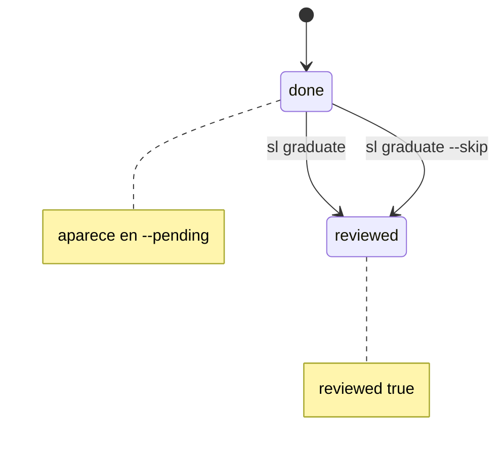

## Request

Cuando un change llega a `done`, su verdad puede graduar a un spec — pero hoy no
hay forma de saber **cuáles faltan** ni de marcar uno como **ya revisado** para
que no reaparezca. Muchos `done` (bugs, chores) no aportan verdad persistente y
no deben graduar; sin una marca de "revisado, sin spec", quedarían como
pendientes para siempre.

Queremos: un comando que liste pendientes de graduar y una forma de resolver cada
uno (graduar a spec, o descartar con razón).

## Investigation

- **"Graduado" hoy se infiere** de la marca `graduado a spec \`<file>\`` que
  `graduate()` escribe en el Log (`src/commands/graduate.mjs`). No cubre el caso
  "revisado, no necesita spec".
- **Falta una señal binaria de resolución.** Decidido: frontmatter `reviewed: true`
  = la pregunta de graduación fue **revisada** (resuelta por spec o por descarte).
  `reviewed` es más correcto que `graduated`: un change descartado no se graduó,
  pero sí se revisó. Opcional, como `owner`/`archived` (`src/writer.mjs` ya tiene
  `setOwner`/`setArchived`).
- **El writer es texto puro**; añadir `setReviewed(text, bool)` sigue el patrón
  de `setArchived` (inserta/quita la línea tras `depends_on`).
- **Sin nag en check** (decidido): listar pendientes es bajo demanda, no warning
  del gate — el repo arrastra ~30 `done` históricos ya consolidados que inundarían
  la salida. `check` solo valida que `reviewed`, si está, sea booleano.
- **Backlog histórico** (decidido): backfill `reviewed: true` en los `done`
  actuales (ya consolidados en `architecture.md`) → `--pending` arranca limpio.
- **Superficie**: extender `sl graduate` (cohesivo) en `bin/sl.mjs`, no comandos
  nuevos sueltos.

## Proposal

### Frontmatter

`reviewed: true` opcional. Ausente = no resuelto. Lo ponen tanto la graduación a
spec como el descarte.

### Comandos (`sl graduate`)

- `sl graduate <id> <spec-slug>` — existente; **además** marca `reviewed: true`.
- `sl graduate <id> --skip [razón]` — marca `reviewed: true` sin crear spec y
  añade al Log `graduation skipped[: razón]`. Solo en `done`.
- `sl graduate --pending` — lista `done` con `reviewed !== true` (formato de `sl list`).

### Helpers (`src/commands/graduate.mjs`)

- `skipGraduation(id, reason, cwd)` — valida `done`, `setReviewed` + `appendLog`.
- `pendingGraduation(cwd)` — devuelve los changes `done` no revisados.

Descartado:
- **Campo `graduated`** — semánticamente incorrecto para el descarte (no se graduó);
  `reviewed` cubre ambos casos.
- **Warning en `check`** — ruidoso con el backlog; bajo demanda es suficiente.
- **Campo derivado sin `reviewed`** — cruzar marca-de-log + flag-de-skip es menos
  explícito y no se ve en el viewer.
- **Guardar `done` en graduate-a-spec** — crear un spec es acto deliberado; no se
  restringe. El guard de `done` aplica solo a `--skip` (descarte fácil de disparar
  por error).

## Specification

### CR1 — graduar a spec marca reviewed
- **Given** un change `done` con id `20260613-120000` cuyo frontmatter no tiene `reviewed`
- **When** corro `sl graduate 20260613-120000 arch`
- **Then** el frontmatter del change contiene la línea `reviewed: true`
- **And** se crea `arch.md` con `> Graduado del change 20260613-120000` (comportamiento existente intacto)

### CR2 — skip resuelve sin spec
- **Given** un change `done` `20260613-120000` sin `reviewed`
- **When** corro `sl graduate 20260613-120000 --skip "bug fix, sin verdad persistente"`
- **Then** el frontmatter contiene `reviewed: true`
- **And** el `## Log` gana una entrada que termina en `graduation skipped: bug fix, sin verdad persistente`
- **And** no aparece ningún archivo nuevo en `specs_dir`

### CR3 — skip sin razón
- **Given** un change `done` sin `reviewed`
- **When** corro `sl graduate <id> --skip`
- **Then** el frontmatter contiene `reviewed: true`
- **And** la entrada de Log termina exactamente en `graduation skipped`

### CR4 — pending lista solo done no revisados
- **Given** tres changes: `20260101-000000` (done, `reviewed: true`), `20260102-000000` (done, sin `reviewed`), `20260103-000000` (draft)
- **When** corro `sl graduate --pending`
- **Then** la salida incluye `20260102-000000`
- **And** no incluye `20260101-000000` ni `20260103-000000`

### CR5 — reviewed debe ser booleano
- **Given** un change con frontmatter `reviewed: 1`
- **When** corro `sl check`
- **Then** los errores incluyen `reviewed must be a boolean`

### CR6 — skip solo en done
- **Given** un change `20260102-000000` con status `in-progress`
- **When** corro `sl graduate 20260102-000000 --skip`
- **Then** falla con un error que indica que solo se gradúan/descartan changes `done`
- **And** no modifica el archivo

## Plan

- [ ] `setReviewed(text, reviewed)` en `src/writer.mjs` (inserta/quita `reviewed: true` tras `depends_on`); tests en `test/writer.test.mjs` (CR1, CR2, CR3)
- [ ] `graduate()` marca `reviewed: true` tras la marca de Log en `src/commands/graduate.mjs`; test en `test/graduate.test.mjs` (CR1)
- [ ] `skipGraduation(id, reason, cwd)` en `src/commands/graduate.mjs` (valida `done`, `setReviewed`+`appendLog` `graduation skipped[: reason]`, sin spec); test en `test/graduate.test.mjs` (CR2, CR3, CR6)
- [ ] `pendingGraduation(cwd)` en `src/commands/graduate.mjs` (done con `reviewed !== true`); test en `test/graduate.test.mjs` (CR4)
- [ ] Validar `reviewed` booleano en `src/check.mjs`; test en `test/check.test.mjs` (CR5)
- [ ] Wire en `bin/sl.mjs`: `sl graduate --pending` y `sl graduate <id> --skip [reason]`, conservando `<id> <spec>` (CR1, CR2, CR3, CR4)
- [ ] Documentar `reviewed` + comandos en `templates/AGENTS.md` (§9 helpers, §10 specs) (sin CR — docs)
- [ ] Backfill `reviewed: true` en los `done` actuales de `.sl/changes/` (sin CR — migración)
- [ ] README: `sl graduate --pending` / `--skip` (sin CR — docs)

## Log
- **2026-06-14T17:09:02Z** — status: draft → approved
