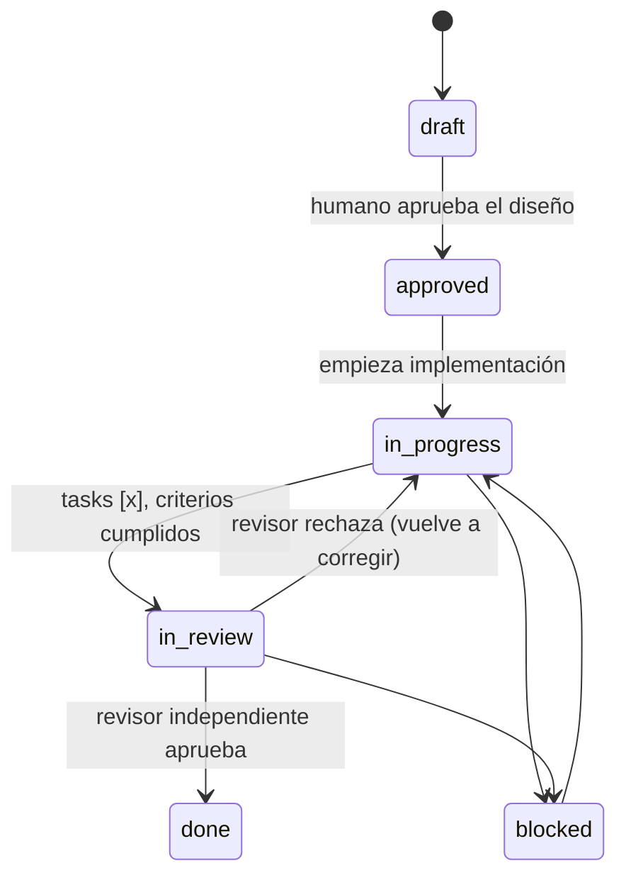

## Request

Hoy el lifecycle es `draft → approved → in-progress → done` (con `blocked`). El
humano aprueba **antes** de implementar (`approved`), pero **no hay gate después**
de implementar: el mismo agente que escribe el código lo marca `done`. Auto-
certificación, con sesgo.

Se pide cerrar el lazo: un estado de **revisión independiente** antes de `done`,
ejecutado por un **agente distinto** al implementador, que verifique que la
implementación cumple la documentación (CRn), no dejó residuo ni deuda, y que la
graduación a spec se hizo y es fiel.

Esto blinda la tesis central de Spec Ledger: el documento es la verdad; el código
es su reflejo. Sin un check independiente doc↔código, "reflejo fiel" queda en
palabra del implementador.

## Investigation

**Estado actual del lifecycle.** `config.yml` define
`statuses: [draft, approved, in-progress, blocked, done]`. Las transiciones se
mueven con `sl status <id> <status>` y se validan por invariantes (change
`20260614-192818-lifecycle-transition-invariants`). El viewer permite arrastrar
status (solo draft↔approved hoy, change `20260614-121840`).

**Quién certifica hoy.** El implementador mueve `in-progress → done` él mismo.
`done` exige todas las tasks `[x]` y criterios cumplidos (§5), pero nadie externo
lo verifica. El sesgo es estructural, no de disciplina.

**Qué ya cubre el sync de documentación.** La **graduación** (§10, `sl graduate`)
actualiza/crea los specs persistentes al llegar a `done`, y el flag `reviewed`
(change `20260614-165720-graduation-tracking`) rastrea que la pregunta
"¿gradúa o no?" quedó resuelta. **No hace falta un stage nuevo de sync** — sería
duplicar la graduación. El gate de revisión solo debe *verificar* que ocurrió.

**Frontera de responsabilidad.** Spec Ledger es dueño de la fidelidad doc↔código
y de la ausencia de residuo (§6.7). **No** debe reimplementar escáneres de
seguridad, linters ni SAST: esos son herramientas independientes
(change `20260613-215319-quality-gate-lint-precommit` ya integra lint/precommit).
El revisor puede *invocarlas* y registrar el veredicto en el Log, pero la auditoría
profunda de seguridad/deuda vive fuera, referenciada.

**Superficie afectada (multi-capa).**
- `config.yml` — añadir `in-review` a `statuses`; decidir qué tipos lo activan
  (un `chore` quizá lo salta).
- Invariantes de transición — `in-progress → in-review → done`; prohibir
  `in-progress → done` directo.
- CLI — `sl status` debe aceptar la transición; evaluar `sl review <id> pass|fail
  "<nota>"` como azúcar que mueve status + escribe Log.
- Viewer — pintar el nuevo estado y su gate.
- AGENTS.md — §5 (diagrama), §6 (regla "revisor ≠ implementador").

**Riesgo.** ¿Cómo se garantiza "agente distinto" técnicamente? La herramienta no
controla qué agente la invoca. Se cubre por **contrato** (regla en §6) + registro
en Log de quién revisó (handle, como `owner`), no por enforcement duro. Aceptable:
Spec Ledger ya opera por convención sobre archivos.

## Proposal

**Lifecycle nuevo:**

**Alcance del revisor (qué valida, en `in-review`):**

1. Cada `CRn` de la Specification se cumple en el código.
2. Sin residuo §6.7 (TODO/FIXME, dead code, shims de retrocompat).
3. Plan ejecutado: tasks `[x]` reales, no marcadas a la ligera.
4. Graduación hecha y fiel: el spec refleja el cambio (o `--skip` justificado).

**Fuera de alcance (delegado a herramientas, no lo reimplementa Spec Ledger):**
auditoría de seguridad profunda, linters, SAST, cobertura. El revisor puede
invocarlas y anotar el veredicto en el Log.

**Roles — revisión por subagente delegado.** El implementador **debe delegar** la
revisión a un **subagente con contexto limpio** (sin el historial de
implementación). El contexto fresco da la imparcialidad que busca el gate, y
mantiene todo dentro del mismo flujo de la herramienta — no hace falta un humano
ni un segundo operador.

Límite técnico: Spec Ledger es un CLI sobre archivos, **no spawnea agentes**. La
delegación es un patrón de orquestación que el contrato (§6) prescribe; el CLI
solo **registra** que ocurrió. Como un subagente no tiene `gh login`, el Log marca
`revisión delegada (subagente, contexto limpio)` en lugar de un handle humano. No
hay enforcement duro de que el contexto fuera realmente limpio — queda por
convención, igual que "una sola concern por change".

**Mecánica CLI (a decidir en Specification):**
- Mínimo: `sl status <id> in-review` y `sl status <id> done`, con invariantes que
  prohíben `in-progress → done` directo.
- Azúcar propuesta: `sl review <id> pass` (→ `done`) / `sl review <id> fail
  "<motivo>"` (→ `in-progress`, escribe Log), que además estampa el handle del
  revisor.

**Activación por tipo (`config.yml`):** obligatorio **solo donde aporta** —
tipos con implementación verificable: `feature`, `bug`, `refactor`. `chore`
(trivial, sin verdad persistente) y `audit` (solo investiga, no implementa) lo
**saltan**: van `in-progress → done` directo. Se modela como flag por tipo en
`config.yml` (p. ej. `review_required: true`), análogo a cómo `stages` se activa
por tipo. Los invariantes leen ese flag para decidir qué transiciones exigir.

**Alternativas descartadas:**
- *Sub-estado de `done` (flag `reviewed_impl`)* en vez de status propio: lo
  rechazo — el gate debe ser visible en el lifecycle y bloquear `done`, no un flag
  post-hoc fácil de omitir.
- *Enforcement duro de "agente distinto"* (la herramienta rechaza si revisor ==
  implementador): rechazado — el CLI no spawnea agentes ni conoce su identidad. La
  imparcialidad se obtiene por **delegación a subagente con contexto limpio**
  (patrón de contrato §6); el CLI solo registra. Proporcional (KISS).
- *Revisión por humano u operador externo*: rechazado — sacaría el gate del flujo
  de la herramienta. El subagente delegado lo mantiene dentro y sin sesgo.
- *Stage de sync de docs nuevo*: rechazado — la graduación (§10) ya lo cubre;
  duplicarlo es over-engineering.

## Specification

> Se completará test-grade tras aprobar el diseño (CRn con valores concretos y
> mensajes literales, por §11). Esbozo de criterios a cubrir:
> - Transición `in-progress → done` directa es rechazada con mensaje literal.
> - `in-progress → in-review → done` permitida.
> - `in-review → in-progress` permitida (rechazo del revisor).
> - `sl review pass|fail` mueve status, escribe Log y estampa handle del revisor.
> - `config.yml` activa `in-review` solo para los tipos configurados.

## Plan

> Se completará tras aprobar el diseño. Tocará: `config.yml`, invariantes de
> transición, `sl status`/`sl review`, viewer, AGENTS.md §5/§6. Atómico por capa.

## Log
