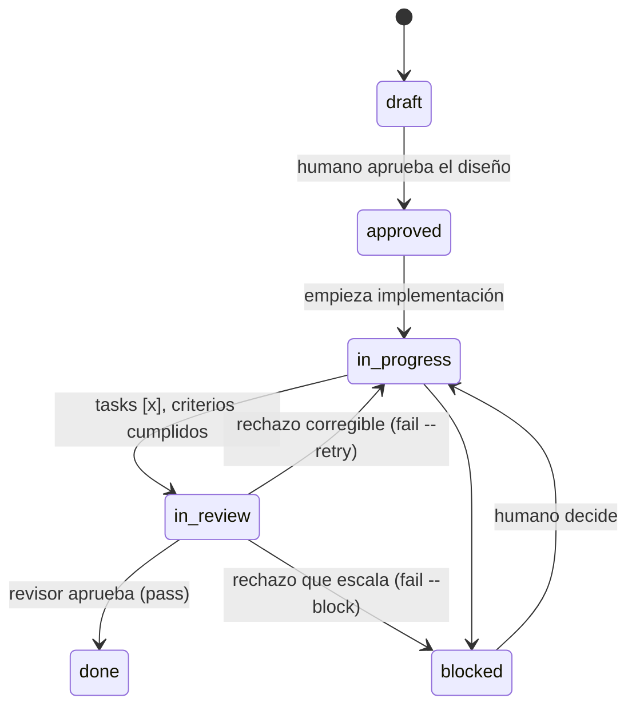

## Request

Hoy el lifecycle es `draft → approved → in-progress → done` (con `blocked`). El
humano aprueba **antes** de implementar (`approved`), pero **no hay gate después**
de implementar: el mismo agente que escribe el código lo marca `done`. Auto-
certificación, con sesgo.

Se pide cerrar el lazo: un estado de **revisión independiente** antes de `done`,
ejecutado por un **agente distinto** al implementador, que verifique que la
implementación cumple la documentación (CRn), no dejó residuo ni deuda, y que la
graduación a spec se hizo y es fiel.

Esto blinda la tesis central de Spec Ledger: el documento es la verdad; el código
es su reflejo. Sin un check independiente doc↔código, "reflejo fiel" queda en
palabra del implementador.

## Investigation

**Estado actual del lifecycle.** `config.yml` define
`statuses: [draft, approved, in-progress, blocked, done]`. `sl status <id>
<status>` solo valida que el destino sea un enum válido — **no** invariantes de
transición. El único guard de transición vive en el viewer (solo `draft→approved`,
change `20260614-121840`). El CLI hoy acepta cualquier salto (p. ej. `draft →
done`). Este change cierra ese hueco además de añadir el gate.

**Quién certifica hoy.** El implementador mueve `in-progress → done` él mismo.
`done` exige todas las tasks `[x]` y criterios cumplidos (§5), pero nadie externo
lo verifica. El sesgo es estructural, no de disciplina.

**Qué ya cubre el sync de documentación.** La **graduación** (§10, `sl graduate`)
actualiza/crea los specs persistentes al llegar a `done`, y el flag `reviewed`
(change `20260614-165720-graduation-tracking`) rastrea que la pregunta
"¿gradúa o no?" quedó resuelta. **No hace falta un stage nuevo de sync** — sería
duplicar la graduación. El gate de revisión solo debe *verificar* que ocurrió.

**Frontera de responsabilidad.** Spec Ledger es dueño de la fidelidad doc↔código
y de la ausencia de residuo (§6.7). **No** debe reimplementar escáneres de
seguridad, linters ni SAST: esos son herramientas independientes
(change `20260613-215319-quality-gate-lint-precommit` ya integra lint/precommit).
El revisor puede *invocarlas* y registrar el veredicto en el Log, pero la auditoría
profunda de seguridad/deuda vive fuera, referenciada.

**Superficie afectada (multi-capa).**
- `config.yml` — añadir `in-review` a `statuses`; decidir qué tipos lo activan
  (un `chore` quizá lo salta).
- Invariantes de transición — `in-progress → in-review → done`; prohibir
  `in-progress → done` directo.
- CLI — `sl status` debe aceptar la transición; evaluar `sl review <id> pass|fail
  "<nota>"` como azúcar que mueve status + escribe Log.
- Viewer — pintar el nuevo estado y su gate.
- AGENTS.md — §5 (diagrama), §6 (regla "revisor ≠ implementador").

**Riesgo.** ¿Cómo se garantiza "agente distinto" técnicamente? La herramienta no
controla qué agente la invoca. Se cubre por **contrato** (regla en §6) + registro
en Log de quién revisó (handle, como `owner`), no por enforcement duro. Aceptable:
Spec Ledger ya opera por convención sobre archivos.

## Proposal

**Lifecycle nuevo:**



**Alcance del revisor (qué valida, en `in-review`):**

1. Cada `CRn` de la Specification se cumple en el código.
2. Sin residuo §6.7 (TODO/FIXME, dead code, shims de retrocompat).
3. Plan ejecutado: tasks `[x]` reales, no marcadas a la ligera.
4. Graduación hecha y fiel: el spec refleja el cambio (o `--skip` justificado).

**Fuera de alcance (delegado a herramientas, no lo reimplementa Spec Ledger):**
auditoría de seguridad profunda, linters, SAST, cobertura. El revisor puede
invocarlas y anotar el veredicto en el Log.

**Roles — revisión por subagente delegado.** El implementador **debe delegar** la
revisión a un subagente. El contrato (§6) fija el **qué**, no el **cómo**:

- **contexto limpio** — sin el historial de implementación; de ahí la
  imparcialidad que busca el gate.
- **modelo acorde a la dificultad** — dimensionar la capacidad al fallo a revisar;
  no gastar un modelo caro en algo trivial. El revisor de un residuo §6.7 no
  necesita el mismo modelo que el de una falla de diseño.

El **cómo** (qué harness, qué API, qué `subagent_type`, cómo se elige el modelo)
es responsabilidad del agente/herramienta que consume Spec Ledger — fuera de
alcance. Spec Ledger es un CLI sobre archivos, **no spawnea agentes**: el contrato
prescribe la delegación y el CLI solo **registra** que ocurrió. Como un subagente
no tiene `gh login`, el Log marca `revisión delegada (subagente, contexto limpio)`
en lugar de un handle humano. Sin enforcement duro de que el contexto fuera
limpio ni del modelo usado — queda por convención, igual que "una sola concern por
change".

**Resultado del rechazo — dos rutas según el veredicto:**

El subagente **clasifica** el fallo con un criterio fijo: *¿se arregla sin tocar
la documentación ni decidir nada nuevo?*

- **Sí → `in-progress`** (rechazo corregible): el defecto cae dentro del contrato
  documentado — código no cumple un `CRn`, residuo §6.7, task no hecha. El
  implementador corrige y reenvía a revisión.
- **No → `blocked`** (rechazo que escala): el problema excede el contrato — spec
  ambigua o contradictoria, hallazgo de seguridad fuera de alcance, falla de
  diseño, o un `CRn` que no refleja la realidad. El humano lo analiza y decide
  (enmendar doc, reabrir, descartar). Reúsa `blocked`, su semántica ya es
  "impedimento que necesita algo fuera del loop autónomo" — sin estado nuevo.

**Mecánica CLI (a refinar en Specification):**
- `sl review <id> pass` → `done` (tras pass, el flujo de graduación §10 aplica).
- `sl review <id> fail --retry "<motivo>"` → `in-progress`.
- `sl review <id> fail --block "<motivo>"` → `blocked`.
- El revisor elige la ruta explícitamente (el CLI no la adivina). Toda variante
  escribe el motivo al Log y marca la revisión como delegada.
- Invariantes: `sl status` valida el **grafo completo** del lifecycle (no solo el
  gate). `in-progress → done` directo prohibido si `review_required`; `in-review`
  solo desde `in-progress`; cualquier arista no listada se rechaza.

**Activación por tipo (`config.yml`):** obligatorio **solo donde aporta** —
tipos con implementación verificable: `feature`, `bug`, `refactor`. `chore`
(trivial, sin verdad persistente) y `audit` (solo investiga, no implementa) lo
**saltan**: van `in-progress → done` directo. Se modela como flag por tipo en
`config.yml` (p. ej. `review_required: true`), análogo a cómo `stages` se activa
por tipo. Los invariantes leen ese flag para decidir qué transiciones exigir.

**Alternativas descartadas:**
- *Sub-estado de `done` (flag `reviewed_impl`)* en vez de status propio: lo
  rechazo — el gate debe ser visible en el lifecycle y bloquear `done`, no un flag
  post-hoc fácil de omitir.
- *Enforcement duro de "agente distinto"* (la herramienta rechaza si revisor ==
  implementador): rechazado — el CLI no spawnea agentes ni conoce su identidad. La
  imparcialidad se obtiene por **delegación a subagente con contexto limpio**
  (patrón de contrato §6); el CLI solo registra. Proporcional (KISS).
- *Revisión por humano u operador externo*: rechazado — sacaría el gate del flujo
  de la herramienta. El subagente delegado lo mantiene dentro y sin sesgo.
- *Stage de sync de docs nuevo*: rechazado — la graduación (§10) ya lo cubre;
  duplicarlo es over-engineering.

## Specification

Hallazgo de la investigación: hoy `sl status` solo valida que el status sea un
enum válido — **no** invariantes de transición (esas viven solo en el viewer,
`draft→approved`). El gate obliga a introducir invariantes en el CLI. Los markers
que el CLI escribe en el Log son **siempre inglés** (§8: CLI es estructura), igual
que `status: X → Y` actual.

### CR1 — config activa in-review y review_required por tipo
- **Given** `templates/config.yml` recién sembrado por `sl init`
- **Then** `statuses` es `[draft, approved, in-progress, in-review, blocked, done]`
- **And** `types.feature`, `types.bug`, `types.refactor` tienen `review_required: true`
- **And** `types.chore` y `types.audit` **no** declaran `review_required`

### CR2 — check valida review_required booleano
- **Given** un change cuyo `config.yml` declara `review_required: "yes"` (string) en un tipo
- **When** se ejecuta `sl check`
- **Then** es error con el texto literal `review_required must be a boolean`

### CR3 — el gate rechaza in-progress → done en tipo con review_required
- **Given** un change `type: feature`, `status: in-progress`
- **When** `sl status <id> done`
- **Then** lanza con el mensaje literal `feature changes must be reviewed before done — move to in-review first`
- **And** el archivo no se modifica (ni status ni Log)

### CR4 — tipo sin review_required va de in-progress a done directo
- **Given** un change `type: chore`, `status: in-progress`
- **When** `sl status <id> done`
- **Then** el status pasa a `done` y se registra `status: in-progress → done` en el Log

### CR5 — in-review solo es alcanzable desde in-progress
- **Given** un change `type: feature`, `status: approved`
- **When** `sl status <id> in-review`
- **Then** lanza con el mensaje literal `invalid transition: approved → in-review`
- **And** el archivo no se modifica

### CR6 — review pass mueve a done y marca la delegación
- **Given** un change `type: feature`, `status: in-review`
- **When** `sl review <id> pass`
- **Then** el status pasa a `done`
- **And** el Log gana la entrada `review → done (delegated subagent, clean context)`

### CR7 — review fail --retry vuelve a in-progress con el motivo
- **Given** un change `type: feature`, `status: in-review`
- **When** `sl review <id> fail --retry "CR3 not met"`
- **Then** el status pasa a `in-progress`
- **And** el Log gana la entrada `review → in-progress (retry): CR3 not met`

### CR8 — review fail --block escala a blocked con el motivo
- **Given** un change `type: feature`, `status: in-review`
- **When** `sl review <id> fail --block "spec is ambiguous"`
- **Then** el status pasa a `blocked`
- **And** el Log gana la entrada `review → blocked: spec is ambiguous`

### CR9 — review exige status in-review
- **Given** un change `type: feature`, `status: in-progress`
- **When** `sl review <id> pass`
- **Then** lanza con el mensaje literal `review requires status in-review (current: in-progress)`
- **And** el archivo no se modifica

### CR10 — review fail exige un motivo
- **Given** un change `type: feature`, `status: in-review`
- **When** `sl review <id> fail --retry` (sin motivo)
- **Then** lanza con el mensaje literal `fail requires a reason — sl review <id> fail --retry|--block "<reason>"`
- **And** el archivo no se modifica

### CR11 — métricas cuentan in-review como WIP
- **Given** un repo con un change en `in-review`
- **When** se calcula `wip` en `metrics.mjs`
- **Then** ese change cuenta como activo (in-review es estado WIP, junto a in-progress y blocked)

### CR12 — el grafo rechaza cualquier transición no permitida
- **Given** un change `type: feature`, `status: draft`
- **When** `sl status <id> done`
- **Then** lanza con el mensaje literal `invalid transition: draft → done`
- **And** el archivo no se modifica
- **And** mover fuera del grafo (p. ej. reabrir un `done`) no es función del CLI: se edita el archivo a mano

## Plan

Invariantes en una función pura `assertTransition({ from, to, reviewRequired })`
en `src/change.mjs` que valida el **grafo completo** del lifecycle (no solo las
aristas del gate), llamada desde `status()` en `src/commands/agent.mjs` (que ya
tiene el `config` vía `locate()`). Aristas permitidas:

```
draft       → approved
approved    → in-progress
in-progress → in-review | blocked | done   (done solo si !reviewRequired)
in-review   → done | in-progress | blocked
blocked     → in-progress
done        → ∅ (terminal)
```

Arista fuera del grafo → `invalid transition: <from> → <to>`. El gate
(`in-progress → done` con `reviewRequired`) usa el mensaje específico de CR3.
Mover fuera del grafo (reabrir, des-aprobar) no es del CLI: archivo a mano. El
comando `sl review` es azúcar sobre `setStatus` + `appendLog` con precondición y
markers fijos en inglés.

- [x] Sembrar `in-review` en `statuses` y `review_required: true` en feature/bug/refactor de `templates/config.yml`; test en `test/cli-bin.test.mjs` (init seeding) (CR1) — 2026-06-15T16:05:39Z
- [x] Validar `review_required` booleano en `src/check.mjs`, junto a la regla de `reviewed`; test en `test/check.test.mjs` (CR2) — 2026-06-15T16:05:39Z
- [x] Añadir `assertTransition()` pura en `src/change.mjs` (grafo completo del lifecycle + regla review_required); test unitario en `test/change.test.mjs` (CR3, CR4, CR5, CR12) — 2026-06-15T16:05:40Z
- [x] Llamar `assertTransition()` desde `status()` en `src/commands/agent.mjs` antes de escribir, derivando `reviewRequired` de `config.types[type]`; test en `test/agent.test.mjs` (CR3, CR4, CR5, CR12) — 2026-06-15T16:05:40Z
- [x] Añadir `review(id, verdict, { mode, reason })` en `src/commands/agent.mjs` (precondición in-review, markers inglés en Log, rutas pass/retry/block); test en `test/agent.test.mjs` (CR6, CR7, CR8, CR9, CR10) — 2026-06-15T16:05:40Z
- [x] Incluir `in-review` en el conjunto WIP de `src/metrics.mjs`; test en `test/metrics.test.mjs` (CR11) — 2026-06-15T16:05:40Z
- [x] Cablear `sl review <id> pass|fail --retry|--block "<reason>"` en `bin/sl.mjs` + entrada en `HELP`; test en `test/cli-bin.test.mjs` — 2026-06-15T16:05:40Z
- [ ] Renderizar el estado `in-review` en el viewer (`src/viewer/public/styles.css`, `app.js`); el viewer sigue permitiendo solo `draft→approved`
- [ ] Documentar el gate en `templates/AGENTS.md`: §5 (diagrama + estado), §6 (regla revisión por subagente: contexto limpio + modelo acorde a dificultad), §9 (`sl review`)

## Log
- **2026-06-15T15:52:31Z** — status: draft → approved
- **2026-06-15T15:57:00Z** — scope broadened: assertTransition validates the full lifecycle graph, not only the gate edges (CR12 added)
- **2026-06-15T15:58:41Z** — status: approved → in-progress
- **2026-06-15T15:58:41Z** — owner → raruiz-hiberuscom (auto)
