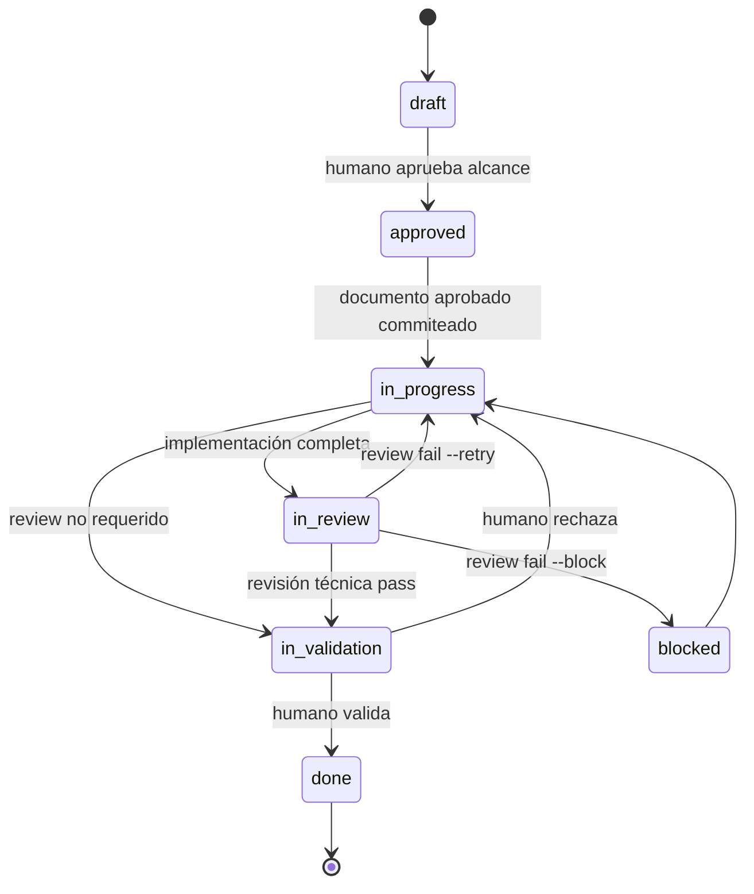

## Request

Hoy un change con `review_required` pasa de la revisión técnica independiente a
`done` sin que el humano haya probado y aceptado el resultado completo. En la
práctica, una implementación puede cumplir tests y criterios según el agente,
pero fallar al usarse, estar incompleta o resolver otro problema. `done` termina
afirmando algo que todavía no ha sido certificado por quien pidió el cambio.

Cuando esa prueba descubre un defecto antes del cierre, el trabajo sigue
perteneciendo al change activo: no debe abrirse otro change pequeño para cada
intento. A la vez, esos intentos de corrección no deben convertirse en una
cadena de commits hasta que el humano confirme que realmente solucionan el
fallo. Esto debe convivir con la trazabilidad existente: documento aprobado
commiteado antes de implementar y commits intermedios cuando continuar pueda
mezclar unidades de trabajo.

La misma falta de intervención humana ocurre al inicio: la regla actual de
captura de fricción permite que el agente cree por iniciativa propia changes que
el humano no considera backlog real. Incluso puede convertir pasos operativos
del flujo —por ejemplo, graduar un change terminado— en chores artificiales. El
agente debe proponer el backlog nuevo y obtener autorización antes de crear sus
archivos, salvo cuando el humano ya pidió explícitamente crear el change.

## Investigation

- El ciclo actual es `in-progress → in-review → done` para los tipos con
  `review_required`. `sl review pass` certifica una revisión independiente por
  subagente, no una validación humana en uso real.
- El viewer solo permite hoy la acción humana `draft → approved`; el humano no
  tiene una transición explícita al final del ciclo.
- `done` es terminal y debe seguir siéndolo. Un defecto descubierto después de
  `done` requiere un nuevo change; `depends_on` basta cuando existe una
  dependencia real con el anterior.
- La regla de captura de fricción favorece crear drafts separados, pero no dice
  primero que un ajuste necesario para cumplir el propósito de un change activo
  debe incorporarse a ese mismo change. Esto puede fragmentar artificialmente
  el trabajo.
- Tampoco distingue backlog de operación: graduar, verificar, commitear o cerrar
  son pasos del change en curso, no nuevos changes. Crear un `draft` no es una
  acción inocua porque ensucia el tablero y convierte una sugerencia del agente
  en trabajo registrado antes de que el humano lo considere necesario.
- La política Git exige el commit del documento aprobado antes de implementar y
  un commit al completar el change, pero no explicita commits intermedios cuando
  varias tareas o cambios sobre el mismo archivo pueden perder atribución.
- Tampoco distingue una unidad ya verificada de una corrección candidata nacida
  de una validación humana fallida. Commitear cada intento produce falsos
  positivos y ruido histórico.

## Proposal

Añadir `in-validation` como gate del **change completo**, sin modificar el
modelo ni los marcadores de tareas:

Mantener `review_required` con su significado actual: decide únicamente si el
change necesita revisión técnica independiente. La validación humana es
universal antes de `done`: los tipos con revisión siguen
`in-progress → in-review → in-validation → done`; los demás siguen
`in-progress → in-validation → done`. No se añade otra opción de configuración.

El viewer ofrecerá al humano aceptar o rechazar un change en `in-validation`.
El rechazo exige un motivo, vuelve a `in-progress` y lo registra en `Log`. El
agente ajusta Specification/Plan y agrega tareas normales cuando sea necesario;
después repite revisión y validación. No se crean estados especiales de tarea.

Antes de crear un draft por una fricción, el contrato exigirá decidir si el
trabajo es necesario para cumplir el propósito de un change activo. Si lo es,
se incorpora allí. Si introduce un resultado independiente, es demasiado
extenso o amplía sustancialmente el impacto, el agente lo **propone** al humano
con tipo, título y motivo, pero no crea el archivo hasta recibir autorización.
Puede agrupar varias propuestas al final del turno para no interrumpir el
trabajo. Una petición humana explícita como “crea el change” ya constituye esa
autorización. Los pasos operativos del ciclo se ejecutan o registran en el
Plan/Log actual, nunca se convierten en backlog. Los changes terminales nunca se
reabren y `depends_on` se usa solo cuando el nuevo change depende realmente de
otro.

La política Git conservará el commit obligatorio del documento aprobado antes
de `in-progress` y añadirá commits intermedios antes de que continuar pueda
perder trazabilidad —por ejemplo, al cambiar de tarea o change, o al volver a
modificar la misma superficie para otra unidad—. Excepción: una corrección
candidata causada por un rechazo humano queda sin commit mientras se valida y
no se mezcla con otra tarea/change. Si se rechaza, se itera sobre el mismo diff;
si se acepta, se commitea la corrección validada junto con la verdad relacionada.

Alternativas descartadas:

- Añadir `extends`: `depends_on` cubre las relaciones necesarias y la decisión
  principal es incorporar al change activo o crear uno nuevo.
- Añadir marcadores de tarea para “pendiente de validación”: la validación
  pertenece al change completo y complicaría innecesariamente el Plan.
- Exigir un commit por cada tarea: no toda tarea forma una unidad aislada; el
  criterio útil es preservar atribución sin commitear intentos no validados.
- Añadir `validation_required`: haría ambiguo qué significa `done` entre tipos;
  la validación humana universal mantiene una única semántica de cierre.

## Specification

### CR1 — Gate humano después de la revisión técnica
- **Given** un change de un tipo con `review_required: true` en `in-review`
- **When** la revisión independiente pasa
- **Then** el change queda en `in-validation`, no en `done`
- **And** `in-validation` aparece como estado activo en CLI, viewer y métricas

### CR2 — Aceptación humana cierra el change
- **Given** un change en `in-validation`
- **When** el humano lo acepta desde el viewer
- **Then** el change pasa a `done`
- **And** el `Log` registra la aceptación con timestamp

### CR3 — Rechazo humano devuelve el mismo change
- **Given** un change en `in-validation`
- **When** el humano lo rechaza indicando un motivo
- **Then** el change vuelve a `in-progress`
- **And** el motivo queda registrado en `Log`
- **And** puede volver a `in-review` tras ajustar su Specification, Plan y tareas normales

### CR4 — Estados terminales no se reabren
- **Given** un change en `done` o `discarded`
- **When** se intenta devolverlo al ciclo activo
- **Then** la transición es rechazada
- **And** un trabajo posterior se representa con un nuevo change y `depends_on` solo si existe dependencia real

### CR5 — La revisión sigue siendo opcional, la validación no
- **Given** un change cuyo tipo no tiene `review_required: true`
- **When** completa su implementación en `in-progress`
- **Then** pasa directamente a `in-validation` sin atravesar `in-review`
- **And** solo llega a `done` tras aceptación humana
- **And** no se requiere una opción `validation_required`

### CR6 — El contrato prioriza ampliar el change activo
- **Given** una fricción o defecto descubierto mientras existe un change activo relacionado
- **When** resolverlo es necesario para cumplir el propósito ya aprobado de ese change
- **Then** el agente actualiza ese mismo change en lugar de crear otro
- **And** propone un nuevo change si el resultado es independiente, demasiado extenso o amplía sustancialmente el impacto

### CR7 — Commits intermedios preservan atribución
- **Given** implementación de un change en curso
- **When** continuar con otra tarea, otro change o una nueva modificación sobre la misma superficie puede volver ambiguo el origen del diff
- **Then** el agente commitea primero la unidad completada con referencia al change
- **And** mantiene obligatorio el commit del documento aprobado antes de pasar a `in-progress`

### CR8 — Intentos rechazados no contaminan el historial
- **Given** que la validación humana rechazó un change y el agente prepara una corrección candidata
- **When** la corrección todavía no ha sido confirmada por el humano
- **Then** el agente no commitea ese intento ni empieza otra tarea o change sobre el mismo worktree
- **And** si la validación falla itera sobre el mismo diff sin acumular commits
- **And** si la validación pasa commitea la corrección validada y la actualización relacionada del ledger

### CR9 — El humano autoriza el backlog propuesto por el agente
- **Given** que el agente detecta trabajo independiente que podría justificar un nuevo change
- **When** el humano no ha pedido explícitamente crear ese change
- **Then** el agente presenta tipo, título y motivo y espera autorización antes de crear el archivo
- **And** puede agrupar varias propuestas para evitar interrupciones innecesarias
- **And** no propone ni crea changes para pasos operativos del flujo actual como verificar, commitear, graduar o cerrar

## Plan

- [x] Extender `src/lifecycle.mjs`, `src/commands/agent.mjs` y el CLI para `in-validation`, aceptación y rechazo con motivo; verificar en `test/lifecycle.test.mjs`, `test/agent.test.mjs` y `test/cli-bin.test.mjs` (CR1, CR2, CR3, CR4, CR5) — 2026-06-19T17:37:37Z
- [x] Actualizar `src/viewer/domain.mjs`, `src/viewer/public/app.js` y las rutas del viewer para presentar aceptación/rechazo humano de `in-validation`; verificar en `test/view.test.mjs` y `test/viewer-metadata.test.mjs` (CR1, CR2, CR3) — 2026-06-19T17:37:37Z
- [x] Incorporar `in-validation` en `src/metrics.mjs`, `src/check.mjs` y `.sl/config.yml`; verificar en `test/metrics.test.mjs`, `test/check.test.mjs` y `test/cli.test.mjs` (CR1, CR4, CR5) — 2026-06-19T17:37:37Z
- [x] Actualizar `templates/AGENTS.md` con el gate humano, el triage y autorización de backlog y la política Git contextual; verificar con `test/cli.test.mjs` (CR4, CR5, CR6, CR7, CR8, CR9) — 2026-06-19T17:37:51Z
- [x] Graduar el ciclo y las reglas de trazabilidad a `.sl/specs/architecture.md`; verificar con `node bin/sl.mjs check 20260619-171002` (CR1, CR2, CR3, CR4, CR5, CR6, CR7, CR8, CR9) — 2026-06-19T17:38:52Z
- [ ] Ejecutar `pnpm verify` y validar manualmente en el viewer aprobación, rechazo con motivo y segundo intento de un change de prueba (support)

## Log

- **2026-06-19T17:10:02Z** — Creado a partir de fricción de uso en otros proyectos: `done` reflejaba revisión técnica, pero no aceptación humana del resultado completo.
- **2026-06-19T17:10:02Z** — Alcance simplificado durante la conversación: sin `extends`, sin estados nuevos de tarea y sin `validation_required`; `depends_on` y las tareas actuales son suficientes, `review_required` conserva exclusivamente su significado de revisión técnica opcional y la validación humana es universal.
- **2026-06-19T17:10:02Z** — Ampliado antes de aprobación: el agente propone backlog independiente y espera autorización; los pasos operativos permanecen dentro del flujo actual y no generan chores artificiales.
- **2026-06-19T17:28:29Z** — status: draft → approved
- **2026-06-19T17:29:46Z** — status: approved → in-progress
- **2026-06-19T17:29:46Z** — owner → Roberto Ruiz (auto)
- **2026-06-19T17:37:38Z** — Implementado ciclo universal de validación humana, acciones de aceptación/rechazo en viewer y métricas/check; suite focalizada verde.
- **2026-06-19T17:37:51Z** — Commit combinado de tareas 1–4: la migración de config y las reglas del contrato comparten test/cli.test.mjs; se mantiene la graduación de architecture.md como unidad separada.
- **2026-06-19T17:38:52Z** — Graduada la semántica persistente de lifecycle, autorización de backlog y trazabilidad Git en architecture.md, eliminando reglas anteriores contradictorias.
