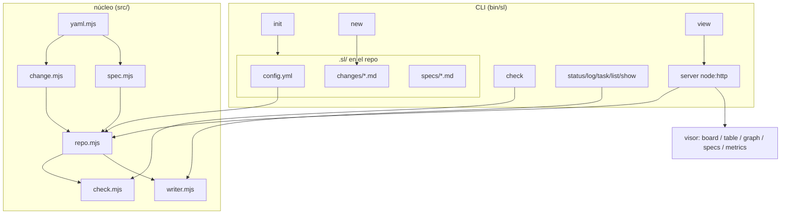
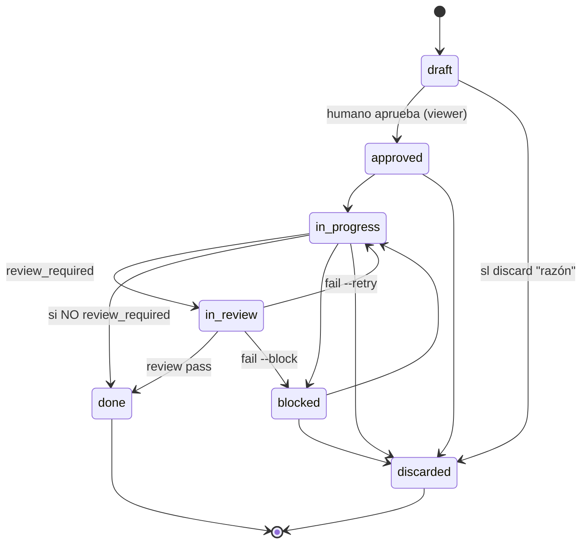

# Arquitectura de Spec Ledger

> Graduado del change 20260613-205854 (capa specs: verdad persistente y graduación).
> Graduado del change 20260614-151759 (discovery del contrato).
> Graduado del change 20260614-162547 (Definition of Ready / tdd).
> Graduado del change 20260614-165720 (revisión de graduación / reviewed).
> Graduado del change 20260614-182513 (owner desde GitHub login).
> Graduado del change 20260615-150510 (gate de revisión independiente + invariantes de transición).
> Graduado del change 20260615-170803 (graduación a spec existente, `sl graduate --into`).
> Graduado del change 20260615-210508 (estado terminal `discarded`).
> Graduado del change 20260616-151221 (parsing estricto de changes).
> Graduado del change 20260616-151216 (Definition of Ready verificable).
> Graduado del change 20260616-151230 (mutaciones de frontmatter fail-fast).
> Graduado del change 20260616-151234 (resolución segura de assets estáticos).
> Graduado del change 20260616-151226 (parser CLI con commander).
> Graduado del change 20260616-162014 (validación de criterios referenciados por tareas).
> Graduado del change 20260616-162020 (normalización compartida de slugs).
> Graduado del change 20260616-162027 (registry corrupto falla sin sobrescribir).
> Graduado del change 20260616-162050 (headings dentro de fenced code blocks).
> Graduado del change 20260616-162104 (profundidad del grafo con ramas aisladas).
> Graduado del change 20260616-162017 (escrituras atomicas de fuente de verdad).
> Graduado del change 20260616-210825 (métricas cuentan cierres por revisión).
> Graduado del change 20260617-020229 (Definition of Ready con patrones configurables).
> Graduado del change 20260616-212836 (ejemplos de graduación no crean enlaces reales).
> Graduado del change 20260616-212840 (captura automática de fricciones).
> Graduado del change 20260616-212319 (archivar no vuelve stale el spec).
> Graduado del change 20260616-212322 (archivado masivo de graduados).
> Graduado del change 20260616-212314 (serialización de mutaciones por archivo).
> Graduado del change 20260616-212309 (tests del viewer sin socket local).
> Graduado del change 20260617-161309 (workflow git para trazabilidad).

Spec Ledger separa **almacén** (fuente de verdad, optimizada para agente y git)
de **presentación** (un visor agradable para el humano). Es un CLI global; en
cada repo solo viven los documentos bajo `.sl/`.

## Componentes

`bin/sl.mjs` define la interfaz de comandos con `commander`, manteniendo
`src/commands/*` como capa de aplicación. La dependencia está fijada en una
línea compatible con Node 20 y el binario conserva el shebang + modo ejecutable,
porque se publica como comando global `sl`. El parser rechaza opciones
desconocidas en lugar de ignorarlas silenciosamente.

## Modelo de datos

- **change**: un archivo markdown. Frontmatter estructurado (`id`, `title`,
  `type`, `status`, `created`, `depends_on`, `owner` opcional, `archived` opcional,
  `reviewed` opcional) + etapas (`## Request`…`## Log`) según el tipo. Tiene ciclo
  de vida (ver **Ciclo de vida y gate de revisión**). Tareas en `## Plan` como
  checklist (`[ ]`/`[x]`/`[!]`).
- **spec**: un archivo markdown sin ciclo de vida. Frontmatter mínimo (`title`,
  `updated`, `tags`) + cuerpo libre. Es la verdad persistente; un change `done`
  gradúa su verdad aquí.

**Revisión de graduación.** Tras `done`, cada change se resuelve: gradúa a un spec
o se descarta (bug/chore sin verdad persistente). Ambos casos fijan `reviewed: true`
(`writer.setReviewed`). `sl graduate --pending` (`pendingGraduation`) lista los
`done` con `reviewed !== true`; `sl graduate <id> --skip [razón]` (`skipGraduation`,
solo en `done`) descarta dejando `graduation skipped` en el Log; `graduate()` a spec
también fija `reviewed`. "Graduado a spec" sigue siendo derivable de la marca
`graduado a spec` del Log — `reviewed` solo registra que la pregunta quedó zanjada.
`check` valida que `reviewed`, si está, sea booleano; no avisa de pendientes (es
bajo demanda).

`sl archive --graduated [--dry-run]` limpia el board de forma explícita y
conservadora: selecciona solo changes `done`, `reviewed: true`, no archivados, y
con resolución de graduación en `## Log` (`graduado a spec` o `graduation
skipped`). El dry-run lista los candidatos y total sin escribir. El archivado
masivo reutiliza el parser del repo y escribe `archived: true` más una entrada
`archived` en el Log; no toca estados activos, bloqueados, descartados, cambios
sin reviewed ni cambios ya archivados.

`graduate()` tiene dos rutas. Por defecto **crea** un spec nuevo (semilla desde
Specification/Proposal) y falla si ya existe. Con `--into` (`{ into: true }`)
**gradúa a un spec existente**: exige que exista (error simétrico si no), refresca
su `updated` (`writer.setSpecUpdated`) y deja el cuerpo al agente — no lo
sobrescribe. Ambas rutas comparten el registro en el change (marker + `reviewed`).
La sustitución es explícita (flag), nunca por auto-detección, para que un slug mal
tecleado no enlace por error.

Las mutaciones de frontmatter en `writer.mjs` preservan el formato textual del
documento, pero fallan explícitamente si no encuentran la línea ancla que deben
editar o usar para insertar (`status`, `depends_on`, `updated`). Así una orden
del CLI no puede aparentar éxito cuando el frontmatter está parcialmente roto.
Las escrituras que reemplazan documentos o estado local pasan por
`writeFileAtomic`: escriben a un temporal en el mismo directorio, sincronizan el
descriptor, hacen `rename` sobre el destino y limpian el temporal si algo falla.
Las creaciones que dependen de exclusividad, como `sl new`, conservan `flag:
'wx'` para no perder la reserva atomica del id.

Las mutaciones read-modify-write de un documento usan `mutateFileAtomic`: toman
un lock por archivo (`.<basename>.lock`), releen la versión actual bajo esa
sección crítica, aplican la transformación y escriben con `writeFileAtomic`.
Así dos comandos sobre el mismo change se serializan sin perder tareas ni Log,
mientras cambios distintos usan locks distintos y no comparten un bloqueo global.
El lock se borra en `finally`; si otro proceso encuentra un lock existente, espera
hasta un timeout y falla sin borrarlo, porque expirar un lock solo por edad puede
romper la exclusión si una mutación legítima tarda más de lo esperado.

El `## Log` es el **ledger del ciclo de vida**, ortogonal a las etapas de
contenido del tipo: registra cada transición de `status` con su timestamp y se
crea automáticamente al primer cambio de estado aunque el tipo no lo declare
(p.ej. `chore`). El `owner` se autoasigna al pasar a `in-progress` (cuando empieza
el trabajo) vía `ownerHandle`: username de GitHub (`gh api user --jq .login`), con
fallback a `git config user.name` si `gh` falta o no está autenticado; tolerante
(vacío si ninguno). No pisa un owner fijado a mano (`sl owner`).

Una entrada de `depends_on` con la forma `<proyecto>:<changeId>` es una
dependencia **cross-proyecto**: `check` no la valida localmente (apunta a otro
repo) ni la mete en el grafo de ciclos; el visor global la resuelve por id o
nombre de proyecto y navega a ese change.

## Ciclo de vida y gate de revisión

**Descartar.** `discarded` es un estado **terminal** alternativo a `done`: el
change se decidió no hacer. Se alcanza desde cualquier estado activo no terminal
(`draft`, `approved`, `in-progress`, `blocked`) con `sl discard <id> "<razón>"`
—la razón es obligatoria y se registra en el Log—. Preferirlo a borrar el
archivo: la decisión y su porqué siguen siendo verdad, y las referencias
`depends_on` se mantienen resolubles. El visor lo oculta por defecto (toggle
"Discarded") y nunca le da columna. `sl status` rechaza `discarded` para forzar
el verbo con razón; tampoco es alcanzable desde el visor (solo hace `draft → approved`).

El gate **`in-review`** cierra el lazo doc↔código: un change con implementación
verificable no llega a `done` sin una **revisión independiente**. La revisión la
ejecuta un **subagente con contexto limpio** (sin el historial de implementación,
para no heredar sesgo) y un **modelo acorde a la dificultad**. *Qué* valida:
cada `CRn` cumplido, sin residuo, Plan realmente hecho, graduación fiel. La
auditoría profunda de seguridad/lint/SAST queda en herramientas dedicadas que el
revisor puede invocar; Spec Ledger no las reimplementa. El *cómo* se lanza el
subagente es del agente anfitrión — el contrato (AGENTS.md §6) solo fija el qué.

**Activación por tipo.** `config.yml` marca `review_required: true` por tipo
(`feature`, `bug`, `refactor` por defecto). `chore` y `audit` lo saltan y van
`in-progress → done` directo.

**Invariantes de transición.** El grafo del ciclo vive en `src/lifecycle.mjs` y
es la **única autoridad**, compartida por `sl status` y el visor.
`lifecycle.assertTransition(from, to, { type, reviewRequired })` valida el grafo
completo (no solo el gate) y `agent.status()` lo invoca antes de escribir, así que
el CLI rechaza cualquier salto inválido (`draft → done` →
`invalid lifecycle transition: draft → done`), regresiones y no-ops
(`change is already "X"`), y el gate (`in-progress → done` bajo `review_required`
→ mensaje accionable). Entre statuses no canónicos degrada a validación por enum.
Mover fuera del grafo (reabrir un `done`, des-aprobar) no es del CLI: se edita el
archivo. El visor añade una restricción humana extra: solo permite
`draft → approved`.

**Veredicto (`sl review`, en `agent.review()`).** `pass` → `done`; `fail --retry`
→ `in-progress` (defecto dentro del contrato, el implementador corrige);
`fail --block` → `blocked` (excede el contrato, decide el humano). Exige estar en
`in-review`, `fail` exige motivo, y cada veredicto deja un marker inglés en el Log
(`review → …`). `in-review` cuenta como WIP en métricas.

**Captura de fricción.** El contrato canónico exige que el agente revise, antes
de cerrar un turno o change, las fricciones descubiertas al usar Spec Ledger. Si
son accionables y quedan fuera del alcance actual, se registran como changes
`draft` separados, uno por concern. Si pertenecen al change en curso, se agregan
al `## Log` o ajustan su Specification/Plan. Si no ameritan backlog, se mencionan
en la respuesta final. Esta captura no debe mezclar concerns ni bloquear el
cierre de trabajo ya completo.

## Identidad

`id` = instante UTC de creación `YYYYMMDD-HHMMSS`, derivado de `created`. Único
sin coordinación central; `sl new` incrementa 1s ante colisión en el mismo
segundo. La reserva se hace de forma atómica por id (`wx` sobre un lock temporal
y escritura exclusiva del archivo final), de modo que dos procesos concurrentes
no pueden escribir el mismo id. El lock incluye metadata del proceso propietario:
si queda huérfano por una terminación abrupta, `sl new` lo puede recuperar; si el
lock desaparece durante la comprobación, el comando reintenta sin fallar. El slug
estructural se normaliza a kebab ASCII y se rechaza si queda vacío. Ordenable
cronológicamente.

La normalización de slugs vive en un helper compartido por `sl new` y
`sl graduate`: minúsculas, diacríticos fuera, separadores no alfanuméricos a
guiones y rechazo cuando no queda ninguna letra o número ASCII. Así los nombres
estructurales mantienen la misma política en changes y specs.

## Métricas

`metrics.mjs` deriva, sin IO, métricas de entrega de los timestamps. El cierre
(`done`) y el paso a cada estado se leen del `## Log`, tanto desde transiciones
`status: ... → estado` como desde veredictos `review → estado`; de ahí salen:
cycle time (`done − created`), lead time por etapa, WIP actual, aging de los
`in-progress`, tiempo bloqueado, throughput por día y desgloses por tipo/owner.
El server las precalcula y el visor las pinta en la pestaña **Metrics**.

## Validación (`sl check`)

`check.mjs` es puro (sin IO) y valida changes y, en modo repo completo, también
la capa de specs y sus enlaces: marcadores de conflicto de merge, etapas
duplicadas, enlaces change↔spec rotos (error), specs huérfanos y `updated`
desfasado respecto a la actividad de un change enlazado (warning). Los enlaces
change→spec salen solo de los marcadores reales que `sl graduate` escribe en
`## Log`; ejemplos o placeholders del mismo texto en otras etapas no crean
enlaces reales. Para detectar specs stale, `updated` se compara contra la
actividad de graduación enlazada, no contra entradas posteriores del Log como
`archived`, porque esas no cambian la verdad persistente.

La validación también fija invariantes del formato Markdown que el parser expone:
headings de etapa con casing canónico, tareas `[x]` con timestamp ISO UTC,
tareas `[!]` con razón y criterios `CRn` no duplicados. El parser de tareas
interpreta el sufijo de resolución/bloqueo desde el último separador ` — ` para
preservar descripciones que contienen la misma raya.
El parser de etapas reconoce `##` solo fuera de fenced code blocks, por lo que
los ejemplos Markdown dentro de fences no crean etapas espurias ni duplicadas.

Con `tdd: true`, `approved` e `in-progress` endurecen la Definition of Ready:
cada `CRn` debe declarar pasos `Given`/`When`/`Then`, y cada tarea que referencia
un criterio debe nombrar tanto objetivo como verificación según los patrones
configurados en `readiness.target_patterns` y `readiness.verification_patterns`.
Los patrones pueden cubrir layouts distintos por repo: tests en `test/`, specs
colocados junto al archivo (`**/*.spec.*`, `**/*.test.*`) o comandos concretos de
verificación. Además, cada `CRn` referenciado por una tarea debe existir en
`## Specification`; un `(CR999)` huérfano es un error en cambios listos para
implementar. En `draft`, esos mismos huecos son warnings para no bloquear la
autoría temprana; con `tdd:false` no se evalúan.

## Trazabilidad git

`git.mjs` (`gitRefs`, runner inyectable) enlaza un change con git por la
convención de commit `[#<id>]`: lista los commits que lo referencian y las
branches cuyo nombre lo contiene; tolera repos no-git devolviendo vacío. El
endpoint `GET /api/git?project=&id=` los sirve y el detalle muestra la sección
**Git**. El lookup de PR (red/`gh`) queda fuera del visor local.

El contrato canónico protege esa trazabilidad con un workflow git explícito:
los agentes no implementan changes aprobados en `main`, `master` ni `dev`;
revisan el worktree antes de empezar; commitean la documentación aprobada antes
de tocar código; implementan un change a la vez; y, al completar tests, review
y graduación/skip, commitean ese change y su verdad relacionada antes de empezar
otro. Los cambios no relacionados no se incluyen silenciosamente. Si archivos
compartidos vuelven inevitable un commit combinado, se declara como excepción y
se nombran los changes que comparten la superficie.

## Discovery del contrato

El **contrato canónico de la herramienta** (instrucciones de uso) vive separado
del contrato propio de cada repo: se distribuye como `templates/AGENTS.md` y
`paths.mjs` lo resuelve como `agentsTemplate`, sin importar la instalación (npm
global, `pnpm link`, node_modules). Es artefacto **de la herramienta**, no del
repo. `init`/`register` lo enlazan en cada repo como `.sl/AGENTS.md` — symlink
**por máquina, gitignored**: nunca se copia (no drifta) ni se committea (no queda
dangling al clonar). Separarlo del raíz evita la recursión: el `AGENTS.md` raíz
es el contrato **propio** del proyecto y solo **referencia** al enlazado.

`init` exige el `AGENTS.md` raíz y appendea la referencia como **caja de alerta
GitHub** (`> [!IMPORTANT]`, marcador `<!-- spec-ledger -->`, idempotente) a cada
archivo de contrato presente que **no sea symlink** — `AGENTS.md` y `CLAUDE.md` —
de modo que cualquier agente (Claude, Codex, opencode, Copilot, Cursor…) lo
descubra sin tooling específico. `contract.mjs` concentra la lógica
(`linkContract`, `ensureReference`, `ensureGitignore`, `checkContract`);
`sl check` falla (error, no warning) si falta el raíz, si un contrato presente no
referencia, o si el link no resuelve — el discovery es condición para que la
herramienta funcione en el repo.

## Definition of Ready (tdd)

El modelo de uso es **documentar con modelo fuerte, implementar con modelo menos
potente**. El flag `tdd` en `config.yml` (default `true`) gobierna la política: con
`true`, los changes se documentan *test-grade* (cada requisito un CR concreto;
cada tarea del Plan nombra archivos+test y mapea a un CR) y se implementan con TDD.
`change.mjs` expone los CR declarados en `## Specification` (`parseChange().criteria`);
`check.mjs` (`checkCoverage`) cruza CR↔tarea y emite **warnings** (nunca errores)
cuando, en un change `approved`/`in-progress` cuyo tipo activa `specification`, un
CR no tiene tarea o una tarea no referencia CR. No juzga si un CR es realmente
test-grade (no parseable) — eso queda como juicio del agente documentador. `draft`
(autoría en curso) y `done` (histórico) no se evalúan. `tdd: false` desactiva el
cruce (repos exploratorios).

## Política de idioma

La estructura es inglés fijo (claves, enums, headings de etapa, nombres de
archivo, CLI). El contenido sigue `config.language`. El contrato (`AGENTS.md`) es
inglés canónico.

## Presentación

El visor (`sl view`) levanta un server `node:http` enlazado **solo a loopback**
(`127.0.0.1`) que relee `.sl/` en cada request (live) y expone JSON. Rechaza
requests cuyo `Host`/`Origin` no sea local (defensa anti DNS-rebinding), añade
headers defensivos (`nosniff`, `X-Frame-Options: DENY`, `no-store`), acota el
body y exige una credencial efímera por proceso (inyectada en la página y
enviada en `x-sl-token`) para escribir. Las escrituras exigen un `project`
exacto, sin fallback al primero. Es de solo lectura salvo `POST /api/status`, que
permite que **el humano** mueva un change de `draft` a `approved` arrastrando su
card entre esas columnas del board (el único salto que le corresponde; el resto
del ciclo lo conduce el agente). La UI rinde board (kanban), table, graph
(`depends_on`), specs y metrics, con búsqueda full-text, filtros (tipo, estado,
owner) y render de markdown + mermaid. El cliente está dividido en módulos
estáticos pequeños: `security.js` (escape/sanitización/Mermaid), `state.js`
(filtros y tombstones), `api.js` (fetch), `templates.js` (lit-html y el wrapper
único de Markdown sanitizado), `view-parts.js` (templates reutilizables) y
`view-renderers.js` (graph/specs/metrics); `app.js` queda como bootstrap y wiring
de eventos. El graph muestra un estado vacío cuando los filtros no dejan changes
visibles, en vez de generar un SVG con dimensiones inválidas. La profundidad del
grafo usa un set de visitados por rama para detectar ciclos solo en el camino
actual: dependencias compartidas entre ramas no colapsan la capa del nodo
dependiente, y los ciclos reales siguen terminando en un SVG finito.

Los tests del visor ejercitan el `createRequestListener` en memoria para validar
status, headers, tokens, body limits, endpoints JSON y assets sin abrir sockets
locales. La cobertura del transporte real queda acotada a un smoke test del bind
a `127.0.0.1`; si el sandbox niega ese bind con `EPERM`/`EACCES`, la suite no
falla por una restricción del entorno que no afecta al router.

Los changes con `archived: true` se ocultan por defecto (toggle "Archived" para
mostrarlos); el flag los saca del board sin sacarlos de `changes_dir`, así
`check` y las deps los siguen viendo. `lit-html`, `marked`, `dompurify` y
`mermaid` son dependencias instaladas (pnpm), servidas desde `node_modules` bajo
`/vendor/*`.

Los assets estáticos propios del viewer se resuelven con contención explícita:
la ruta se decodifica, se resuelve contra `publicDir`, se valida con
`path.relative` y, cuando el fichero existe, se vuelve a validar contra
`realpath`. Esto evita traversal codificado y escapes por directorios hermanos
con prefijo común; las rutas `/api/*` y `/vendor/*` se resuelven antes de esa
rama estática.
**Frontera de confianza:** los documentos del repo son contenido no confiable
aunque el repo sea local. El cuerpo Markdown se rinde vía `safeHtml` (marked →
DOMPurify) antes de tocar el DOM; si `marked` o `DOMPurify` no cargan, `safeHtml`
falla cerrado y muestra un mensaje en vez de insertar HTML no sanitizado. Mermaid
se inicializa con `securityLevel: 'strict'`, de modo que ningún change/spec pueda
ejecutar JavaScript en el origen del visor. En modo global el visor lee el
registro y muestra todos los proyectos (selector + autoenfoque), y la búsqueda
"Global" (`GET /api/search?q=`) hace match full-text en todos los repos vivos y
agrupa los resultados por proyecto.
El registry local distingue archivo ausente de archivo corrupto: si no existe,
empieza vacío; si existe y no es JSON válido, `readRegistry` falla con un error
claro y `register` no lo sobrescribe silenciosamente.

## Política de dependencias

Spec Ledger no prohíbe dependencias runtime, pero las trata como coste de
producto: cada una debe ser madura, mantenida y proporcional al problema que
resuelve. El núcleo CLI prefiere APIs estándar de Node y código propio pequeño,
pero usa `yaml` para parsear y serializar `.sl/config.yml` y frontmatter porque
YAML tiene suficientes reglas y bordes como para no mantener un parser propio. En
dominios con superficie amplia o riesgo de seguridad —templates DOM, render
Markdown, sanitización HTML, diagramas— el visor usa librerías especializadas y
conocidas (`lit-html`, `marked`, `dompurify`, `mermaid`) en vez de reinventarlas.
