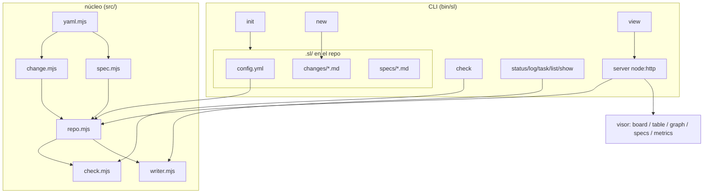
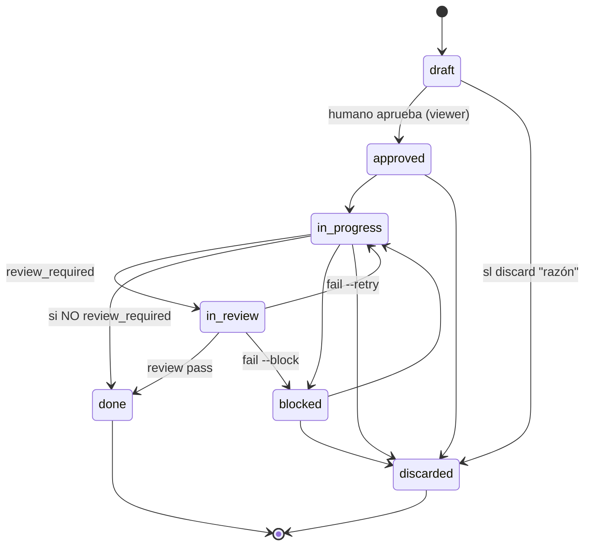

# Arquitectura de Spec Ledger

> Graduado del change 20260613-205854.
> Graduado del change 20260614-151759 (discovery del contrato).
> Graduado del change 20260614-162547 (Definition of Ready / tdd).
> Graduado del change 20260614-165720 (revisión de graduación / reviewed).
> Graduado del change 20260614-182513 (owner desde GitHub login).
> Graduado del change 20260615-150510 (gate de revisión independiente + invariantes de transición).
> Graduado del change 20260615-170803 (graduación a spec existente, `sl graduate --into`).
> Graduado del change 20260615-210508 (estado terminal `discarded`).

Spec Ledger separa **almacén** (fuente de verdad, optimizada para agente y git)
de **presentación** (un visor agradable para el humano). Es un CLI global; en
cada repo solo viven los documentos bajo `.sl/`.

## Componentes

## Modelo de datos

- **change**: un archivo markdown. Frontmatter estructurado (`id`, `title`,
  `type`, `status`, `created`, `depends_on`, `owner` opcional, `archived` opcional,
  `reviewed` opcional) + etapas (`## Request`…`## Log`) según el tipo. Tiene ciclo
  de vida (ver **Ciclo de vida y gate de revisión**). Tareas en `## Plan` como
  checklist (`[ ]`/`[x]`/`[!]`).
- **spec**: un archivo markdown sin ciclo de vida. Frontmatter mínimo (`title`,
  `updated`, `tags`) + cuerpo libre. Es la verdad persistente; un change `done`
  gradúa su verdad aquí.

**Revisión de graduación.** Tras `done`, cada change se resuelve: gradúa a un spec
o se descarta (bug/chore sin verdad persistente). Ambos casos fijan `reviewed: true`
(`writer.setReviewed`). `sl graduate --pending` (`pendingGraduation`) lista los
`done` con `reviewed !== true`; `sl graduate <id> --skip [razón]` (`skipGraduation`,
solo en `done`) descarta dejando `graduation skipped` en el Log; `graduate()` a spec
también fija `reviewed`. "Graduado a spec" sigue siendo derivable de la marca
`graduado a spec` del Log — `reviewed` solo registra que la pregunta quedó zanjada.
`check` valida que `reviewed`, si está, sea booleano; no avisa de pendientes (es
bajo demanda).

`graduate()` tiene dos rutas. Por defecto **crea** un spec nuevo (semilla desde
Specification/Proposal) y falla si ya existe. Con `--into` (`{ into: true }`)
**gradúa a un spec existente**: exige que exista (error simétrico si no), refresca
su `updated` (`writer.setSpecUpdated`) y deja el cuerpo al agente — no lo
sobrescribe. Ambas rutas comparten el registro en el change (marker + `reviewed`).
La sustitución es explícita (flag), nunca por auto-detección, para que un slug mal
tecleado no enlace por error.

El `## Log` es el **ledger del ciclo de vida**, ortogonal a las etapas de
contenido del tipo: registra cada transición de `status` con su timestamp y se
crea automáticamente al primer cambio de estado aunque el tipo no lo declare
(p.ej. `chore`). El `owner` se autoasigna al pasar a `in-progress` (cuando empieza
el trabajo) vía `ownerHandle`: username de GitHub (`gh api user --jq .login`), con
fallback a `git config user.name` si `gh` falta o no está autenticado; tolerante
(vacío si ninguno). No pisa un owner fijado a mano (`sl owner`).

Una entrada de `depends_on` con la forma `<proyecto>:<changeId>` es una
dependencia **cross-proyecto**: `check` no la valida localmente (apunta a otro
repo) ni la mete en el grafo de ciclos; el visor global la resuelve por id o
nombre de proyecto y navega a ese change.

## Ciclo de vida y gate de revisión

**Descartar.** `discarded` es un estado **terminal** alternativo a `done`: el
change se decidió no hacer. Se alcanza desde cualquier estado activo no terminal
(`draft`, `approved`, `in-progress`, `blocked`) con `sl discard <id> "<razón>"`
—la razón es obligatoria y se registra en el Log—. Preferirlo a borrar el
archivo: la decisión y su porqué siguen siendo verdad, y las referencias
`depends_on` se mantienen resolubles. El visor lo oculta por defecto (toggle
"Discarded") y nunca le da columna. `sl status` rechaza `discarded` para forzar
el verbo con razón; tampoco es alcanzable desde el visor (solo hace `draft → approved`).

El gate **`in-review`** cierra el lazo doc↔código: un change con implementación
verificable no llega a `done` sin una **revisión independiente**. La revisión la
ejecuta un **subagente con contexto limpio** (sin el historial de implementación,
para no heredar sesgo) y un **modelo acorde a la dificultad**. *Qué* valida:
cada `CRn` cumplido, sin residuo, Plan realmente hecho, graduación fiel. La
auditoría profunda de seguridad/lint/SAST queda en herramientas dedicadas que el
revisor puede invocar; Spec Ledger no las reimplementa. El *cómo* se lanza el
subagente es del agente anfitrión — el contrato (AGENTS.md §6) solo fija el qué.

**Activación por tipo.** `config.yml` marca `review_required: true` por tipo
(`feature`, `bug`, `refactor` por defecto). `chore` y `audit` lo saltan y van
`in-progress → done` directo.

**Invariantes de transición.** El grafo del ciclo vive en `src/lifecycle.mjs` y
es la **única autoridad**, compartida por `sl status` y el visor.
`lifecycle.assertTransition(from, to, { type, reviewRequired })` valida el grafo
completo (no solo el gate) y `agent.status()` lo invoca antes de escribir, así que
el CLI rechaza cualquier salto inválido (`draft → done` →
`invalid lifecycle transition: draft → done`), regresiones y no-ops
(`change is already "X"`), y el gate (`in-progress → done` bajo `review_required`
→ mensaje accionable). Entre statuses no canónicos degrada a validación por enum.
Mover fuera del grafo (reabrir un `done`, des-aprobar) no es del CLI: se edita el
archivo. El visor añade una restricción humana extra: solo permite
`draft → approved`.

**Veredicto (`sl review`, en `agent.review()`).** `pass` → `done`; `fail --retry`
→ `in-progress` (defecto dentro del contrato, el implementador corrige);
`fail --block` → `blocked` (excede el contrato, decide el humano). Exige estar en
`in-review`, `fail` exige motivo, y cada veredicto deja un marker inglés en el Log
(`review → …`). `in-review` cuenta como WIP en métricas.

## Identidad

`id` = instante UTC de creación `YYYYMMDD-HHMMSS`, derivado de `created`. Único
sin coordinación central; `sl new` incrementa 1s ante colisión en el mismo
segundo. La reserva se hace de forma atómica por id (`wx` sobre un lock temporal
y escritura exclusiva del archivo final), de modo que dos procesos concurrentes
no pueden escribir el mismo id. El lock incluye metadata del proceso propietario:
si queda huérfano por una terminación abrupta, `sl new` lo puede recuperar; si el
lock desaparece durante la comprobación, el comando reintenta sin fallar. El slug
estructural se normaliza a kebab ASCII y se rechaza si queda vacío. Ordenable
cronológicamente.

## Métricas

`metrics.mjs` deriva, sin IO, métricas de entrega de los timestamps. El cierre
(`done`) y el paso a cada estado se leen del `## Log`; de ahí salen: cycle time
(`done − created`), lead time por etapa, WIP actual, aging de los `in-progress`,
tiempo bloqueado, throughput por día y desgloses por tipo/owner. El server las
precalcula y el visor las pinta en la pestaña **Metrics**.

## Validación (`sl check`)

`check.mjs` es puro (sin IO) y valida changes y, en modo repo completo, también
la capa de specs y sus enlaces: marcadores de conflicto de merge, etapas
duplicadas, enlaces change↔spec rotos (error), specs huérfanos y `updated`
desfasado respecto a la actividad de un change enlazado (warning). Los enlaces
salen de los marcadores que escribe `sl graduate`.

## Trazabilidad git

`git.mjs` (`gitRefs`, runner inyectable) enlaza un change con git por la
convención de commit `[#<id>]`: lista los commits que lo referencian y las
branches cuyo nombre lo contiene; tolera repos no-git devolviendo vacío. El
endpoint `GET /api/git?project=&id=` los sirve y el detalle muestra la sección
**Git**. El lookup de PR (red/`gh`) queda fuera del visor local.

## Discovery del contrato

El **contrato canónico de la herramienta** (instrucciones de uso) vive separado
del contrato propio de cada repo: se distribuye como `templates/AGENTS.md` y
`paths.mjs` lo resuelve como `agentsTemplate`, sin importar la instalación (npm
global, `pnpm link`, node_modules). Es artefacto **de la herramienta**, no del
repo. `init`/`register` lo enlazan en cada repo como `.sl/AGENTS.md` — symlink
**por máquina, gitignored**: nunca se copia (no drifta) ni se committea (no queda
dangling al clonar). Separarlo del raíz evita la recursión: el `AGENTS.md` raíz
es el contrato **propio** del proyecto y solo **referencia** al enlazado.

`init` exige el `AGENTS.md` raíz y appendea la referencia como **caja de alerta
GitHub** (`> [!IMPORTANT]`, marcador `<!-- spec-ledger -->`, idempotente) a cada
archivo de contrato presente que **no sea symlink** — `AGENTS.md` y `CLAUDE.md` —
de modo que cualquier agente (Claude, Codex, opencode, Copilot, Cursor…) lo
descubra sin tooling específico. `contract.mjs` concentra la lógica
(`linkContract`, `ensureReference`, `ensureGitignore`, `checkContract`);
`sl check` falla (error, no warning) si falta el raíz, si un contrato presente no
referencia, o si el link no resuelve — el discovery es condición para que la
herramienta funcione en el repo.

## Definition of Ready (tdd)

El modelo de uso es **documentar con modelo fuerte, implementar con modelo menos
potente**. El flag `tdd` en `config.yml` (default `true`) gobierna la política: con
`true`, los changes se documentan *test-grade* (cada requisito un CR concreto;
cada tarea del Plan nombra archivos+test y mapea a un CR) y se implementan con TDD.
`change.mjs` expone los CR declarados en `## Specification` (`parseChange().criteria`);
`check.mjs` (`checkCoverage`) cruza CR↔tarea y emite **warnings** (nunca errores)
cuando, en un change `approved`/`in-progress` cuyo tipo activa `specification`, un
CR no tiene tarea o una tarea no referencia CR. No juzga si un CR es realmente
test-grade (no parseable) — eso queda como juicio del agente documentador. `draft`
(autoría en curso) y `done` (histórico) no se evalúan. `tdd: false` desactiva el
cruce (repos exploratorios).

## Política de idioma

La estructura es inglés fijo (claves, enums, headings de etapa, nombres de
archivo, CLI). El contenido sigue `config.language`. El contrato (`AGENTS.md`) es
inglés canónico.

## Presentación

El visor (`sl view`) levanta un server `node:http` enlazado **solo a loopback**
(`127.0.0.1`) que relee `.sl/` en cada request (live) y expone JSON. Rechaza
requests cuyo `Host`/`Origin` no sea local (defensa anti DNS-rebinding), añade
headers defensivos (`nosniff`, `X-Frame-Options: DENY`, `no-store`), acota el
body y exige una credencial efímera por proceso (inyectada en la página y
enviada en `x-sl-token`) para escribir. Las escrituras exigen un `project`
exacto, sin fallback al primero. Es de solo lectura salvo `POST /api/status`, que
permite que **el humano** mueva un change de `draft` a `approved` arrastrando su
card entre esas columnas del board (el único salto que le corresponde; el resto
del ciclo lo conduce el agente). La UI rinde board (kanban), table, graph
(`depends_on`), specs y metrics, con búsqueda full-text, filtros (tipo, estado,
owner) y render de markdown + mermaid. El cliente está dividido en módulos
estáticos pequeños: `security.js` (escape/sanitización/Mermaid), `state.js`
(filtros y tombstones), `api.js` (fetch), `view-parts.js` (snippets reutilizables)
y `view-renderers.js` (graph/specs/metrics); `app.js` queda como bootstrap y
wiring de eventos. El graph muestra un estado vacío cuando los filtros no dejan
changes visibles, en vez de generar un SVG con dimensiones inválidas.

Los changes con `archived: true` se ocultan por defecto (toggle "Archived" para
mostrarlos); el flag los saca del board sin sacarlos de `changes_dir`, así
`check` y las deps los siguen viendo. `marked`, `dompurify` y `mermaid` son
dependencias instaladas (pnpm), servidas desde `node_modules` bajo `/vendor/*`.
**Frontera de confianza:** los documentos del repo son contenido no confiable
aunque el repo sea local. El cuerpo Markdown se rinde vía `safeHtml` (marked →
DOMPurify) antes de tocar el DOM; si `marked` o `DOMPurify` no cargan, `safeHtml`
falla cerrado y muestra un mensaje en vez de insertar HTML no sanitizado. Mermaid
se inicializa con `securityLevel: 'strict'`, de modo que ningún change/spec pueda
ejecutar JavaScript en el origen del visor. En modo global el visor lee el
registro y muestra todos los proyectos (selector + autoenfoque), y la búsqueda
"Global" (`GET /api/search?q=`) hace match full-text en todos los repos vivos y
agrupa los resultados por proyecto.

## Política de dependencias

Spec Ledger no prohíbe dependencias runtime, pero las trata como coste de
producto: cada una debe ser madura, mantenida y proporcional al problema que
resuelve. El núcleo CLI prefiere APIs estándar de Node y código propio pequeño,
pero usa `yaml` para parsear y serializar `.sl/config.yml` y frontmatter porque
YAML tiene suficientes reglas y bordes como para no mantener un parser propio. En
dominios con superficie amplia o riesgo de seguridad —render Markdown,
sanitización HTML, diagramas— el visor usa librerías especializadas y conocidas
(`marked`, `dompurify`, `mermaid`) en vez de reinventarlas.
